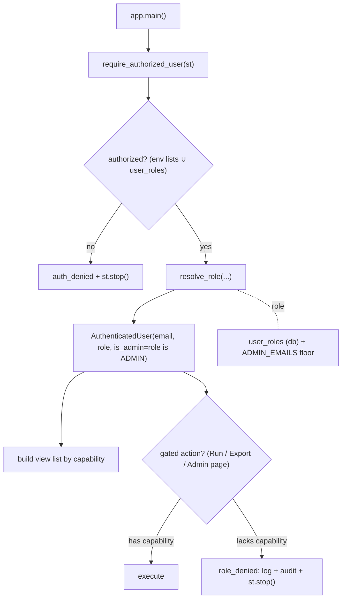

# AUTH-003 — Basic role model · Design

| | |
|---|---|
| **Ticket** | AUTH-003 — Add basic role model (separate viewer / analyst / admin) |
| **Type / Priority** | Story · P1 |
| **Owner / Reviewer** | Claude (design) / Codex (implementation review) |
| **Status** | Implemented and review-hardened (role model, migration, enforcement, tests, and approved failure policy) |
| **Branch** | `claude/auth-003-role-model` |
| **Depends on** | AUTH-001 (sign-in) · AUTH-002 (allowlist/admins) · OBS-001 (logging) · OBS-003 (audit trail) · SCAN-002 (storage/migrations) |
| **Unblocks** | watchlists (WATCH-*) · future per-object authorization |

> Goal (from the ticket): *Separate viewer, analyst, and admin capabilities.*
> Acceptance (AUTH-003): role config is environment- or **database-driven** · admin-only features are
> gated · unauthorized role attempts are logged · tests cover role permission checks.

**Read first:** the existing gate, the `AuthenticatedUser` identity, and the pure
`is_email_authorized` decision live in [`backend/auth/session.py`](../../backend/auth/session.py) and
its LLD [`components/authentication.md`](components/authentication.md). That LLD already names this
ticket as the next step: *"AUTH-003 role-gated features would build on the existing `is_admin` flag."*
This document is the **contract**; the companion [`auth-003-handoff.md`](auth-003-handoff.md) is the
**build plan**. Where they disagree, this design wins — flag it in the handoff §7.

---

## 1. Context & goal

Today the scanner has a **binary** access model. AUTH-001 authenticates a Google identity and AUTH-002
authorizes it against two env email lists:

- `ADMIN_EMAILS` → `AuthenticatedUser.is_admin = True` (sees the Admin health / settings / audit pages).
- `ALLOWED_EMAILS` → an authorized non-admin who can do **everything except** the admin pages — run
  scans, view results and charts, and export CSVs.

There is no tier *between* "can do everything non-admin" and "admin". AUTH-003 introduces three roles
so capability is separated along the lines the ticket specifies:

| Role | Intent | Representative capabilities |
|---|---|---|
| **viewer** | Read-only analyst's-eye view | view previous scan results, comparison, validation, charts |
| **analyst** | viewer **+** produce work | run manual scans, export results, create watchlists (future) |
| **admin** | analyst **+** operate the system | refresh data, manage universes, modify scanner config, view system health, view audit log, assign roles |

The roles are **hierarchical** (`admin ⊇ analyst ⊇ viewer`): every capability an analyst has, an admin
also has. This keeps the model small and matches the additive way the app already extends the view
list for admins ([`app.py`](../../app.py) `main()`).

**Implementation note.** This document began as the design contract. AUTH-003 now implements the
role model, `user_roles` ORM/migration, capability gates, admin surface, cache-only viewer charts,
and regression tests. The current failure and concurrency policies below include the hardening
approved during PR #80 review.

---

## 2. Scope

**In scope (this design):**
- A hierarchical `Role` model and a capability → minimum-role map.
- A **database-driven** role store (`user_roles`), proposed column-by-column, that is *also* a runtime
  authorization source, with `ADMIN_EMAILS` retained as an env **bootstrap-admin floor**.
- A pure role-**resolution** function with an explicit precedence, plus the `require_capability` guard
  that mirrors the existing `require_authorized_user` pattern.
- The **enforcement points** in `app.py` (view list, Run button, export, admin pages) and the
  defense-in-depth rule (UI hides *and* the handler re-checks).
- **Logging + audit** of unauthorized attempts and of role changes.
- The admin **role-management** surface (list users + assign roles).
- The test surface that proves the permission checks.

**Out of scope (reserved, not built):**
- The **watchlist feature** itself — only the `create_watchlist` capability is reserved on the analyst
  role; gating attaches when WATCH-* lands.
- Finer-than-role per-object ACLs (e.g. per-universe permissions) and a second OIDC provider — noted as
  extension points (§10).

---

## 3. Role & capability model

### 3.1 Roles (hierarchical)

```
viewer (level 0)  ⊂  analyst (level 1)  ⊂  admin (level 2)
```

A `Role` is an ordered enum; `role_has_capability(role, cap)` is the single decision
`role.level >= MIN_ROLE[cap].level`. There is no per-role permission *list* to keep in sync — the
hierarchy plus one capability→min-role map is the whole policy, which is what makes it cheap to test
exhaustively (handoff §3).

### 3.2 Capability map

Each capability names a **minimum role**. Capabilities are the unit of enforcement; UI controls and
action handlers ask `role_has_capability(user.role, CAP)`, never `role == "admin"`.

| Capability | Min role | App surface (today) |
|---|---|---|
| `VIEW_RESULTS` | viewer | Scan history, Scan comparison, Validation pages; results table + charts |
| `RUN_SCAN` | analyst | Sidebar **Run screener** button → `_execute_screener` |
| `EXPORT_RESULTS` | analyst | Live results, History, Comparison, and Validation CSV downloads (`EVENT_EXPORT_DOWNLOADED`) |
| `CREATE_WATCHLIST` | analyst | *(reserved — feature not yet built)* |
| `REFRESH_DATA` | admin | Any in-app data-refresh control *(today refresh is a CLI/prefetch path, outside the role model)* |
| `MANAGE_UNIVERSES` | admin | Mutating universe actions *(viewing the universe **status** table stays viewer-level)* |
| `MODIFY_CONFIG` | admin | **Admin settings** page (`ui/config_page.py`) |
| `VIEW_HEALTH` | admin | **Admin health** page (`ui/health_page.py`) |
| `VIEW_AUDIT_LOG` | admin | **Audit log** page (`ui/audit_page.py`) |
| `MANAGE_ROLES` | admin | **Admin roles** page *(new this ticket)* |

> Note on "view charts": a viewer can select a persisted History result and reconstruct its chart
> from local cached candles and the run's persisted parameters. This path never performs a live broker
> fetch. Scanner charts remain available for an existing session cache; only **Run** and every CSV
> **Export** require `analyst` (§5.3). This is why we gate actions, not read-only pages.

---

## 4. Storage — `user_roles` (implemented)

The role store is a small, durable table. It is the runtime source of truth for who has which role
**and** a runtime authorization source (a row authorizes entry — see §5.1). It mirrors the column and
timestamp conventions of the existing models in
[`backend/storage/models.py`](../../backend/storage/models.py) (`AuditLog`, `AppConfig`).

| Column | Type | Notes |
|---|---|---|
| `email` | `String`, **primary key** | The normalized, lower-cased identity key — exactly the form `is_email_authorized` already compares against. One row per user. |
| `role` | `String` + **CHECK** in (`viewer`,`analyst`,`admin`) | Stored as the role *name*; the CHECK constraint plus app-level enum parsing reject any other value (defense against a bad write). |
| `assigned_by` | `String`, nullable | Email of the admin who set this row (audit/forensics). Null for a seed/migration-created row. |
| `created_at` | `DateTime(timezone=True)`, default `now()` UTC | Matches the existing models' UTC timestamp pattern. |
| `updated_at` | `DateTime(timezone=True)`, `onupdate=now()` UTC | Bumped on every reassignment. |

The implementation includes the ORM model **and** the hand-written Alembic migration
`migrations/versions/20260623auth003_create_user_roles.py`, and updates the table-name sets in
[`tests/test_scan_storage_migrations.py`](../../tests/test_scan_storage_migrations.py) — the
migration-drift guard (`alembic upgrade head` must equal `Base.metadata`) keeps future model-only
changes red in CI.

**Why a table and not more env lists** — see the decision record in §7.

---

## 5. Role resolution & enforcement

### 5.1 Authorization gate (extended)

AUTH-002's entry gate stays, widened by one **injected** table-membership check so the DB store is a
genuine self-service authorization source while the env lists remain a bootstrap that works on an empty
table:

```
authorized(email) = email ∈ ADMIN_EMAILS            (env bootstrap admin)
                  ∨ email ∈ ALLOWED_EMAILS           (env allowlist — unchanged)
                  ∨ email ∈ user_roles               (db — new; injected lookup)
                  ∨ (not production ∧ allowlist+table empty)   (dev-permits, unchanged)
```

The pure decision keeps flowing through an `is_email_authorized`-style function so it stays testable
with no Streamlit and no DB (the table membership is passed in as a `bool`/set, mirroring how `allowed`
and `admins` are passed today).

### 5.2 Role resolution (pure, precedence explicit)

```python
def resolve_role(
    email: str,
    *,
    in_admin_env: bool,        # email ∈ ADMIN_EMAILS
    table_role: Role | None,   # user_roles lookup, injected (None if no row)
    default_role: Role,        # DEFAULT_ROLE setting, defaults to analyst
    auth_required: bool,       # settings.auth_required
) -> Role:
    if not auth_required:      # local dev / auth disabled → full-access "owner"
        return Role.ADMIN
    if in_admin_env:           # ADMIN_EMAILS is a floor: cannot be demoted via the table
        return Role.ADMIN
    if table_role is not None: # the database is the source of truth for everyone else
        return table_role
    return default_role        # no row → analyst (preserve today's scan/export access)
```

Precedence, highest first: **auth-disabled owner → env-admin floor → table role → analyst default.**
The two consequences that matter:
- An `ADMIN_EMAILS` operator can never be locked out by a bad table write (you demote a bootstrap admin
  only by editing the env). This is the **anti-lockout** guarantee.
- An authorized user with no table row keeps exactly today's capabilities (analyst), so AUTH-003 is a
  **non-breaking** change for every current user. A `viewer` is therefore an explicit, opt-in
  assignment.

### 5.3 The `require_capability` guard

A thin guard mirrors `require_authorized_user` ([`session.py`](../../backend/auth/session.py)): it is
injected with `st_module` (testable with a fake), and on denial it **logs**, **audits**, shows a
generic message, and `st.stop()`s — code below the guard never runs.

```python
def require_capability(st_module, user: AuthenticatedUser, capability: str) -> None:
    if role_has_capability(user.role, capability):
        return
    # log (OBS-001) + durable audit (OBS-003), then stop — see §6
    ...
    st_module.error("You do not have permission to perform this action.")
    _stop(st_module)
```

### 5.4 Defense-in-depth in `app.py`

Enforcement is **two-layered** — the UI hides what you can't do, and the handler re-checks before it
acts. Hiding a button is UX, not security; the handler check is the boundary.

- **View list** ([`app.py`](../../app.py) `main()`): viewer sees the read-only views; the admin pages
  are appended only for `MANAGE_*`/`VIEW_HEALTH`/`VIEW_AUDIT_LOG` holders (replaces the current
  `is_admin` test). A new **Admin roles** page is appended for `MANAGE_ROLES`.
- **Run / Export**: the sidebar **Run** button is shown only for `RUN_SCAN`, and live-results,
  History, Comparison, and Validation CSV payloads/buttons are built only for `EXPORT_RESULTS`.
  `_execute_screener` re-checks `RUN_SCAN` (defense-in-depth — a stale rerun or crafted request cannot
  run a scan a viewer's UI never offered).
- **Admin pages**: each admin page handler calls `require_capability(..., <its capability>)` at the top,
  exactly as the pages already re-check `is_admin` today (`_record_admin_page_access` stays).



---

## 6. Logging & audit of unauthorized attempts

The acceptance criterion *"unauthorized role attempts are logged"* is satisfied at the `require_capability`
denial branch, reusing the exact OBS-001 + OBS-003 idiom AUTH-002 uses for `auth_denied`/`login_denied`
([`session.py`](../../backend/auth/session.py)):

- **Log (OBS-001):** a new `EVENT_ROLE_DENIED` via `log_event(..., level=logging.WARNING, email=…,
  required_capability=…, role=…)`. Like `auth_denied`, it records **who** and **what was attempted** —
  never the contents of the role table or the env lists, so the log cannot leak who else has access.
- **Durable audit (OBS-003):** a `role_denied` event via `record_audit_event_once`
  ([`backend/audit/recorder.py`](../../backend/audit/recorder.py)), deduped per
  `session + capability` so a viewer hammering a hidden control writes one row, not hundreds. Metadata:
  `required_capability`, `actual_role`, `feature` (all redacted by the recorder's existing pipeline).
- **Role changes are audited too:** assigning a role records `role_changed` with
  `target_email / old_role / new_role / assigned_by` — the admin-action trail the Roles page needs.

New event constants land in [`backend/observability/__init__.py`](../../backend/observability/__init__.py)
next to `EVENT_AUTH_DENIED` / `EVENT_ADMIN_PAGE_ACCESSED`.

---

## 7. Key design decisions & trade-offs (ADR-style)

| Decision | Rationale | Alternative rejected |
|---|---|---|
| **DB-driven role store (`user_roles`)** | The acceptance criterion permits env- or db-driven; you chose db so an admin can (re)assign roles at **runtime** from the UI without a redeploy/env edit, and the table doubles as a self-service allowlist (§5.1). | *More env lists* (`VIEWER_EMAILS`/`ANALYST_EMAILS`) — zero migration, but every change is a redeploy and there is no in-app management. |
| **`ADMIN_EMAILS` retained as a bootstrap-admin floor** | An empty `user_roles` on day one would otherwise mean **no admin exists to populate it** — a lockout. Env admins are the anti-lockout safety and cannot be demoted by a bad table write (§5.2). | *Pure DB with a seeded admin row* — works, but a wrong/dropped seed re-introduces the lockout; env is the durable escape hatch. |
| **Hierarchical roles + capability map** | `admin ⊇ analyst ⊇ viewer` plus one capability→min-role table is the entire policy — small, and exhaustively testable as a matrix. Matches how `app.py` already *adds* admin views. | *Per-role permission sets / full RBAC matrix* — more expressive, but more surface to keep in sync than three tiers need. |
| **Default role = analyst; auth-off = owner** | Preserves current access: every existing `ALLOWED_EMAILS` user keeps scan/export, and local dev stays unrestricted. AUTH-003 ships **non-breaking**. | *Default viewer (least-privilege)* — safer in the abstract, but silently strips scan/export from current users until re-listed; rejected per your call. |
| **Gate capabilities, not pages; enforce twice** | Hiding a control is UX; the handler re-check is the boundary. A viewer can reconstruct charts from persisted History while Run/all exports stay analyst-only, and a stale rerun cannot escalate. | *Hide-only* — a leftover/forged rerun could trigger an action the UI no longer shows. |
| **`is_admin` kept as a derived field** | `is_admin := role is Role.ADMIN` keeps every existing `is_admin` reader and test working while the policy moves to capabilities. | *Remove `is_admin`* — a wider, riskier blast radius for no functional gain. |
| **Reuse the OBS-001/003 denial idiom** | `role_denied` logs+audits exactly like `auth_denied`/`login_denied`, deduped per session — operators get one consistent trail; no new logging machinery. | *A bespoke role-denial sink* — divergent format, more to maintain. |

**Consequences.** Easier: runtime role management; non-breaking rollout; cheap exhaustive tests. Harder:
a schema change (migration + drift-guard test updates — handoff §5); two authorization inputs to reason
about (env + table) — mitigated by the single precedence in §5.2. Revisit as it grows: per-object ACLs,
caching the table lookup if it becomes hot, and last-admin-deletion protection on the Roles page (§10).

---

## 8. Security & integrity considerations

1. **Fail closed.** Production keeps AUTH-002's posture: no `ALLOWED_EMAILS`/admin/table membership →
   denied. `resolve_role` never invents access; the only "permissive" branch is `auth_required=false`,
   which production validation already forbids ([`settings.py`](../../backend/config/settings.py)
   `validate_production_settings`).
2. **Least privilege by capability.** Every gated action checks the *minimum* capability; admin is a
   superset, not a bypass. No code path checks "is this user special" outside `role_has_capability`.
3. **No list/table leakage.** Denial logs/audits carry the actor's email and the attempted capability
   only — never who else holds a role (same rule as `auth_denied`).
4. **Admin-only, audited, validated role writes.** Only `MANAGE_ROLES` reaches the write path; the role
   value is parsed through the `Role` enum and constrained by a DB CHECK (no arbitrary strings); every
   write records `role_changed` with `assigned_by`. Writes use the SQLAlchemy ORM (parameterized) — no
   string-built SQL.
5. **No privilege self-escalation.** A non-admin never reaches the Roles UI or the write repository.
   The Roles page must guard **last-admin** removal and self-demotion (keep ≥1 effective admin; env
   bootstrap admins are the ultimate backstop) — see §10.
6. **Anti-lockout.** The env bootstrap-admin floor guarantees a recoverable admin even if the table is
   empty, wrong, or wiped.
7. **Identity trust unchanged.** Roles are keyed on the **verified, normalized** email AUTH-001 already
   establishes; no new identity surface is introduced.
8. **Re-resolve every run; never cache the role in session state.** `require_authorized_user` runs on
   every Streamlit rerun, so the role **must** be re-resolved (fresh table lookup) each run and must
   **not** be stored in `st.session_state`. Otherwise an admin's **revocation/demotion** would only take
   effect on the user's next fresh session — a stale-authorization window. Re-resolving each run makes a
   role change effective on the target's very next interaction. *(Found by the design `/security-review`.)*
9. **Lookup failures are distinct from missing rows.** Role lookup returns `found`, `missing`,
   `unavailable`, or `invalid`. Only `missing` receives the analyst default. On `unavailable`/`invalid`,
   env admins remain admin, independently authorized users become viewer, and table-only users are
   denied. A database outage therefore cannot elevate an assigned viewer. *(Hardened in Codex review.)*
10. **Export gating is render-time, not post-submit.** A CSV download has no separate server handler —
    `st.download_button` prepares its payload when the page renders. So `EXPORT_RESULTS` is enforced by
    guarding **before the export bytes are built and the button is rendered**, not by a (non-existent)
    post-click handler. A viewer's run must never construct the export payload on the live, History,
    Comparison, or Validation surfaces. *(Hardened in Codex review.)*

> The implementation received a code and security hardening review (threat lens:
> authorization/privilege escalation, lockout, input validation, and data exposure). Its resolved
> findings are folded into items 8–10 and the handoff decisions below.

---

## 9. Acceptance-criteria mapping

| Acceptance criterion | Where satisfied |
|---|---|
| Role config is environment- or **database-driven** | §4 `user_roles` table (db source of truth) + §5.1 env bootstrap; §7 decision record |
| Admin-only features are gated | §3.2 capability map (admin caps) + §5.4 enforcement in `app.py` (view list + admin-page handlers) |
| Unauthorized role attempts are logged | §6 `EVENT_ROLE_DENIED` (log) + `role_denied` (durable audit), deduped per session |
| Tests cover role permission checks | handoff §3: resolution-precedence matrix, capability matrix, guard denial (log+audit), repository round-trip, migration-drift green, admin-only/no-self-escalation |

---

## 10. Files in this change & notes for the reviewer

**This (design) pass lands docs only:**
- `docs/architecture/auth-003-role-model.md` *(this file)*
- [`docs/architecture/auth-003-handoff.md`](auth-003-handoff.md) — the implementation build plan
- [`docs/architecture/README.md`](README.md) — two index rows under "Ticket-scoped design docs"

**The implementation pass surface** is enumerated in the handoff §1 (new `backend/auth/roles.py`, the
`UserRole` model + migration + drift-test updates, repository helpers, the `session.py`/`app.py`
enforcement edits, the admin Roles page, tests, and the `authentication.md` LLD update).

**Resolved reviewer decisions:**
1. **Roles page placement** — standalone **Admin roles** view, keeping `MANAGE_ROLES` separate from
   `MODIFY_CONFIG`.
2. **`DEFAULT_ROLE` exposure** — constant `analyst`; no environment knob until an operator needs it.
3. **Admin protection** — refuse self-demotion/self-revocation and lock current admin rows before the
   last-admin check and mutation.
4. **Data/universe capabilities** — reserve `MANAGE_UNIVERSES` / `REFRESH_DATA` until in-app mutating
   controls exist; the universe status table remains viewer-readable.
5. **Local development** — auth-disabled runs use the synthetic `local-owner@localhost` admin.
