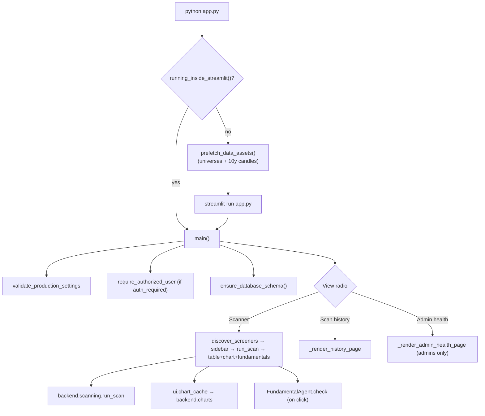

# LLD — App entrypoint & orchestration (`app.py`)

| | |
|---|---|
| **Component** | Streamlit entrypoint + CLI prefetch + UI orchestration |
| **Source** | [`app.py`](../../../app.py), [`ui/common.py`](../../../ui/common.py) |
| **Layer** | UI / orchestration (repo root + `ui/`) |
| **Status** | Stable (REF-001 split: page renderers moved to `ui/`) |
| **Related** | [HLD](../high-level-design.md) · [authentication.md](authentication.md) · [screener-framework.md](screener-framework.md) · [scan-service-and-provenance.md](scan-service-and-provenance.md) · [data-acquisition.md](data-acquisition.md) · [charts-visualization.md](charts-visualization.md) · [ui-pages.md](ui-pages.md) · [fundamentals-ai.md](fundamentals-ai.md) |

## 1. Purpose & responsibilities

`app.py` is the single file launched two ways. It owns **UI orchestration only**
— show screeners, run the selected one via the scan service, render the table +
chart, and offer Check Fundamentals. Strategy lives in `screeners/`, plumbing in
`backend/`.

**Two launch modes:**
- `python app.py` → not inside Streamlit → **prefetch** universes + ~10y candles in plain Python (terminal shows progress), then re-exec `streamlit run app.py`.
- `streamlit run app.py` → skip prefetch, trust the on-disk cache.

`ui/common.py` holds shared display helpers (CSV-injection escaping, secret redaction wrapper, emoji rating badges, decimal column config) used by both the scanner page and the history page (pages must not import each other).

## 2. Position in the system

## 3. Key functions

| Function | Role |
|---|---|
| `running_inside_streamlit()` | `get_script_run_ctx` check that picks the launch path. |
| `prefetch_data_assets()` | Refresh universes → union → cleanup legacy cache → `ensure_daily_history` per stock; emits `data_refresh_*` events; never blocks the UI. |
| `launch_streamlit_from_plain_python()` | `configure_logging()` → prefetch → re-exec via `streamlit.web.cli`. |
| `main()` | The per-rerun flow: validate → auth gate → migrate → view router → scan state machine. |
| `_execute_screener(selected, *, triggered_by)` | Build loader + params (+ overrides, progress callback), call `run_scan`, return a `scan_cache` payload (or `None`). |
| `_render_scan_output` / `_render_results_with_chart` | Stats expander, selectable table, table↔dropdown sync, embedded chart. |
| `_render_fundamentals_panel` / `_render_verdict_block` | Per-row Check Fundamentals (criteria vs universal mode), verdict rendering. |
| `_render_parameter_overrides` / `_apply_param_overrides` | Sidebar per-screener param tuning via `session_state`. |
| `_scan_trigger(user)` | `"ui"` or `"ui:<email>"` audit label. |

## 4. Key design decisions & trade-offs

| Decision | Rationale | Alternative rejected |
|---|---|---|
| **Prefetch before UI on `python app.py`** | All slow network work happens up front in the terminal; the browser opens to an instant app. | Fetch in-UI — blocking, repeated downloads. |
| **`main()` order: validate → auth → migrate → view** | A prod misconfig stops before any folder/DB/UI; an unauthenticated tab can't even open a DB connection (migrate is after auth); a broken screener can't block the history view (discovery is after the view router). | Any other order weakens one of those guarantees. |
| **`session_state` scan-cache state machine** | `pending_run` consumed once; subsequent reruns re-render from `scan_cache`; screener switch invalidates by key. Streamlit reruns top-to-bottom on every interaction. | Re-run screener each rerun — slow, loses state. |
| **Every scan uses the full 10y window** | `lookback_days` is display/strategy metadata; the loaded frame is the shared 10y cache so long-memory rules/charts see all history. | Slice to `lookback_days` — hides old events. |
| **`triggered_by` passed into `_execute_screener`, not discovered there** | Keeps the persistence layer independent of Streamlit's auth object (reusable by the daily job). | Read auth in the service — coupling. |
| **`params_for_chart` kept callback-free** | `build_chart` must never receive stale function refs from a prior rerun. | Reuse `params` — stale callbacks. |
| **Table↔dropdown sync by writing selectbox state pre-widget** | A keyed widget ignores `index=` on reruns; writing `session_state[key]` before instantiation is the only way a row click moves the dropdown; "last used wins". | Post-widget set — ignored by Streamlit. |
| **Agents/heavy helpers behind `@st.cache_resource`/`cache_data`** | One agent per (model, fast_mode); cheap status panels cached 30s to survive reruns. | Rebuild each rerun — slow/costly. |
| **All error text through `_redact_secrets`** | UI panels never leak credentials (adds `st.secrets` OIDC values on top of env secrets). | Raw `str(exc)` — leak. |

## 5. Failure modes

- `SettingsError` → `st.error`, return (prod misconfig stops the page).
- Missing Dhan creds → `_execute_screener` shows setup error, returns `None`.
- Screener `FAILED` → error shown, not cached (the FAILED run is still persisted by the service).
- `ScreenerRegistryError` → error on the Scanner view; the history view still works.
- Chart build error / no cached candles → inline info/error, scan output still renders.

## 6. Testing

- [`tests/test_app_orchestration.py`](../../../tests/test_app_orchestration.py) — view routing, scan state machine, trigger label, fundamentals panel, param overrides (page renderers monkeypatched via `app._render_*`).
- [`tests/test_app_history_page.py`](../../../tests/test_app_history_page.py), [`tests/test_app_health_page.py`](../../../tests/test_app_health_page.py) — view delegation.

## 7. Extension points

A new top-level view = add to `view_options` + a renderer in `ui/` (gate by `is_admin` if needed). New shared display helpers go in `ui/common.py`. New screeners need no `app.py` change (auto-discovered).
