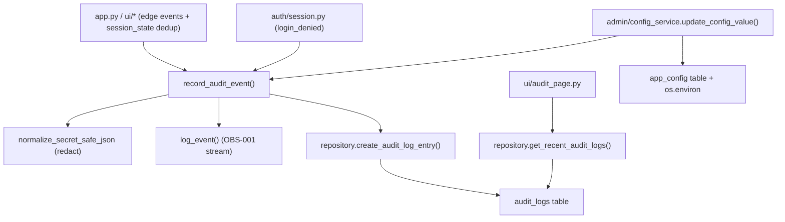

# LLD — Audit log (`backend/audit`, `backend/admin`)

| | |
|---|---|
| **Component** | Durable user-action audit trail + admin runtime-config |
| **Source** | [`backend/audit/recorder.py`](../../../backend/audit/recorder.py) · [`backend/admin/config_service.py`](../../../backend/admin/config_service.py) · [`ui/audit_page.py`](../../../ui/audit_page.py) · [`ui/config_page.py`](../../../ui/config_page.py) |
| **Layer** | Cross-cutting (recorder is a backend leaf; pages are UI) |
| **Status** | Implemented (OBS-003) |
| **Related** | [HLD](../high-level-design.md) · [obs-003-audit-log.md](../obs-003-audit-log.md) · [observability.md](observability.md) · [security.md](security.md) · [storage-persistence.md](storage-persistence.md) · [authentication.md](authentication.md) · [configuration.md](configuration.md) · [ui-pages.md](ui-pages.md) |

## 1. Purpose & responsibilities

Record **who did what, and when** to a durable, queryable `audit_logs` table:
sign-ins, manual scans, the startup data refresh, configuration changes, CSV
exports, and admin-page access. Each row carries the actor email, a UTC timestamp,
and redacted action metadata.

**Responsibilities**
- `record_audit_event(...)` — redact metadata, emit an OBS-001 `log_event`, and
  best-effort write one `audit_logs` row.
- `should_record_once(...)` — once-per-session dedup for level-triggered events.
- `backend/admin` — a whitelisted runtime-config override service (`LOG_LEVEL`,
  `LOG_FORMAT`, and the ALERT-002 alert preferences) that gives `config_changed`
  a real trigger.
- Admin **Audit log** viewer and **Admin settings** form pages.

**Non-responsibilities**
- Does not implement masking — it calls [security.md](security.md) via
  `normalize_secret_safe_json`.
- Does not own the schema or queries — those live in [storage-persistence.md](storage-persistence.md).
- `backend/` never imports Streamlit; session-state dedup is driven from the UI.

## 2. Position in the system

## 3. Public interface

| Symbol | Contract |
|---|---|
| `record_audit_event(*, event, user_email=None, metadata=None, level=INFO, session_factory=session_scope) -> bool` | Redact metadata, emit `log_event`, best-effort persist a row. Returns `False` (not raises) on DB failure. |
| `record_audit_event_once(*, session_state, dedup_key, event, ...) -> bool` | For audit-critical level-triggered events: check a session key, call `record_audit_event`, and mark the key only after the durable row is written. |
| `should_record_once(session_state, key) -> bool` | `True` the first time `key` is seen in a session; marks it. Framework-free (takes a dict / `st.session_state`). |
| `apply_config_overrides(*, session_factory=session_scope) -> dict[str,str]` | Replay stored whitelisted overrides into `os.environ`; best-effort. |
| `update_config_value(key, raw_value, *, updated_by, session_factory=session_scope) -> ConfigUpdateResult` | Validate (startup parsers) → persist `app_config` → set `os.environ` → record `config_changed`. Raises `SettingsError` on invalid/non-editable. |
| `EDITABLE_CONFIG_KEYS` | Whitelist mapping `LOG_LEVEL`/`LOG_FORMAT` and the ALERT-002 keys (`ALERT_ENABLED`, `ALERT_CONTENT`, `TELEGRAM_CHAT_ID`, `ALERT_EMAIL_TO`) → `EditableSetting` (label, parser, current, plus `choices` for a select box or empty for a validated text input). |

## 4. Recorded events & triggers

| Event | Site | Trigger / dedup |
|---|---|---|
| `login_success` | `app.py` after auth | once per session/email |
| `login_denied` | `auth/session.py` denial | once per session/email (OBS-001 `auth_denied` log stays) |
| `manual_scan_started` | `app.py` Run button | edge-triggered |
| `data_refresh_started` | `app.py` prefetch | system event (`user_email=NULL`) |
| `config_changed` | `admin/config_service` | form submit |
| `export_downloaded` | results + history CSV buttons | `download_button` click |
| `admin_page_accessed` | `app.py` admin views | first access per page/session |

## 5. Key design decisions & trade-offs

| Decision | Rationale | Alternative rejected |
|---|---|---|
| **Best-effort persistence** | An audit write must never break a login/scan/download; DB errors are swallowed + logged. | Hard-fail — a DB hiccup blocks user actions. |
| **Two sinks (DB + `log_event`)** | Audit actions also appear in the live log stream with one redaction implementation. | DB only — invisible to log aggregators. |
| **Redact at the recorder boundary** | Reuses `normalize_secret_safe_json` (same as `params_json`); satisfies the "values redacted" AC for every event. | Per-page redaction — drift, gaps. |
| **Success-only audit dedup** | Streamlit reruns every interaction; `record_audit_event_once` keeps one row per session but marks the key only after persistence succeeds. | Mark before write — a transient DB failure permanently hides the retry. |
| **Config whitelist = non-secret operational keys** | Editing only `LOG_LEVEL`/`LOG_FORMAT` and the non-secret alert prefs/destinations (ALERT-002) keeps the form from becoming an auth-bypass lever or secret store; channel credentials stay env-only. | Editable secrets/auth — security risk. |
| **Overrides via `os.environ`** | `get_settings()` reads env live, so an override applies without rewriting the settings system; replayed at startup. | New settings layer — large, invasive. |

## 6. Configuration

The admin form **edits** existing settings ([configuration.md](configuration.md)):
`LOG_LEVEL`, `LOG_FORMAT`, and the ALERT-002 alert preferences (`ALERT_ENABLED`,
`ALERT_CONTENT`, `TELEGRAM_CHAT_ID`, `ALERT_EMAIL_TO`; see
[notifications.md](notifications.md)). Overrides persist
in `app_config` and are re-applied by `apply_config_overrides()` in `main()` after
the schema bootstrap (then `configure_logging()` is refreshed so a changed level
takes effect on the same run).

## 7. Testing

- [`tests/test_audit_repository.py`](../../../tests/test_audit_repository.py) — model/repository round-trip, filters, id tie-break, system event, redaction.
- [`tests/test_audit_recorder.py`](../../../tests/test_audit_recorder.py) — dual-sink, redaction, best-effort swallow, success-only dedup.
- [`tests/test_config_service.py`](../../../tests/test_config_service.py) — validate/persist/apply/audit, invalid/unchanged/non-editable, `apply_config_overrides`.
- [`tests/test_app_audit_page.py`](../../../tests/test_app_audit_page.py) · [`tests/test_app_config_page.py`](../../../tests/test_app_config_page.py) — admin guard + render flows.

## 8. Extension points

Add a tracked event: declare an `EVENT_*` constant in
[observability.md](observability.md), then call `record_audit_event(event=…,
user_email=…, metadata=…)` at the site (use `record_audit_event_once` for
level-triggered events that should retry after transient persistence failure).
Add an editable setting: one `EDITABLE_CONFIG_KEYS` entry with the existing
parser — but keep secrets/auth/infra keys out (§5).
