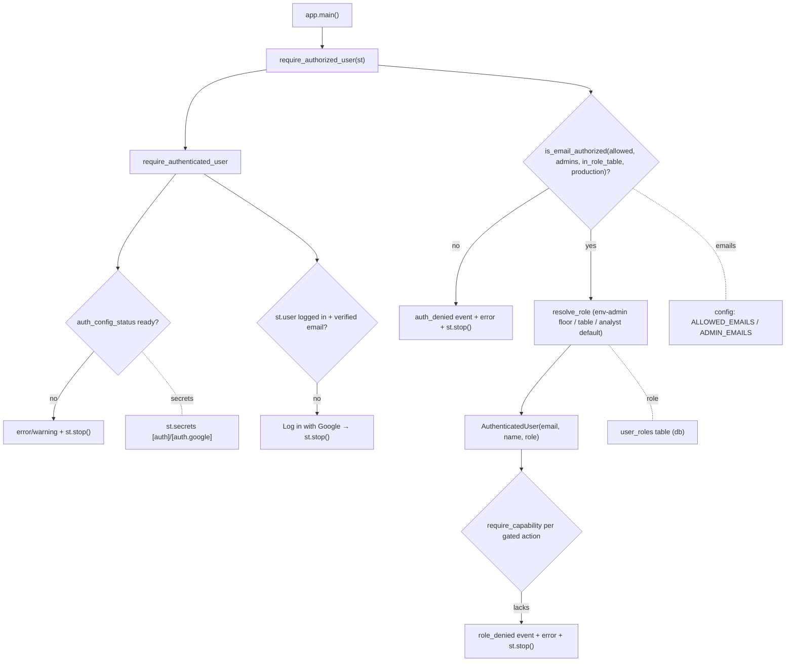

# LLD — Authentication & access control (`backend/auth`)

| | |
|---|---|
| **Component** | Google OIDC sign-in gate + email allowlist + role model |
| **Source** | [`backend/auth/session.py`](../../../backend/auth/session.py) · [`backend/auth/roles.py`](../../../backend/auth/roles.py) · [`backend/admin/roles_service.py`](../../../backend/admin/roles_service.py) · [`ui/roles_page.py`](../../../ui/roles_page.py) |
| **Layer** | Cross-cutting security (`backend/`) |
| **Status** | Stable (AUTH-001 sign-in · AUTH-002 allowlist/admins · AUTH-003 viewer/analyst/admin roles) |
| **Related** | [HLD](../high-level-design.md) · [configuration.md](configuration.md) · [app-orchestration.md](app-orchestration.md) · [observability.md](observability.md) · [health-monitoring.md](health-monitoring.md) · [security.md](security.md) · [audit-log.md](audit-log.md) · [storage-persistence.md](storage-persistence.md) · design [auth-003-role-model.md](../auth-003-role-model.md) |

## 1. Purpose & responsibilities

The single gate `app.py` calls at the top of `main()` so an unauthenticated **or**
unauthorized visitor stops **before** any screener control, result, chart, or CSV
download renders — and, once in, so each action is gated by the user's role.

- **Authentication (AUTH-001)** — Google SSO via Streamlit's native OIDC (`st.login`/`st.user`/`st.logout`). Validates config presence, Authlib availability, login state, and the verified email claim.
- **Authorization (AUTH-002)** — `ALLOWED_EMAILS` decides who may use the app; `ADMIN_EMAILS` are always allowed. Dev-permits-empty / prod-fails-closed.
- **Role model (AUTH-003)** — every authorized user resolves to one hierarchical role (`viewer < analyst < admin`). The `user_roles` table is the runtime source of truth and **also authorizes sign-in** (a row grants entry, unioned with the env lists); `ADMIN_EMAILS` is a bootstrap-admin floor. Capabilities (run scan, export, manage config/health/audit/roles, …) gate features via `require_capability`, with the UI hiding controls **and** the handler re-checking (defense in depth). Default role for an authorized user with no row is **analyst** (preserves AUTH-002 access).

**Non-responsibilities**: parses no env directly (reads [configuration.md](configuration.md)); owns no per-object ACLs (role is the unit of authorization).

> **Audit (OBS-003).** A rejected sign-in records a `login_denied` audit row (next to the existing `auth_denied` log); a successful authorization records `login_success` once per session from `main()`. A blocked capability records `role_denied` (logged + audited, deduped per session); an admin assigning/revoking a role records `role_changed`. See [audit-log.md](audit-log.md).

## 2. Position in the system

## 3. Public interface

| Symbol | Contract |
|---|---|
| `require_authorized_user(st_module) -> AuthenticatedUser` | The app's gate: authenticate + authorize + resolve role; stops on failure. Returns user with canonical lowercase email + `role`. |
| `require_authenticated_user(st_module)` | AUTH-001 only: renders login/logout, stops if not signed in / unverified. |
| `get_authenticated_user(st_module)` | `AuthenticatedUser | None`; reads `st.user` (attribute- or mapping-style). |
| `is_email_authorized(email, *, allowed, admins, production, in_role_table=False)` | **Pure** decision (no Streamlit/env): admins always; else a `user_roles` row; else on allowlist; else dev-permits / prod-denies. |
| `require_capability(st_module, *, role, capability, email=None)` | AUTH-003 guard: returns if the role holds the capability, else logs + audits `role_denied` and `st.stop()`s. Pure decision is `role_has_capability`. |
| `auth_config_status(st_module)` | Whether `[auth]` + `[auth.google]` secrets are complete. |
| `auth_secret_values(st_module)` | OIDC secrets (cookie_secret, client_id/secret) for the redactor. |
| `AuthenticatedUser` | frozen: `email`, `name?`, `role` (`is_admin` is a derived `@property` = `role is ADMIN`). |
| `Role` / `role_has_capability` / `resolve_role` / `MIN_ROLE` / `DEFAULT_ROLE` | [`backend/auth/roles.py`](../../../backend/auth/roles.py): the pure hierarchy + capability map + precedence (`viewer<analyst<admin`). |
| `assign_role` / `revoke_role` / `list_role_assignments` | [`backend/admin/roles_service.py`](../../../backend/admin/roles_service.py): admin-only, validated, audited writes with a last-admin guard. |

## 4. Key design decisions & trade-offs

| Decision | Rationale | Alternative rejected |
|---|---|---|
| **`st_module` injected, not imported** | Tests pass a tiny fake (`SimpleNamespace`/dict) — no browser/Google needed; `is_email_authorized` is a pure function. | Import `streamlit` directly — untestable. |
| **Single gate at top of `main()`** | One call protects every downstream feature; nothing renders before it. | Per-feature checks — easy to miss one. |
| **Check config readiness before showing the login button** | Avoids a half-working UI where "Log in" only throws (missing secrets / Authlib). | Show button always — confusing failure. |
| **Email lowercased everywhere; verified-claim required** | Case-insensitive allowlist; trust the email as identity only when Google verified it (absent claim allowed for non-Google/test fakes). | Trust raw casing/unverified — allowlist bugs. |
| **Dev-permits-empty, prod-fails-closed** | Local convenience vs deployed safety; mirrors config validation (prod requires an allow/admin email and forbids `AUTH_REQUIRED=false`). | Same behavior both — unsafe or annoying. |
| **`auth_denied` logs email only, never the allowlist** | Operator audit without leaking who else has access. | Log the list — info leak. |
| **`_stop()` guards fakes that don't stop** | A test fake whose `stop()` returns would otherwise run protected code; the guard raises. | Bare `st.stop()` — fakes leak through. |
| **DB-driven roles + env-admin floor (AUTH-003)** | Admins reassign roles at runtime from the UI; `ADMIN_EMAILS` guarantees a bootstrap admin so the table can never lock everyone out, and a bad table write can only *lower* privilege. | More env lists (redeploy per change) / pure-DB (seed lockout risk). |
| **Hierarchical roles + capability map** | `admin ⊇ analyst ⊇ viewer` + one min-role table is the whole policy — exhaustively testable; code checks capabilities, never `role == "admin"`. | Per-role permission sets — more to keep in sync. |
| **Table also authorizes entry; best-effort + fail-closed lookup** | The Roles page is a real self-service access manager; a DB read error yields "no row" so a transient failure denies a table-only user rather than granting access. | Role-only table (two places to manage) / fail-open (unsafe). |
| **`is_admin` is a derived property; role re-resolved every run** | Existing `is_admin` readers keep working with no drift-prone field; re-resolving each rerun makes a revocation effective on the next interaction (no stale-auth caching). | Settable `is_admin` field / caching the role in `session_state`. |

## 5. Failure modes

- Missing SSO config → prod: `st.error` + stop (hard); dev: `st.warning` + stop.
- Authlib missing → hard error + stop (login would only throw).
- No/unverified email → error + stop.
- Not authorized → generic message + `auth_denied` event + stop (user stays signed in to switch accounts).
- Lacks a capability → generic message + `role_denied` event (logged + audited) + stop.
- `user_roles` read error during the gate → treated as no assignment (fail closed); env allow-listed/admin users are unaffected.

## 6. Configuration

`st.secrets`: `[auth]` (`redirect_uri`, `cookie_secret`) + `[auth.google]` (`client_id`, `client_secret`, `server_metadata_url`). Env (via config): `AUTH_REQUIRED`, `ALLOWED_EMAILS`, `ADMIN_EMAILS`, `APP_ENV`. Roles live in the **`user_roles`** table (`email` PK · `role` CHECK viewer/analyst/admin · `assigned_by` · timestamps — see [storage-persistence.md](storage-persistence.md)); `DEFAULT_ROLE` (analyst) is a constant in `roles.py`, not an env knob.

## 7. Testing

- [`tests/test_auth_session.py`](../../../tests/test_auth_session.py) — config/login states, verified-claim handling, the `is_email_authorized` matrix, table-grants-entry, admin-floor-over-table, and the `require_capability` allow/deny (log + audit).
- [`tests/test_auth_roles.py`](../../../tests/test_auth_roles.py) — pure `resolve_role` precedence + capability matrices + `Role.parse`.
- [`tests/test_user_roles_repository.py`](../../../tests/test_user_roles_repository.py) — repository round-trip, CHECK rejection, normalization.
- [`tests/test_admin_roles_service.py`](../../../tests/test_admin_roles_service.py) — assign/revoke + audit + last-admin guard.
- [`tests/test_app_roles_page.py`](../../../tests/test_app_roles_page.py) — the admin Roles page guard + feedback flow.

## 8. Extension points

Finer-grained per-object ACLs (e.g. per-universe) would extend the capability map / add a join table. A second OIDC provider would generalize `AUTH_PROVIDER` + the provider-keys tuple. Authorization and role decisions should keep flowing through the pure `is_email_authorized` / `resolve_role` / `role_has_capability` for testability; promote `DEFAULT_ROLE` to a setting only if viewer-by-default is ever needed.
