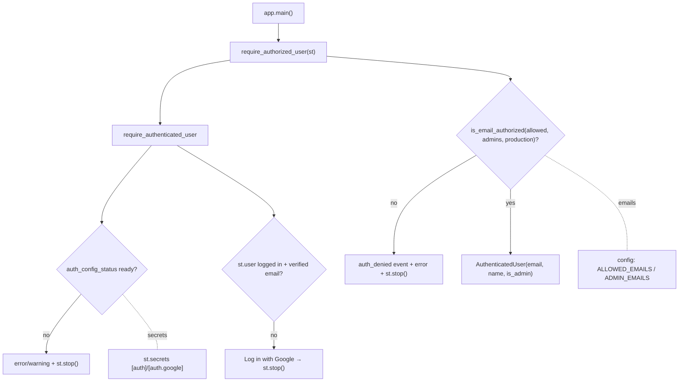

# LLD — Authentication & access control (`backend/auth`)

| | |
|---|---|
| **Component** | Google OIDC sign-in gate + email allowlist |
| **Source** | [`backend/auth/session.py`](../../../backend/auth/session.py) |
| **Layer** | Cross-cutting security (`backend/`) |
| **Status** | Stable (AUTH-001 sign-in · AUTH-002 allowlist/admins) |
| **Related** | [HLD](../high-level-design.md) · [configuration.md](configuration.md) · [app-orchestration.md](app-orchestration.md) · [observability.md](observability.md) · [health-monitoring.md](health-monitoring.md) · [security.md](security.md) · [audit-log.md](audit-log.md) |

## 1. Purpose & responsibilities

The single gate `app.py` calls at the top of `main()` so an unauthenticated **or**
unauthorized visitor stops **before** any screener control, result, chart, or CSV
download renders.

- **Authentication (AUTH-001)** — Google SSO via Streamlit's native OIDC (`st.login`/`st.user`/`st.logout`). Validates config presence, Authlib availability, login state, and the verified email claim.
- **Authorization (AUTH-002)** — `ALLOWED_EMAILS` decides who may use the app; `ADMIN_EMAILS` are always allowed and flagged `is_admin` (gates the Admin health view). Dev-permits-empty / prod-fails-closed.

**Non-responsibilities**: parses no env directly (reads [configuration.md](configuration.md)); general role-based feature gating is out of scope (only the admin flag exists).

> **Audit (OBS-003).** A rejected sign-in records a `login_denied` audit row (next to the existing `auth_denied` log) in the denial branch; a successful authorization records `login_success` once per session from `main()`. See [audit-log.md](audit-log.md).

## 2. Position in the system

## 3. Public interface

| Symbol | Contract |
|---|---|
| `require_authorized_user(st_module) -> AuthenticatedUser` | The app's gate: authenticate + authorize; stops on failure. Returns user with canonical lowercase email + `is_admin`. |
| `require_authenticated_user(st_module)` | AUTH-001 only: renders login/logout, stops if not signed in / unverified. |
| `get_authenticated_user(st_module)` | `AuthenticatedUser | None`; reads `st.user` (attribute- or mapping-style). |
| `is_email_authorized(email, *, allowed, admins, production)` | **Pure** decision (no Streamlit/env): admins always; else on allowlist; else dev-permits / prod-denies. |
| `auth_config_status(st_module)` | Whether `[auth]` + `[auth.google]` secrets are complete. |
| `auth_secret_values(st_module)` | OIDC secrets (cookie_secret, client_id/secret) for the redactor. |
| `AuthenticatedUser` | frozen: `email`, `name?`, `is_admin`. |

## 4. Key design decisions & trade-offs

| Decision | Rationale | Alternative rejected |
|---|---|---|
| **`st_module` injected, not imported** | Tests pass a tiny fake (`SimpleNamespace`/dict) — no browser/Google needed; `is_email_authorized` is a pure function. | Import `streamlit` directly — untestable. |
| **Single gate at top of `main()`** | One call protects every downstream feature; nothing renders before it. | Per-feature checks — easy to miss one. |
| **Check config readiness before showing the login button** | Avoids a half-working UI where "Log in" only throws (missing secrets / Authlib). | Show button always — confusing failure. |
| **Email lowercased everywhere; verified-claim required** | Case-insensitive allowlist; trust the email as identity only when Google verified it (absent claim allowed for non-Google/test fakes). | Trust raw casing/unverified — allowlist bugs. |
| **Dev-permits-empty, prod-fails-closed** | Local convenience vs deployed safety; mirrors config validation (prod requires an allow/admin email and forbids `AUTH_REQUIRED=false`). | Same behavior both — unsafe or annoying. |
| **`auth_denied` logs email only, never the allowlist** | Operator audit without leaking who else has access. | Log the list — info leak. |
| **`_stop()` guards fakes that don't stop** | A test fake whose `stop()` returns would otherwise run protected code; the guard raises. | Bare `st.stop()` — fakes leak through. |

## 5. Failure modes

- Missing SSO config → prod: `st.error` + stop (hard); dev: `st.warning` + stop.
- Authlib missing → hard error + stop (login would only throw).
- No/unverified email → error + stop.
- Not authorized → generic message + `auth_denied` event + stop (user stays signed in to switch accounts).

## 6. Configuration

`st.secrets`: `[auth]` (`redirect_uri`, `cookie_secret`) + `[auth.google]` (`client_id`, `client_secret`, `server_metadata_url`). Env (via config): `AUTH_REQUIRED`, `ALLOWED_EMAILS`, `ADMIN_EMAILS`, `APP_ENV`.

## 7. Testing

- [`tests/test_auth_session.py`](../../../tests/test_auth_session.py) — config status, login states, verified-claim handling, the pure `is_email_authorized` matrix, admin flagging, denial logging.

## 8. Extension points

AUTH-003 role-gated features would build on the existing `is_admin` flag. A second OIDC provider would generalize `AUTH_PROVIDER` + the provider-keys tuple. Authorization decisions should keep flowing through the pure `is_email_authorized` for testability.
