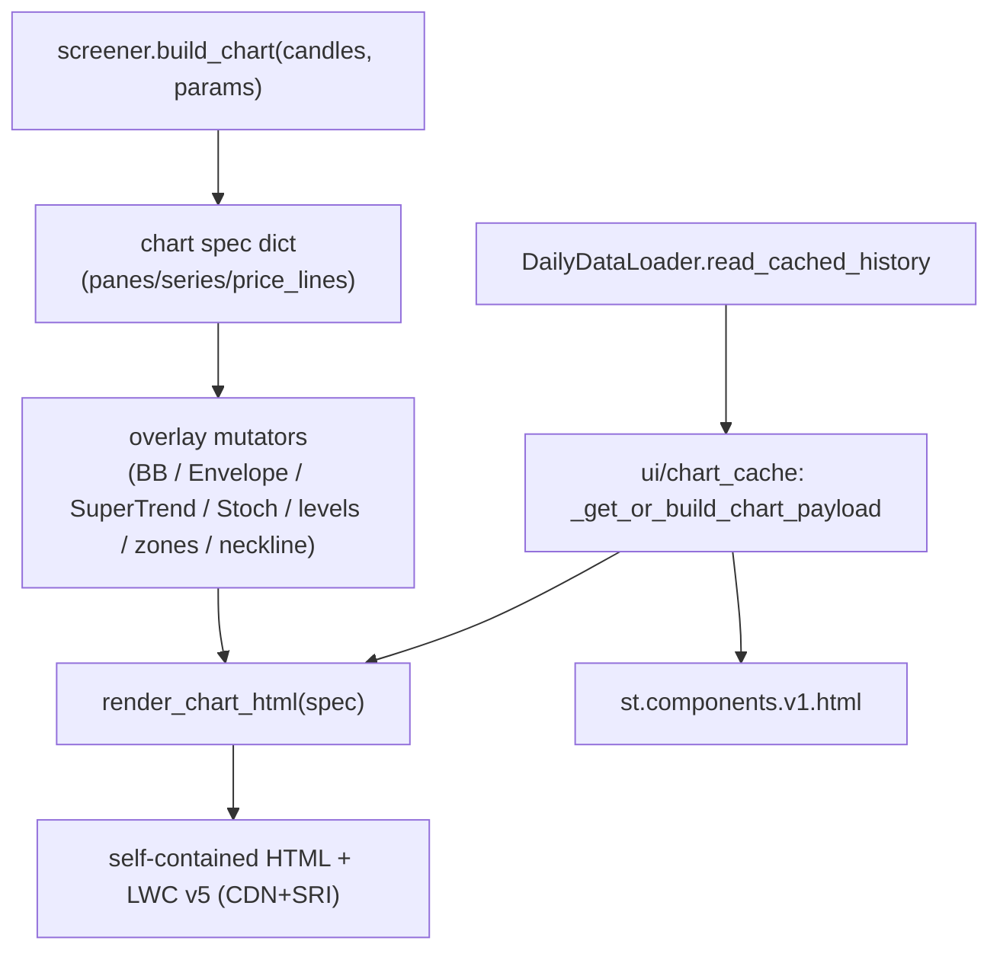

# LLD — Charts & visualization

| | |
|---|---|
| **Component** | Lightweight-Charts spec builders + per-session chart cache |
| **Source** | [`backend/charts.py`](../../../backend/charts.py), [`ui/chart_cache.py`](../../../ui/chart_cache.py) |
| **Layer** | Screening engine output + UI (`backend/` + `ui/`) |
| **Status** | Stable (lightweight-charts-migration + TA overlay expansion) |
| **Related** | [HLD](../high-level-design.md) · [screener-framework.md](screener-framework.md) · [indicators.md](indicators.md) · [app-orchestration.md](app-orchestration.md) · [security.md](security.md) |

## 1. Purpose & responsibilities

Turn a screener's candles into an **interactive TradingView Lightweight Charts v5**
widget. `charts.py` builds a JSON-serializable **chart spec** (panes + series +
price-lines) and renders it to a self-contained HTML doc; `ui/chart_cache.py`
memoizes that expensive render per Streamlit session.

**Why Lightweight Charts (not Plotly)**: native drag-to-scale price axis — the
TradingView-style interaction Plotly can't do.

## 2. Position in the system

## 3. Public interface

### `backend/charts.py`
| Symbol | Contract |
|---|---|
| `candlestick_with_volume(candles, title, *, ha=False)` | 2-pane spec (price+volume); `ha=True` plots Heikin Ashi. |
| `candlestick_volume_oscillator(candles, title, *, ha=False)` | 3-pane spec (price/volume/empty oscillator). |
| `add_line_overlay` / `add_series_markers` | Append a line / markers to a pane. |
| `add_supertrend_overlay` | Bicolor SuperTrend drawn as contiguous same-direction **runs** (LWC connects across gaps in one series). |
| `add_bollinger_overlay` / `add_envelope_overlay` / `add_stochastic_overlay` | Indicator overlays (stoch adds OS/OB guide lines). |
| `add_levels_overlay` | Relevance-weighted S/R: line **width scales with `relevance`**, color by kind, solid. |
| `add_zone_overlays` | FVG / order-block bands as dotted top/bottom lines (no native rectangle in v5). |
| `add_neckline_overlay` | Single dashed double-top/bottom breakout level. |
| `render_chart_html(spec)` | Spec → HTML; **`allow_nan=False`** + `</`→`<\/` escaping (HTML-injection defense); pinned CDN + **SRI integrity hash**. |

### `ui/chart_cache.py`
`_get_or_build_chart_payload(selected, symbol, security_id, data_loader, params_for_chart)` → cached/rebuilt `_ChartRenderPayload(html, height, from_cache)`. Cache key = screener + symbol + security_id + **candle-file mtime** + params digest; bounded LRU (16) in `st.session_state`; schema-versioned (`_CHART_PAYLOAD_SCHEMA`).

## 4. Key design decisions & trade-offs

| Decision | Rationale | Alternative rejected |
|---|---|---|
| **Generic spec → generic JS** | No per-screener JavaScript; any spec renders via one template. | Per-chart JS — unmaintainable. |
| **Pinned CDN + SRI integrity** | Browser refuses altered bytes for the pinned LWC version (supply-chain guard). | Unpinned/no-SRI — silent tampering risk. |
| **`allow_nan=False` + `</` escaping** | Stray NaN fails loudly (builders already convert NaN→whitespace); embedded JSON can't break out of `<script>`. | Lenient JSON — invalid data / injection. |
| **SuperTrend as runs** | One bicolor line that flips sides; LWC connects gaps within a series and two series look like a channel. | Single/two series — visual artifacts. |
| **Zones as dotted line pairs** | LWC v5 has no filled rectangle here; dotted top/bottom carry the demand/supply band forward. | Skip zones — lose price-action context. |
| **Cache keyed on candle mtime** | A fresh prefetch changes mtime → chart rebuilds; otherwise reuse (avoids re-render on every rerun/row click). | Time TTL — stale after prefetch / needless rebuilds. |
| **session_state cache, not `st.cache_data`** | Payload depends on the screener's Python callable; avoids hashing function objects. | `st.cache_data` — function-hashing friction. |

## 5. Failure modes

- Empty/missing candles → `_empty_spec(...)` renders a "no candles available" placeholder.
- CDN fails in browser → the page shows "Chart library failed to load".
- Malformed cached payload → dropped, rebuilt from disk.

## 6. Testing

- [`tests/test_charts.py`](../../../tests/test_charts.py) — spec builders, overlays, NaN→whitespace, HTML escaping, SuperTrend run-splitting.

## 7. Extension points

A new overlay is a new `add_*` mutator appending series/price-lines to a pane — no renderer change. New colors go in the single `_COLORS` dict (re-themes the whole app). Bump `_CHART_PAYLOAD_SCHEMA` when the cached payload shape changes.
