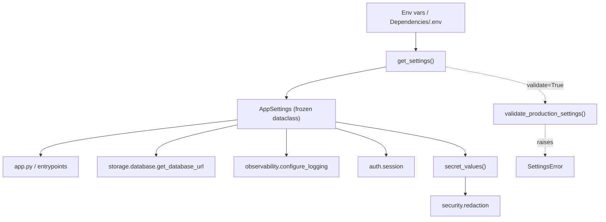

# LLD — Configuration (`backend/config`)

| | |
|---|---|
| **Component** | Runtime configuration / settings |
| **Source** | [`backend/config/settings.py`](../../../backend/config/settings.py), [`backend/config/__init__.py`](../../../backend/config/__init__.py) |
| **Layer** | Foundation (leaf utility — imported by almost everything) |
| **Status** | Stable (DEPLOY-004) |
| **Related** | [HLD](../high-level-design.md) · [security.md](security.md) · [observability.md](observability.md) · [authentication.md](authentication.md) · [data-acquisition.md](data-acquisition.md) |

## 1. Purpose & responsibilities

Turn the loose bag of environment-variable strings (from the shell, the hosting
platform, or `Dependencies/.env`) into **one typed, immutable settings object**
(`AppSettings`) that the rest of the app reads. It is the single source of truth
for *where data lives*, *which credentials exist*, *how logging renders*, and
*whether the app is allowed to run in production*.

**Responsibilities**
- Parse + normalize env vars (booleans, log levels, log format, email sets, paths).
- Support legacy aliases during migration (`SCANNER_ENV`→`APP_ENV`, `DHAN_CLIENT_CODE`→`DHAN_CLIENT_ID`).
- Derive all runtime directory paths from `DATA_DIR` (universe CSVs, parquet cache, fundamentals cache, PDFs).
- **Fail closed in production** (`validate_production_settings`).
- Expose secret-safe summaries (`safe_dict`, custom `__repr__`) and the list of secret values for redaction (`secret_values`).

**Non-responsibilities**
- Does **not** read `st.secrets` (Google OIDC config lives there — see [authentication.md](authentication.md)).
- Does **not** create the DB engine (that is [storage-persistence.md](storage-persistence.md)).
- Does **not** itself perform redaction — it only *supplies* the secret values to [security.md](security.md).

## 2. Position in the system

`backend/config/__init__.py` is a **compatibility shim**: it re-exports the
settings API plus snapshot path constants (`DATA_DIR`, `UNIVERSE_DIR`,
`DAILY_CACHE_DIR`, …) so legacy `from backend.config import DATA_DIR` imports keep
working after `config.py` became the `config/` package.

## 3. Public interface

| Symbol | Kind | Contract |
|---|---|---|
| `AppSettings` | frozen dataclass | Typed config; `repr=False` + custom `__repr__` so secrets never print. Properties: `is_production`, `universe_dir`, `daily_cache_dir`, `fundamentals_cache_dir`, `fundamentals_pdf_dir`. Methods: `safe_dict()`. |
| `get_settings(*, env=None, validate=False)` | fn | Build settings from `os.environ` (after `load_environment()`), or from an injected `env` mapping in tests. |
| `validate_production_settings(settings=None)` | fn | Raise `SettingsError` if production is missing `DATABASE_URL`/`DATA_DIR`/Dhan creds, has `AUTH_REQUIRED=false`, or has no allow/admin email. |
| `get_dhan_credentials(required=False)` | fn | `DhanCredentials | None`; raises with setup hint when `required=True` and missing. |
| `secret_values(settings=None)` | fn | List of configured secret strings for the redactor. |
| `get_fundamentals_model()` | fn | `CLAUDE_AGENT_MODEL` or default `claude-sonnet-4-6`. |
| `get_agent_fast_mode()` | fn | `SCANNER_AGENT_FAST_MODE` truthiness. |
| `credential_status()` | fn | UI-friendly booleans (no secret values). |
| `ensure_project_dirs()` | fn | `mkdir -p` the runtime folder skeleton (dirs only, never files). |
| `dhan_request_delay_seconds()` / `dhan_rate_limit_retry_delays()` | fn | Dhan pacing knobs (defaults `0.5s` / `[2,5,10]s`). |
| `SettingsError` | exc | Signals *config* problems, distinct from screener/network bugs. |

## 4. Key design decisions & trade-offs

| Decision | Rationale | Alternative rejected |
|---|---|---|
| **Frozen dataclass with `repr=False` + custom `__repr__`** | A default repr would print API keys/DB passwords into logs and test failures. `safe_dict()` reports *presence* (`has_serpapi_api_key`) not value. | Plain dataclass / dict — leaks secrets. |
| **Paths resolved from `__file__`, not CWD** | `PROJECT_ROOT = Path(__file__).resolve().parents[2]` — running `python app.py` from any folder still finds `Dependencies/`, `data/`, `screeners/`. | `Path.cwd()` — breaks when launched elsewhere. |
| **Two "from_env" flags** (`database_url_from_env`, `data_dir_from_env`) | Production validation must distinguish "operator configured this" from "we silently fell back to a local default". | Inferring from value — can't tell a real SQLite URL from the fallback. |
| **`status`/env legacy aliases via `_env_value`** | New canonical names win, old `.env` files keep working during migration. | Hard rename — breaks existing local setups. |
| **Email lists as immutable lowercase `frozenset`** | Case/space-insensitive allowlist comparisons that can't be mutated behind the settings module's back. | Mutable list — accidental mutation, case bugs. |
| **`__init__.py` snapshot constants** | Legacy callers want startup paths; the snapshot is taken from live settings at import so a pre-startup `DATA_DIR` still redirects everything. | Forcing every caller onto `get_settings()` — large churn. |
| **`SettingsError` swallowed in `__init__.py`** | A malformed value must not break importing path constants (app, Alembic `env.py`, storage all import `backend.config`); the real error is re-raised at startup by `get_settings`/`validate_*`. | Let import crash — obscure failure far from the cause. |

## 5. Failure modes

- Invalid `LOG_LEVEL` / `LOG_FORMAT` / `AUTH_REQUIRED` → `SettingsError` with the allowed set named.
- Production missing required config → `SettingsError` listing every missing/unsafe item at once.
- `python-dotenv` not installed → `load_environment()` is a no-op; env still read from the process.
- `get_dhan_credentials(required=True)` missing creds → `RuntimeError` pointing at `.env.example` and the token-setup script.

## 6. Configuration surface (env vars)

`APP_ENV`(`SCANNER_ENV`) · `DATA_DIR` · `DATABASE_URL` · `ALLOWED_EMAILS` · `ADMIN_EMAILS` ·
`ANTHROPIC_API_KEY` · `SERPAPI_API_KEY` · `DHAN_CLIENT_ID`(`DHAN_CLIENT_CODE`) · `DHAN_ACCESS_TOKEN` ·
`LOG_LEVEL`(+`SCANNER_DEBUG`) · `LOG_FORMAT` · `AUTH_REQUIRED` · `CLAUDE_AGENT_MODEL` ·
`SCANNER_AGENT_FAST_MODE` · `SCANNER_DHAN_REQUEST_DELAY_SECONDS` · `SCANNER_DHAN_RATE_LIMIT_RETRY_DELAYS`.

## 7. Testing

- [`tests/test_settings.py`](../../../tests/test_settings.py) — parsing, aliases, production validation, secret-safe repr.
- [`tests/test_config.py`](../../../tests/test_config.py) — legacy export surface + path constants.

Tests inject `env={...}` into `get_settings` so they never read the developer's real `.env`.

## 8. Extension points

Add a new setting in one visible block: add the `AppSettings` field, parse it in `get_settings(...)`, add a production rule (if needed) in `validate_production_settings`, and cover it in `tests/test_settings.py`. If it is secret-like, also add it to `secret_values()`.
