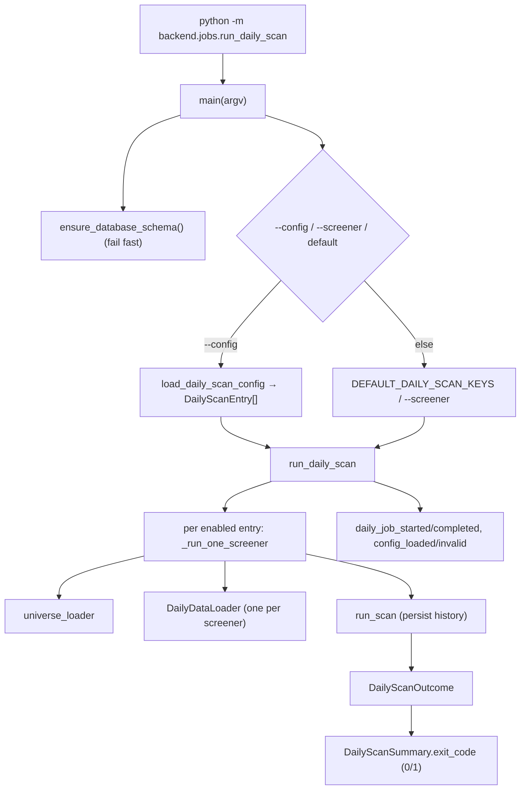

# LLD — Daily scan job (`backend/jobs`)

| | |
|---|---|
| **Component** | Headless daily-scan CLI + YAML schedule loader |
| **Source** | [`backend/jobs/run_daily_scan.py`](../../../backend/jobs/run_daily_scan.py), [`backend/jobs/daily_scan_config.py`](../../../backend/jobs/daily_scan_config.py) |
| **Layer** | Entrypoint (`backend/`) — UI-free |
| **Status** | Stable (JOB-001 CLI · JOB-002 config schedule) |
| **Related** | [HLD](../high-level-design.md) · [scan-service-and-provenance.md](scan-service-and-provenance.md) · [screener-framework.md](screener-framework.md) · [data-acquisition.md](data-acquisition.md) · [observability.md](observability.md) · [storage-persistence.md](storage-persistence.md) |

## 1. Purpose & responsibilities

A schedulers/cron/host-friendly command that runs scans **without Streamlit** and
reports success/failure via the **process exit code**. It is "small and boring":
it owns no indicator math, widgets, or SQL — it wires the existing services
together and is stricter than the UI about persistence.

- `python -m backend.jobs.run_daily_scan` → the deterministic default set (`bollinger_band_reversal`, `heikin_ashi_supertrend`, `envelope_knoxville_buy`).
- `--screener KEY` (repeatable, JOB-001) **or** `--config schedule.yaml` (JOB-002) — mutually exclusive.

## 2. Position in the system

## 3. Public interface

| Symbol | Contract |
|---|---|
| `main(argv=None, *, job_runner=run_daily_scan, schema_bootstrapper=ensure_database_schema, output=None) -> int` | Parse args, migrate, dispatch, return exit code. Injectable for tests. |
| `run_daily_scan(*, screener_keys=None, scan_entries=None, registry_loader, universe_loader, data_client_factory, data_loader_factory, scan_runner, session_factory, today, output) -> DailyScanSummary` | Heavy DI surface; production uses defaults, tests pass fakes (no Dhan/network/DB/Streamlit). |
| `DailyScanOutcome` | frozen: `screener_key, universe_key?, status?, run_id?, row_count, fatal, message` (concise, secret-safe). |
| `DailyScanSummary.exit_code` | `1` if any outcome `fatal`, else `0`. |
| `TRIGGERED_BY = "job:daily_scan"` | Audit identity persisted to `scan_runs`. |
| `load_daily_scan_config(path) -> list[DailyScanEntry]` / `DailyScanEntry` / `DailyScanConfigError` | YAML shape-validation only (registry-free). |

## 4. Key design decisions & trade-offs

| Decision | Rationale | Alternative rejected |
|---|---|---|
| **Exit-code is the contract; stricter than the UI** | Schedulers branch on exit code. A missing `run_id` (history not persisted) is **fatal** here even though the UI is best-effort — a daily job is only useful if tomorrow's history/comparison can query what ran. | Mirror UI best-effort — silent no-history runs. |
| **PARTIAL is not fatal** | SCAN-003 already recorded which symbols failed; operators can still use the history. | Fail on partial — noisy. |
| **Migrate before any work (`schema_bootstrapper`)** | Don't spend broker/API quota on a run that can't persist; exit 1 + completion receipt if the schema is unavailable. | Run then fail to persist — wasted quota. |
| **Keep going after one bad entry** | A config with one typo + two valid screeners still runs the valid work (useful history) and still returns exit 1. | Abort whole batch — lose good scans. |
| **Config loader is registry-free** | Validates only *shape*; "does this screener/universe exist?" is answered at run time (one source of truth) and stays trivially unit-testable. | Validate existence in loader — duplicate logic, heavy import. |
| **`--screener` vs `--config` mutually exclusive** | "I passed both" is a clear argparse error, not a silent precedence surprise. | Silent precedence — confusing. |
| **One `DailyDataLoader` per screener** | Loader holds per-run stats (`last_failures`, cache counts); a fresh loader scopes them to the screener whose status is persisted. | Shared loader — mixed stats. |
| **Copy registry default params before mutating** | Registry metadata is process-shared; apply config overrides then add dates last so a config can't override run dates or leak into other runs. | Mutate in place — cross-run leakage. |
| **All operator output secret-safe** | `redact_exception`/`redact_text`; `_print_outcome` never receives raw exceptions. | Print `str(exc)` — leak. |

## 5. Failure modes / exit codes

- Schema unavailable → exit 1 (+ `daily_job_completed` receipt).
- Bad/empty config → exit 1 (+ `daily_job_config_invalid`).
- Unknown screener key → that entry fatal, others run, exit 1.
- Setup failure (universe/creds/loader) → fatal outcome for that screener.
- `run_id is None` (no history) or `FAILED` status → fatal. `SUCCESS`/`PARTIAL` with a `run_id` → exit 0.

## 6. Observability

`daily_job_started` (selection mode), `daily_job_config_loaded`/`config_invalid`, `daily_job_completed` (exit code + success/partial/failed counts + duration). `LOG_FORMAT=json` for log aggregators. See [observability.md](observability.md).

## 7. Testing

- [`tests/test_daily_scan_job.py`](../../../tests/test_daily_scan_job.py) — full DI: outcomes, exit codes, unknown key, partial, schema-unavailable, arg parsing.
- [`tests/test_daily_scan_config.py`](../../../tests/test_daily_scan_config.py) — YAML shape validation, error messages, disabled entries.

## 8. Extension points

A new scheduled batch is a YAML entry (`name` + `screener_key` [+ `universe_key`/`params`]). A new selection source plugs into `main`'s dispatch. The job reuses `run_scan` verbatim — backend changes need no job edits.
