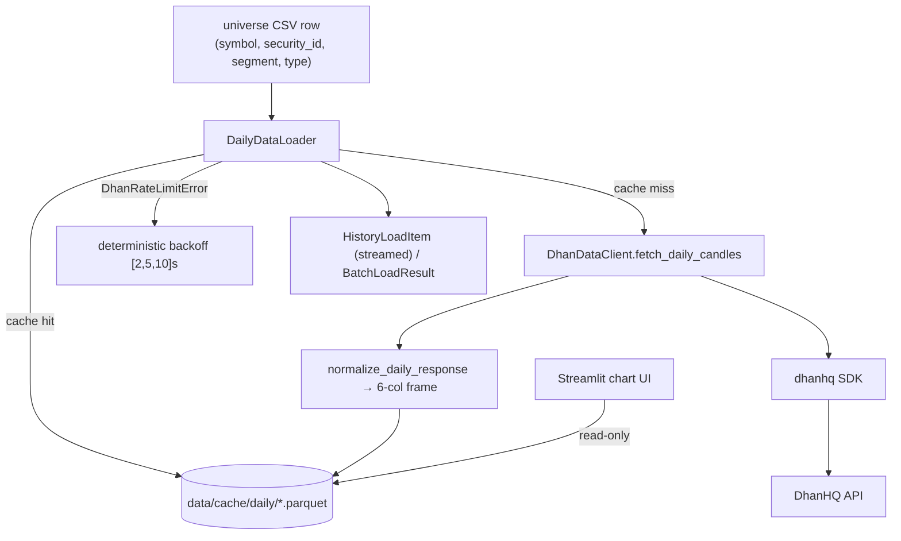

# LLD — Data acquisition (Dhan client + daily candle cache)

| | |
|---|---|
| **Component** | Market-data acquisition + local candle cache |
| **Source** | [`backend/dhan_client.py`](../../../backend/dhan_client.py), [`backend/daily_data_loader.py`](../../../backend/daily_data_loader.py), [`Dependencies/dhan_token_setup.py`](../../../Dependencies/dhan_token_setup.py) |
| **Layer** | Data plumbing (`backend/`) |
| **Status** | Stable (+ DH-904 rate-limit handling, perf-001 streaming) |
| **Related** | [HLD](../high-level-design.md) · [configuration.md](configuration.md) · [universe-management.md](universe-management.md) · [screener-framework.md](screener-framework.md) · [app-orchestration.md](app-orchestration.md) |

## 1. Purpose & responsibilities

Be the *only* place that talks to the DhanHQ broker API, and turn its candle
responses into a uniform on-disk Parquet cache that every screener reads.

**Responsibilities**
- `DhanDataClient` — wrap the SDK; normalize any wire shape into the canonical
  6-column frame `timestamp, open, high, low, close, volume`.
- Detect Dhan **rate-limit (DH-904)** responses and raise `DhanRateLimitError`.
- `DailyDataLoader` — one Parquet file per `(symbol, security_id)`; incremental
  top-up; deterministic backoff; per-symbol failure capture; a streaming iterator.
- `dhan_token_setup.py` — one-time interactive OAuth helper that writes
  `DHAN_ACCESS_TOKEN` into `Dependencies/.env`.

**Non-responsibilities**
- No strategy logic (that is [screener-catalog.md](screener-catalog.md)).
- No universe membership (that is [universe-management.md](universe-management.md)).
- The Streamlit UI **never fetches live** — it reads cache only (`read_cached_history`).

## 2. Position in the system

## 3. Public interface

### `backend/dhan_client.py`
| Symbol | Contract |
|---|---|
| `DhanDataClient(credentials=None, raw_client=None)` | Builds an authed SDK client via `DhanContext`; tests inject `raw_client`. `from_env()` classmethod. |
| `.fetch_daily_candles(security_id, exchange_segment, instrument_type, from_date, to_date)` | Returns normalized 6-col frame. |
| `normalize_daily_payload` / `normalize_daily_response` | Tolerate dict-of-arrays or list-of-dicts; coerce numerics; "no data" → empty frame (not an error); status≠success → `RuntimeError`. |
| `infer_epoch_unit` | Guess s/ms/µs from magnitude. |
| `DhanRateLimitError` | Retryable DH-904 signal. |

### `backend/daily_data_loader.py`
| Symbol | Contract |
|---|---|
| `DailyDataLoader(client, cache_dir, request_delay_seconds, rate_limit_retry_delays, fetch_timeout_seconds, max_consecutive_failures, sleep_func)` | `client=None` ⇒ cache-only mode (fetches fail loudly). |
| `.read_cached_history(symbol, security_id)` | Disk-only read (chart UI path); empty frame if missing/corrupt. |
| `.get_daily_history(instrument, start, end, force_refresh=False)` | `(frame, served_from_cache)`; **cache hit only when the file covers the entire requested range.** |
| `.ensure_daily_history(instrument, years_back=10, today=None)` | `(frame, status)` where status ∈ `fresh`/`incremental`/`fresh_download`/`backfilled`. The prefetch engine. |
| `.iter_universe_history(...)` | Yields `HistoryLoadItem` per symbol (streaming — compute as you load). |
| `.load_universe_history(...)` | Batch wrapper → `BatchLoadResult` (frames + failures + counters). |
| `.cleanup_legacy_cache_files()` / `.cleanup_stale_cache_files(max_age_days=...)` | Cache hygiene. |
| `history_start_date(years_back, today)` | Leap-safe "subtract whole years" (Feb 29 → Feb 28). |
| `safe_file_stem(value)` | Path-traversal-safe filename fragment. |

## 4. Key design decisions & trade-offs

| Decision | Rationale | Alternative rejected |
|---|---|---|
| **Normalize at the boundary** | Screeners get one stable 6-col frame; SDK wire-shape changes are absorbed here. | Per-screener parsing — duplicated, fragile. |
| **One file per `(symbol, security_id)`, no date in name** | Different scan windows reuse one growing cache; incremental top-up only fetches missing tail. | Date-range filenames (legacy) — duplicate files, re-fetches. `cleanup_legacy_cache_files` removes those. |
| **Cache hit requires full-range coverage** | A partial parquet (interrupted prefetch) would silently run a long-lookback screener on too little data. | Slice whatever exists — silent wrong results. |
| **`.checked` sidecar marker** | Remembers a no-new-rows tail (weekend/holiday) so the next launch doesn't re-pay for the same empty request. | Re-request every launch — wasted quota. |
| **Deterministic DH-904 backoff `[2,5,10]s`** | Predictable, testable retry without random jitter; raises after the list is exhausted. | Infinite/exponential random retry — unbounded, flaky tests. |
| **Optional wall-clock timeout via worker thread** | The SDK exposes no timeout; a thread + `future.result(timeout)` lets a stuck call not freeze the Streamlit run (Python can't kill it, but `shutdown(wait=False)` moves on). | Block forever — frozen UI. |
| **`client=None` cache-only mode fails loudly on fetch** | Chart UI / cleanup can build a loader without creds, but a real fetch attempt raises a clear error not `AttributeError`. | Silent no-op — confusing empty results. |
| **Circuit breaker (`max_consecutive_failures`)** | Protects the user and Dhan after repeated broker errors; still yields a failure item per skipped symbol for complete diagnostics. | Keep hammering — quota burn / hang. |
| **Streaming `iter_universe_history`** | Strategy can compute per-symbol without holding the whole universe in memory (perf-001). | Batch-only — memory pressure on large universes. |
| **Timestamps stored as IST-naive** | Matches local CSV conventions; avoids tz surprises in tables/charts. | Keep tz-aware UTC — display friction here. |

## 5. Failure modes / degradation

- Per-symbol fetch exception → redacted message captured in `BatchLoadResult.failures` + `external_api_failed` log event ([observability.md](observability.md)); the scan continues (→ `partial`).
- Corrupt/empty/all-NaT parquet → treated as no cache, full re-download.
- Rate limit beyond retry budget → `DhanRateLimitError` propagates.
- Missing creds at fetch time (`required=True`) → `RuntimeError` with setup hint.

## 6. Configuration & dependencies

`DHAN_CLIENT_ID`/`DHAN_ACCESS_TOKEN` (via [configuration.md](configuration.md)); pacing knobs `SCANNER_DHAN_REQUEST_DELAY_SECONDS`, `SCANNER_DHAN_RATE_LIMIT_RETRY_DELAYS`. External: `dhanhq` SDK, `pandas`/`pyarrow`. Cache dir `DATA_DIR/cache/daily`.

## 7. Testing

- [`tests/test_dhan_client.py`](../../../tests/test_dhan_client.py) — payload normalization, epoch inference, rate-limit detection, "no data".
- [`tests/test_daily_data_loader.py`](../../../tests/test_daily_data_loader.py) — cache hit/miss, incremental/backfill statuses, `.checked` marker, retries, circuit breaker, cleanup, streaming.

## 8. Extension points

Add a new instrument type by passing different `exchange_segment`/`instrument_type` on the universe row — the loader is shape-agnostic. A new timeframe would mean a sibling loader + cache dir rather than overloading this daily one.
