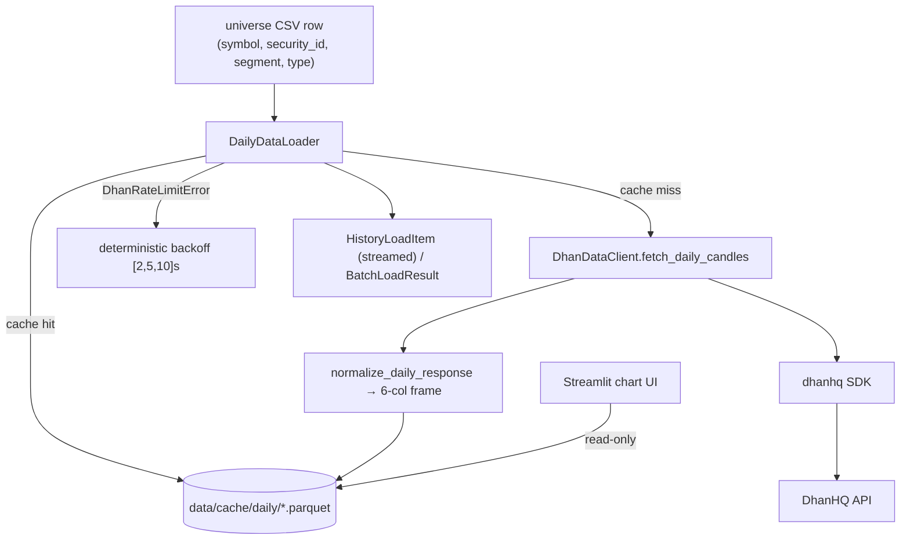

# LLD — Data acquisition (Dhan client + daily candle cache)

| | |
|---|---|
| **Component** | Market-data acquisition + local candle cache |
| **Source** | [`backend/dhan_client.py`](../../../backend/dhan_client.py), [`backend/daily_data_loader.py`](../../../backend/daily_data_loader.py), [`Dependencies/dhan_token_setup.py`](../../../Dependencies/dhan_token_setup.py) |
| **Layer** | Data plumbing (`backend/`) |
| **Status** | Stable (+ DH-904 rate-limit handling, perf-001 streaming) |
| **Related** | [HLD](../high-level-design.md) · [configuration.md](configuration.md) · [universe-management.md](universe-management.md) · [data-quality.md](data-quality.md) · [screener-framework.md](screener-framework.md) · [app-orchestration.md](app-orchestration.md) |

## 1. Purpose & responsibilities

Be the *only* place that talks to the DhanHQ broker API, and turn its candle
responses into a uniform on-disk Parquet cache that every screener reads.

**Responsibilities**
- `DhanDataClient` — wrap the SDK; normalize any wire shape into the canonical
  6-column frame `timestamp, open, high, low, close, volume`.
- Detect Dhan **rate-limit (DH-904)** responses and raise `DhanRateLimitError`.
- `DailyDataLoader` — one Parquet file per `(symbol, security_id)`; incremental
  top-up; deterministic backoff; per-symbol failure capture; a streaming iterator.
- `dhan_token_setup.py` — one-time interactive OAuth helper that writes
  `DHAN_ACCESS_TOKEN` into `Dependencies/.env`.

**Non-responsibilities**
- No strategy logic (that is [screener-catalog.md](screener-catalog.md)).
- No universe membership (that is [universe-management.md](universe-management.md)).
- The **chart** path is cache-only (`read_cached_history`); a **screener run** in the UI builds a live `DhanDataClient` and *will* fetch on a cache miss via `get_daily_history` — the `python app.py` prefetch normally makes those cache hits.

## 2. Position in the system

```mermaid
flowchart TD
    UCSV["universe CSV row\n(symbol, security_id, segment, type)"] --> L["DailyDataLoader"]
    L -->|cache hit| PARQ[("data/cache/daily/*.parquet")]
    L -->|cache miss| C["DhanDataClient.fetch_daily_candles"]
    C --> SDK["dhanhq SDK"] --> DHAN["DhanHQ API"]
    C --> NORM["normalize_daily_response → 6-col frame"]
    NORM --> PARQ
    L -->|DhanRateLimitError| RETRY["deterministic backoff [2,5,10]s"]
    L --> ITEM["HistoryLoadItem (streamed) / BatchLoadResult"]
    UI["Streamlit chart UI"] -->|read-only| PARQ
```

## 3. Public interface

### `backend/dhan_client.py`
| Symbol | Contract |
|---|---|
| `DhanDataClient(credentials=None, raw_client=None)` | Builds an authed SDK client via `DhanContext`; tests inject `raw_client`. `from_env()` classmethod. |
| `.fetch_daily_candles(security_id, exchange_segment, instrument_type, from_date, to_date)` | Returns normalized 6-col frame. |
| `normalize_daily_payload` / `normalize_daily_response` | Tolerate dict-of-arrays or list-of-dicts; coerce numerics; "no data" → empty frame (not an error); status≠success → `RuntimeError`. |
| `infer_epoch_unit` | Guess s/ms/µs from magnitude. |
| `DhanRateLimitError` | Retryable DH-904 signal. |

### `backend/daily_data_loader.py`
| Symbol | Contract |
|---|---|
| `DailyDataLoader(client, cache_dir, request_delay_seconds, rate_limit_retry_delays, fetch_timeout_seconds, max_consecutive_failures, fetch_workers, sleep_func)` | `client=None` ⇒ cache-only mode (fetches fail loudly). `fetch_workers` (1–8, default 1 via `SCANNER_DHAN_FETCH_WORKERS`) opts into parallel fetch behind a shared `_RequestPacer` (PERF-001). |
| `.read_cached_history(symbol, security_id)` | Disk-only read (chart UI path); empty frame if missing/corrupt. |
| `.get_daily_history(instrument, start, end, force_refresh=False, *, allow_unpublished_tail=False)` | `(frame, served_from_cache)`; direct and historical callers require complete weekday coverage. Only scanner universe loading explicitly opts into a bounded current-session/weekend/marker tail. |
| `.ensure_daily_history(instrument, years_back=10, today=None)` | `(frame, status)` where status ∈ `fresh`/`incremental`/`fresh_download`/`backfilled`. The prefetch engine. |
| `.fetch_window(instrument, start, end)` | Network-only fetch (same pacing, DH-904 backoff, and optional timeout) that **does not write the cache**. Added for the DATA-002 repair, which merges a bounded window *over* existing history — writing it directly would truncate a ten-year file to that window. An empty frame means the vendor has no rows there, not an error. |
| `.iter_universe_history(...)` | Yields `HistoryLoadItem` per symbol (streaming — compute as you load). |
| `.load_universe_history(...)` | Batch wrapper → `BatchLoadResult` (frames + failures + counters). |
| `.cleanup_legacy_cache_files()` / `.cleanup_stale_cache_files(max_age_days=...)` | Cache hygiene. |
| `history_start_date(years_back, today)` | Leap-safe "subtract whole years" (Feb 29 → Feb 28). |
| `safe_file_stem(value)` | Path-traversal-safe filename fragment. |

### DATA-004 `.firstbar` earliest-history evidence

When a vendor request begins before a stock listed, the returned frame begins at
the stock's earliest available candle. `DailyDataLoader` stores that answer next
to the parquet as `<symbol>_<security-id>.firstbar`, a JSON object with canonical
`requested_from`, `earliest_available`, and `recorded_on` dates. The public cache
contract remains strict: a request is front-complete only when the parquet first
date literally reaches `requested_start`, or a fresh qualifying `.firstbar`
exists **and its `earliest_available` exactly equals the parquet first date**.
The exact binding prevents contradictory cache/sidecar dates from certifying
history that cannot be proved complete.

The marker is internal, optional evidence—not a user input or a database record.
Its JSON reader accepts only a JSON object with string `YYYY-MM-DD` fields and
the chronology `requested_from < earliest_available <= recorded_on`; extra fields
are ignored for forwards compatibility. Its 30-day TTL is measured against the
injected wall clock, not the requested data window. Future, stale (age 30 days or
more), malformed, noncanonical, or shallower-than-request evidence is ignored and
therefore causes a safe refetch. A shallow probe preserves a deeper marker only
while that marker is fresh; expired or future-dated evidence is replaced by the
new probe, without renewing a fresh marker's timestamp. An equally deep/deeper
non-empty response that still starts late replaces the marker; one that reaches
the requested start removes the now-obsolete marker best-effort. Empty/invalid
frames leave prior evidence unchanged.

`.firstbar` shares the cache lifecycle: it travels with its parquet and
`cleanup_stale_cache_files()` removes it when orphaned or when the associated
cache ages out. `tests/test_daily_data_loader_vendor_earliest.py` covers marker
creation, strict parsing/chronology, exact cache binding, wall-clock TTL,
shallower/equally-deep update rules, cleanup, and the request-bounded late-listing
vendor fixture.

## 4. Key design decisions & trade-offs

| Decision | Rationale | Alternative rejected |
|---|---|---|
| **Normalize exact rows at the boundary** | Screeners get one stable `timestamp, open, high, low, close, volume` frame; exact duplicates across all six canonical columns are removed before every cache write. Same-date rows that differ in any column remain for DATA-001/DATA-002 rather than silently picking a price. | Per-screener parsing or date-only de-duplication — duplicated, fragile, or able to hide a vendor conflict. |
| **One file per `(symbol, security_id)`, no date in name** | Different scan windows reuse one growing cache; incremental top-up only fetches missing tail. | Date-range filenames (legacy) — duplicate files, re-fetches. `cleanup_legacy_cache_files` removes those. |
| **Conservative direct cache coverage** | Historical and direct `get_daily_history` callers require every requested weekday candle; they ignore `.checked` evidence. Weekend-only gaps remain valid because no daily bar exists on those dates. | Infer that every request is a live scanner session — can silently feed incomplete history to forward-return calculations. |
| **Explicit scanner unpublished-tail opt-in** | Only the sequential and parallel universe-loading paths pass `allow_unpublished_tail=True`, allowing the current session's requested end and a `.checked`-verified weekday-holiday gap. The marker may rescue at most seven calendar days (`_MAX_TOLERABLE_GAP_DAYS = 7`), preventing a stale cache from being certified indefinitely. | Depend on a trading calendar or apply the relaxation to all callers — extra dependency or unsafe historical behavior. |
| **Deterministic DH-904 backoff `[2,5,10]s`** | Predictable, testable retry without random jitter; raises after the list is exhausted. | Infinite/exponential random retry — unbounded, flaky tests. |
| **Optional wall-clock timeout via worker thread** | The SDK exposes no timeout; a thread + `future.result(timeout)` lets a stuck call not freeze the Streamlit run (Python can't kill it, but `shutdown(wait=False)` moves on). | Block forever — frozen UI. |
| **`client=None` cache-only mode fails loudly on fetch** | Chart UI / cleanup can build a loader without creds, but a real fetch attempt raises a clear error not `AttributeError`. | Silent no-op — confusing empty results. |
| **Circuit breaker (`max_consecutive_failures`)** | Protects the user and Dhan after repeated broker errors; still yields a failure item per skipped symbol for complete diagnostics. | Keep hammering — quota burn / hang. |
| **Streaming `iter_universe_history`** | Strategy can compute per-symbol without holding the whole universe in memory. | Batch-only — memory pressure on large universes. |
| **Candle quality gate at the load boundary (DATA-001)** | Each successful frame is run through `validate_candles` ([data-quality.md](data-quality.md)); a **fatal** defect becomes a `phase="data_quality"` failure so scanners never see corrupt data, while warnings pass through. Reports are exposed on `BatchLoadResult.data_quality_reports` / `last_data_quality_reports` for the scan-run receipt. | Hand raw vendor candles straight to screeners — false signals from malformed/stale data. |
| **Opt-in parallel fetch + shared `_RequestPacer` (PERF-001)** | `fetch_workers>1` overlaps slow Dhan I/O, but one global pacer keeps the inter-request delay identical regardless of worker count — so parallelism never raises the actual Dhan request rate. Default stays 1 (sequential). | Per-worker delay — would multiply the global rate and risk DH-904. |
| **Timestamps stored as IST-naive** | Matches local CSV conventions; avoids tz surprises in tables/charts. | Keep tz-aware UTC — display friction here. |

## 5. Failure modes / degradation

- Per-symbol fetch exception → redacted message captured in `BatchLoadResult.failures` + `external_api_failed` log event ([observability.md](observability.md)); the scan continues (→ `partial`).
- Malformed cached parquet → the DATA-002 repair pass at the end of the prefetch attempts a fix (de-duplicate, re-download, or drop an impossible bar) and re-validates; see [data-quality.md](data-quality.md).
- Fatal candle quality defect → frame withheld as a `phase="data_quality"` failure + `candle_data_quality_failed` event (codes only); warning-only frames pass through with a `candle_data_quality_warning` event (DATA-001).
- Corrupt/empty/all-NaT parquet → treated as no cache, full re-download.
- Rate limit beyond retry budget → `DhanRateLimitError` propagates.
- Missing creds at fetch time (`required=True`) → `RuntimeError` with setup hint.

## 6. Configuration & dependencies

`DHAN_CLIENT_ID`/`DHAN_ACCESS_TOKEN` (via [configuration.md](configuration.md)); pacing/concurrency knobs `SCANNER_DHAN_REQUEST_DELAY_SECONDS`, `SCANNER_DHAN_RATE_LIMIT_RETRY_DELAYS`, `SCANNER_DHAN_FETCH_WORKERS` (PERF-001, default 1). External: `dhanhq` SDK, `pandas`/`pyarrow`. Cache dir `DATA_DIR/cache/daily`.

## 7. Testing

- [`tests/test_dhan_client.py`](../../../tests/test_dhan_client.py) — payload normalization, epoch inference, rate-limit detection, "no data".
- [`tests/test_daily_data_loader.py`](../../../tests/test_daily_data_loader.py) — cache hit/miss, conservative direct historical coverage, explicit sequential/parallel scanner tail opt-in, seven-day `.checked` marker bound, incremental/backfill statuses, retries, circuit breaker, cleanup, streaming.
- [`tests/test_candle_cache_write_paths.py`](../../../tests/test_candle_cache_write_paths.py) — all six cache-write paths, including malformed-cache recovery and incremental exact-row normalization while preserving conflicting same-date rows for data-quality reporting.

## 8. Extension points

Add a new instrument type by passing different `exchange_segment`/`instrument_type` on the universe row — the loader is shape-agnostic. A new timeframe would mean a sibling loader + cache dir rather than overloading this daily one.
