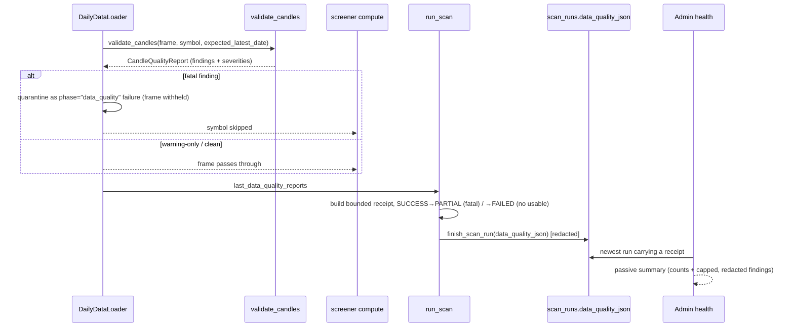

# LLD — Candle data quality (`backend/data_quality`)

| | |
|---|---|
| **Component** | Reusable OHLCV candle-quality validation + scan-time quarantine, receipt, and health surfacing |
| **Source** | [`backend/data_quality/candles.py`](../../../backend/data_quality/candles.py), [`backend/data_quality/__init__.py`](../../../backend/data_quality/__init__.py); integrated in [`daily_data_loader.py`](../../../backend/daily_data_loader.py), [`scanning/service.py`](../../../backend/scanning/service.py), [`health.py`](../../../backend/health.py), [`ui/health_page.py`](../../../ui/health_page.py) |
| **Layer** | Foundation checker (pure, no I/O) + boundary integration in the data/scan layers |
| **Status** | Stable (DATA-001A checker · DATA-001B integration) |
| **Related** | [HLD](../high-level-design.md) · [data-acquisition.md](data-acquisition.md) · [scan-service-and-provenance.md](scan-service-and-provenance.md) · [storage-persistence.md](storage-persistence.md) · [health-monitoring.md](health-monitoring.md) · [observability.md](observability.md) · [security.md](security.md) |

## 1. Purpose & responsibilities

Stop stale or malformed candle data from silently producing false signals
(EPIC 12 / DATA-001). A pure validator inspects each symbol's daily OHLCV frame
and returns a structured report; the loader **quarantines** frames with fatal
defects before any scanner consumes them, the scan service records a bounded
per-run **receipt** and downgrades the run's status, and Admin health surfaces
the newest receipt — all without re-fetching or mutating data.

**Two parts:**
- **DATA-001A — checker** (`candles.py`): `validate_candles(...)` → an immutable
  `CandleQualityReport` of `DataQualityFinding`s with stable codes/severities.
  Pure, dependency-light (stdlib + pandas), never mutates the caller's frame, no
  network.
- **DATA-001B — integration**: loader-boundary quarantine, the persisted
  `scan_runs.data_quality_json` receipt + status escalation, structured events,
  and the passive health summary.

## 2. Position in the system

## 3. Public interface

| Symbol | Contract |
|---|---|
| `validate_candles(df, *, symbol, expected_latest_date=None, required_columns=None, stale_tolerance_days=STALE_LATEST_TOLERANCE_DAYS) -> CandleQualityReport` | Pure validation of one daily OHLCV frame. Never mutates `df`. Accepts a `timestamp`/`date` column **or** a `DatetimeIndex`. |
| `CandleQualityReport` | Frozen: `symbol, row_count, latest_date, findings`; `.has_fatal_findings`, `.is_usable` (= no fatal). |
| `DataQualityFinding` | Frozen: `code, severity ("warning"|"fatal"), message, affected_rows`. |

**Finding codes**

| Severity | Codes |
|---|---|
| **fatal** (frame must not be scanned) | `EMPTY_FRAME`, `MISSING_REQUIRED_COLUMNS`, `MISSING_DATE_AXIS`, `INVALID_DATE`, `DUPLICATE_DATE`, `INVALID_NUMERIC_VALUE` (NaN/inf/non-numeric), `HIGH_BELOW_LOW`, `OPEN_OUTSIDE_RANGE`, `CLOSE_OUTSIDE_RANGE`, `NEGATIVE_VOLUME` |
| **warning** (usable, but recorded) | `STALE_LATEST_CANDLE`, `CALENDAR_DATE_GAP` (> `MAX_CALENDAR_GAP_DAYS`), `SUSPICIOUS_OVERNIGHT_PRICE_GAP` (> `SUSPICIOUS_OVERNIGHT_GAP_PCT`) |

The persisted receipt (`scan_runs.data_quality_json`, `schema_version=1`) carries
`expected_latest_date`, `checked_symbols`, `usable_symbols`, `warning_symbols`,
`fatal_symbols`, `warning_findings`, `fatal_findings`, `total_findings`,
`findings_truncated`, and a capped, redacted `findings` list.

## 4. Key design decisions & trade-offs

| Decision | Rationale | Alternative rejected |
|---|---|---|
| **Pure checker, structured findings (no printing/raising)** | Reusable and trivially unit-testable; callers decide how to act on severity. | Validate-and-log inside the loader — untestable, no reuse. |
| **Quarantine at the loader boundary** | One choke point catches every screener; fatal frames become `phase="data_quality"` loader failures *before* scanner math runs. | Per-screener checks — duplicated, easy to forget in a new screener. |
| **Fatal vs warning split** | Structurally impossible candles (high<low, NaN, dup dates) must block; merely stale/gappy data is still usable and only recorded. | All-or-nothing — either misses real corruption or discards usable data. |
| **Fatal → PARTIAL, all-fatal+empty → FAILED** | Truthful run status: a few bad symbols shouldn't fail the run, but a run with no usable data isn't a success. | Always SUCCESS — a false green; always FAILED — over-reacts to one bad symbol. |
| **Stale tolerance (`STALE_LATEST_TOLERANCE_DAYS`)** | Callers pass today's date as "expected", but the newest *trading* candle is normally a few days old (weekends/holidays/pre-EOD). A small calendar-day tolerance keeps the stale signal meaningful instead of flagging the whole universe every off-day. | Exact `<` comparison — fires for every symbol on weekends; a full trading-calendar dependency — heavier than a warning needs. |
| **Bounded receipt (`MAX_PERSISTED_FINDINGS`, fatal-first)** | A full-universe run can produce hundreds of findings; aggregate counts still describe the whole set, so only a fatal-first sample is persisted/rendered. `findings_truncated`/`total_findings` flag the omission. | Persist every finding — JSON-column and health-table bloat. |
| **Redact at every hop** | `redact_text` in the receipt builder, `normalize_secret_safe_json` on persist, `_redact_secrets` on render — defence in depth even though messages carry only symbol + code + thresholds. | Trust the message — a future finding could embed sensitive text. |

## 5. Failure modes / degradation

- Fatal candle defect → frame withheld from scanners (`phase="data_quality"` loader failure), `candle_data_quality_failed` logged (codes only), run → PARTIAL (or FAILED if no usable symbols remain).
- Warning-only frame → passes through, recorded in the receipt, `candle_data_quality_warning` logged.
- No reports (e.g. cached-only run with no fetches) → receipt is `None`; health shows "No scan has recorded … findings yet."
- Old runs / pre-DATA-001 receipts → nullable column + defensive `_copy_data_quality_run` parsing → health simply omits them.

## 6. Configuration & dependencies

Module constants in `candles.py`: `DEFAULT_REQUIRED_COLUMNS` (`open/high/low/close/volume`),
`MAX_CALENDAR_GAP_DAYS = 7`, `SUSPICIOUS_OVERNIGHT_GAP_PCT = 50.0`,
`STALE_LATEST_TOLERANCE_DAYS = 4`; `MAX_PERSISTED_FINDINGS = 50` in `scanning/service.py`.
Dependencies: stdlib + pandas only. No network, no settings, no secrets.

## 7. Testing

- [`tests/test_candle_data_quality.py`](../../../tests/test_candle_data_quality.py) — every finding code, stale tolerance boundary, gap thresholds, and input-immutability.
- [`tests/test_daily_data_loader.py`](../../../tests/test_daily_data_loader.py) — fatal frames quarantined before scan; warning-only frames pass through and log.
- [`tests/test_scan_service.py`](../../../tests/test_scan_service.py) — PARTIAL/FAILED escalation, secret-safe receipt, and the fatal-first findings cap.
- [`tests/test_health.py`](../../../tests/test_health.py) / [`tests/test_app_health_page.py`](../../../tests/test_app_health_page.py) — newest-receipt selection, redaction, truncation caption.
- [`tests/test_scan_storage_migrations.py`](../../../tests/test_scan_storage_migrations.py) / [`tests/test_scan_storage_repository.py`](../../../tests/test_scan_storage_repository.py) — `data_quality_json` column + secret-safe persistence.

## 8. Extension points

A new check = one helper in `candles.py` returning `DataQualityFinding`(s) with a
new stable code + matching tests; choose `fatal` only for structurally unusable
data. Reuse `validate_candles` anywhere a candle frame enters the system (e.g. a
future intraday loader) by calling it at that boundary and acting on
`report.is_usable`.
