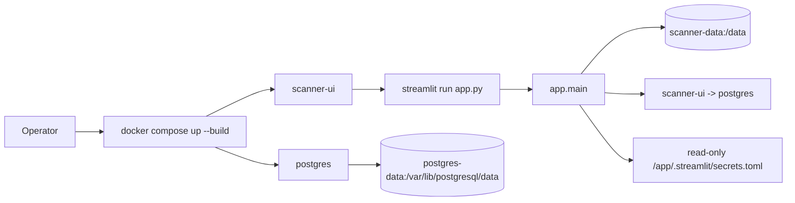

# LLD - Deployment runtime (`Dockerfile`, `docker-compose.yml`, `.dockerignore`)

| | |
|---|---|
| **Component** | Production container image + local production Docker Compose stack + CI image/stack gates (DEPLOY-001, DEPLOY-002) |
| **Source** | [`Dockerfile`](../../../Dockerfile), [`docker-compose.yml`](../../../docker-compose.yml), [`.dockerignore`](../../../.dockerignore), [`.env.example`](../../../.env.example), [`.github/workflows/quality-and-security.yml`](../../../.github/workflows/quality-and-security.yml) (`docker-build` job) |
| **Layer** | Deployment / packaging (no app logic - scanner behavior, schema, auth, and the daily job stay in the app layers) |
| **Status** | Stable (DEPLOY-001 image, DEPLOY-002 local production Compose stack) |
| **Related** | [HLD](../high-level-design.md) · [operations.md](../../operations.md) · [configuration.md](configuration.md) · [authentication.md](authentication.md) · [storage-persistence.md](storage-persistence.md) |

## 1. Purpose & responsibilities

Make the app repeatable to package and run. The Docker image owns Python
dependency installation, Streamlit startup, the exposed port, container health,
non-root execution, and a clean build context. The Compose stack owns the local
production topology: one app container, one private Postgres container, persistent
volumes, and a root `.env` file for operator-supplied settings.

This layer deliberately does **not** change scanner logic, database schema,
authentication behavior, or the daily-job command. It only provides a predictable
runtime around those existing contracts.

## 2. Position in the system

`scanner-ui -> postgres` is private to the Compose network. The Postgres service
has no host port, so a normal local production run opens only the Streamlit UI
port on the developer machine.

## 3. Public interface

| Surface | Contract |
|---|---|
| **Image build** | `docker build -t streamlit-scanner-app .` from the repo root. |
| **Compose startup** | `cp .env.example .env`, `cp .streamlit/secrets.example.toml .streamlit/secrets.toml`, then `docker compose up --build`. |
| **Services** | Exactly two long-lived services: `scanner-ui` and `postgres`. The optional daily job is a one-off `docker compose run`, not a daemon service. |
| **HTTP** | Streamlit listens on `0.0.0.0:8501`; Compose publishes `${SCANNER_UI_PORT:-8501}:8501`; the image declares `EXPOSE 8501`. |
| **Health** | Docker `HEALTHCHECK` probes `http://127.0.0.1:8501/_stcore/health`; Compose waits for `postgres` with `pg_isready` before starting `scanner-ui`. |
| **Runtime data** | `scanner-data` mounts at `/data`; `DATA_DIR=/data`. |
| **Database** | `postgres:16-bookworm` stores data in `postgres-data`; `DATABASE_URL=postgresql+psycopg://...@postgres:5432/...`. |
| **Secrets/config** | Root `.env` feeds non-secret and secret env values to Compose; `.streamlit/secrets.toml` is mounted read-only for Google OIDC. |
| **Daily job** | `docker compose run --rm scanner-ui python -m backend.jobs.run_daily_scan --config config/daily_scans.yaml`. |

## 4. Key design decisions & trade-offs

| Decision | Rationale | Alternative rejected |
|---|---|---|
| **`python:3.11-slim-bookworm` base** | 3.11 is the deployment target in CI; slim Debian keeps the runtime small and boring. | Full `python` image (bloat) / Alpine (musl wheel friction). |
| **Install `requirements.txt` constrained by `constraints.txt`, before `COPY . .`** | Runtime-only deps (no dev/optional accelerators); copying deps first lets Docker cache the install layer across source edits. | Install everything / copy source first - slower rebuilds, larger image. |
| **`streamlit run app.py`, not `python app.py`** | The plain-Python entrypoint does local prefetch-then-launch-browser; a container should become a web server immediately. | `python app.py` - would try to open a browser and run the prefetch wrapper at boot. |
| **Production + auth-required defaults** | A deployed image and Compose stack fail closed until real prod env + OIDC secrets are present. | Permissive defaults - an exposed container would run unauthenticated. |
| **Non-root `appuser`** | Least privilege; mutable state is confined to `/data` and the user's home cache. | Run as root - unnecessary privilege in a long-lived container. |
| **Compose has `scanner-ui` + `postgres` only** | The acceptance scope is app + database. The daily scan job can run on demand against the same volumes with `docker compose run`. | Add `scanner-job` now - more moving parts before scheduling semantics are designed. |
| **Postgres has no host port** | Only the app needs database access in normal local production mode; no host `5432` reduces accidental exposure. | Publish `5432:5432` by default - convenient but broader than the app needs. |
| **Separate `scanner-data` and `postgres-data` volumes** | Candle/cache resets should not wipe scan history, and DB resets should not require deleting app caches. | One shared volume - harder to reason about backups and resets. |
| **Secrets mounted, not baked** | `.streamlit/secrets.toml` contains Google OIDC credentials and belongs outside Docker layers and build context. | `COPY` secrets into the image - leaks through image history and registries. |
| **CI image + Compose smoke** | Local machines may lack Docker; CI proves both the image and the Compose stack start on every PR. | Trust docs/tests only - broken Compose could ship unnoticed. |

## 5. Failure modes / degradation

- **Missing production settings**: `app.main()` renders a runtime configuration
  error before scanner controls appear (fail closed).
- **Missing OIDC secrets in production**: Streamlit auth fails closed; the
  secrets file must be mounted or injected by the platform.
- **Unmounted `/data` outside Compose**: the image still starts, but generated
  candles/cache and the SQLite fallback are ephemeral. Compose prevents this by
  mounting `scanner-data` at `/data`.
- **Postgres not ready**: Compose uses `depends_on.condition=service_healthy`
  so `scanner-ui` starts only after `pg_isready` succeeds. App startup still owns
  migrations and database errors.
- **Bad root `.env` interpolation**: `docker compose config` fails before
  containers start.
- **Dockerfile / Compose drift**: the CI `docker-build` job fails the PR rather
  than shipping an unbuildable image or a broken local production stack.

## 6. Configuration & dependencies

- **Image-set environment** (overridable at runtime): `APP_ENV=production`,
  `AUTH_REQUIRED=true`, `DATA_DIR=/data`, `STREAMLIT_SERVER_ADDRESS=0.0.0.0`,
  `STREAMLIT_SERVER_PORT=8501`, `STREAMLIT_SERVER_HEADLESS=true`,
  `STREAMLIT_BROWSER_GATHER_USAGE_STATS=false`, plus `PYTHONDONTWRITEBYTECODE` /
  `PYTHONUNBUFFERED` / `PIP_NO_CACHE_DIR`.
- **Compose-set environment**: `DATABASE_URL` is constructed from
  `POSTGRES_USER`, `POSTGRES_PASSWORD`, and `POSTGRES_DB`; Dhan credentials,
  allow/admin emails, logging, and optional AI/search knobs come from root
  `.env`.
- **Runtime-injected** (not baked in): `DHAN_CLIENT_ID` / `DHAN_ACCESS_TOKEN`,
  `ALLOWED_EMAILS` / `ADMIN_EMAILS`, optional `SERPAPI_API_KEY` / Claude
  settings, and the mounted `secrets.toml`.
- **Python deps**: only `requirements.txt` + `constraints.txt`. Dev tools and
  optional `TA-Lib`/`pandas_ta` accelerators are intentionally excluded (the app
  falls back to pure-pandas indicators).
- **Build context (`.dockerignore`)**: excludes local secrets (`.env`,
  `Dependencies/.env`, `.streamlit/secrets.toml`), generated Dhan instrument
  CSVs, `data/cache/`, generated universe files, SQLite databases + WAL/SHM,
  `.git`, and coverage/test caches. The curated, tracked Hemant universe CSVs
  are explicitly **kept** in the context because they are source data the app
  needs at runtime.

## 7. Testing

- [`tests/test_docker_artifacts.py`](../../../tests/test_docker_artifacts.py)
  asserts the Dockerfile contract, Compose service/volume contract,
  `.dockerignore` exclusions, `.env.example` values, README/operations examples,
  and the HLD/LLD links - string-level contract checks that need no Docker
  daemon.
- [`tests/test_supply_chain_policy.py`](../../../tests/test_supply_chain_policy.py)
  asserts the CI workflow includes the Docker build, Compose config, Compose
  smoke, cleanup commands, and `contents: read` permission.
- The standard quality workflow still runs pytest/compileall/Ruff/mypy/Bandit/
  pre-commit/`pip_audit`.
- CI adds `docker build --tag streamlit-scanner-app:ci .`,
  `docker compose config`, `docker compose up --build --wait --wait-timeout 180`,
  and `docker compose down --volumes --remove-orphans` so real image and stack
  assembly are verified where local machines may lack Docker.

## 8. Extension points

- **Add a scheduled `scanner-job` service** only after the scheduler contract is
  designed. For now, the documented one-off command keeps the stack simple:
  `docker compose run --rm scanner-ui python -m backend.jobs.run_daily_scan`.
- **Slim the image** further by adding `tests/`, `docs/`, `.github/` to
  `.dockerignore` (deferred - marginal while the image is small).
- **Pin the base by digest** (`python:3.11-slim-bookworm@sha256:...`) for fully
  reproducible builds.
- **Add system libraries** only if a future runtime dep needs them (insert an
  `apt-get install ... && rm -rf /var/lib/apt/lists/*` layer before the pip
  install); today's pinned deps install from wheels with no apt packages.
