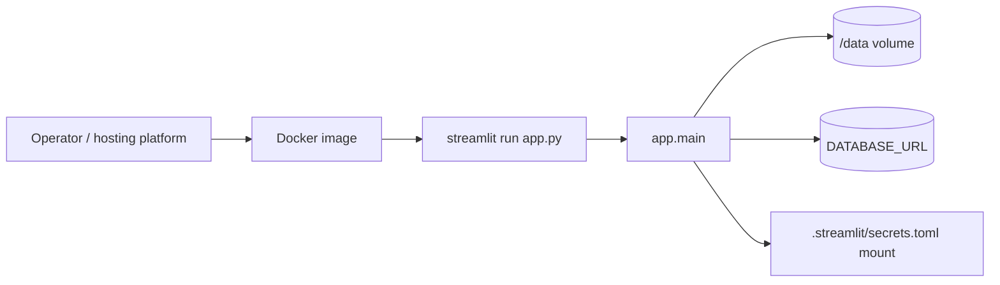

# Deployment Runtime LLD

## Purpose and boundaries

DEPLOY-001 makes the application repeatable to package and run as a container.
The runtime image owns Python dependencies, Streamlit startup, exposed port,
container health, and a clean build context. It does not change scanner logic,
database schema, authentication behavior, or the daily-job command.

## Position

## Public interface

- Build: `docker build -t streamlit-scanner-app .`
- HTTP: Streamlit listens on `0.0.0.0:8501`; the image declares `EXPOSE 8501`.
- Health: Docker probes `http://127.0.0.1:8501/_stcore/health`.
- Runtime data: `DATA_DIR=/data`; callers should mount a persistent volume.
- Secrets/config: existing environment variables plus a read-only
  `.streamlit/secrets.toml` mount for Google OIDC.

## Design decisions and trade-offs

- The image uses `python:3.11-slim-bookworm` because Python 3.11 is the
  deployment target in CI and the slim Debian base keeps the runtime boring.
- Dependencies install from `requirements.txt` constrained by `constraints.txt`;
  dev tools and optional accelerator packages are left out of the runtime image.
- Startup uses `streamlit run app.py`, not `python app.py`. The plain-Python
  entrypoint exists for local prefetch followed by browser launch, while a
  container should become a web server immediately.
- The default container environment is production and auth-required. A local
  smoke test can override `APP_ENV=development` and `AUTH_REQUIRED=false`, but a
  deployed image fails closed until the required production env and OIDC secrets
  are present.
- The app runs as non-root `appuser`. Mutable state is limited to `/data` and
  Streamlit/user cache files under the app user's home.

## Build context

`.dockerignore` keeps local secrets and regenerated state out of the image:

- `Dependencies/.env`, `.streamlit/secrets.toml`, and generated Dhan instrument
  CSVs are excluded.
- `data/cache/`, generated universe files, SQLite databases, WAL files, and
  coverage/test caches are excluded.
- Curated tracked Hemant universe CSVs remain in the context because they are
  source data.

## Failure modes

- Missing production settings: `app.main()` renders a runtime configuration
  error before scanner controls appear.
- Missing OIDC secrets in production: Streamlit auth fails closed; the secrets
  file must be mounted or injected by the platform.
- Unmounted `/data`: the app can start, but generated candles/cache and SQLite
  fallback state are ephemeral. Production should always mount persistent
  storage and use Postgres via `DATABASE_URL`.
- Docker build drift: CI runs the `docker-build` job to catch dependency or
  Dockerfile regressions.

## Testing

- `tests/test_docker_artifacts.py` asserts the Dockerfile contract, dockerignore
  exclusions, README/operations examples, and HLD/LLD links.
- The normal quality workflow still runs pytest, compileall, Ruff, mypy, Bandit,
  pre-commit config validation, and `pip_audit -r constraints.txt`.
- CI adds `docker build --tag streamlit-scanner-app:ci .` because local developer
  machines may not have Docker installed.
