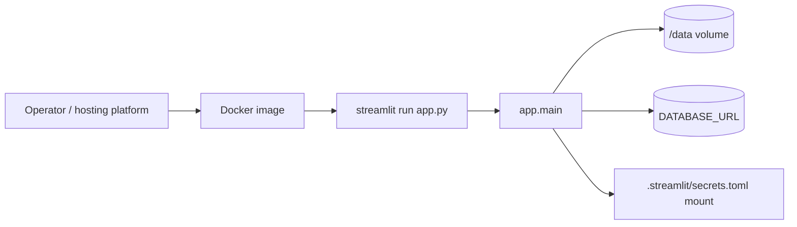

# LLD — Deployment runtime (`Dockerfile`, `.dockerignore`)

| | |
|---|---|
| **Component** | Production container image + build context + CI image-build gate (DEPLOY-001) |
| **Source** | [`Dockerfile`](../../../Dockerfile), [`.dockerignore`](../../../.dockerignore), [`.github/workflows/quality-and-security.yml`](../../../.github/workflows/quality-and-security.yml) (`docker-build` job) |
| **Layer** | Deployment / packaging (no app logic — scanner behavior, schema, auth, and the daily job are unchanged) |
| **Status** | Stable (DEPLOY-001) |
| **Related** | [HLD](../high-level-design.md) · [operations.md](../../operations.md) · [configuration.md](configuration.md) · [authentication.md](authentication.md) · [storage-persistence.md](storage-persistence.md) |

## 1. Purpose & responsibilities

Make the app repeatable to package and run as a container. The image owns Python
dependency installation, Streamlit startup, the exposed port, container health,
non-root execution, and a clean build context. It deliberately does **not** change
scanner logic, the database schema, authentication behavior, or the daily-job
command — it only packages them.

## 2. Position in the system

## 3. Public interface

| Surface | Contract |
|---|---|
| **Build** | `docker build -t streamlit-scanner-app .` from the repo root. |
| **HTTP** | Streamlit listens on `0.0.0.0:8501`; the image declares `EXPOSE 8501`. |
| **Health** | Docker `HEALTHCHECK` probes `http://127.0.0.1:8501/_stcore/health`. |
| **Runtime data** | `DATA_DIR=/data`; callers mount a persistent volume there. |
| **Secrets/config** | The usual environment variables, plus a read-only `.streamlit/secrets.toml` mount for Google OIDC. |
| **Daily job** | Same image with `--entrypoint python ... -m backend.jobs.run_daily_scan` (see [operations.md](../../operations.md#docker--container-deployment)). |

## 4. Key design decisions & trade-offs

| Decision | Rationale | Alternative rejected |
|---|---|---|
| **`python:3.11-slim-bookworm` base** | 3.11 is the deployment target in CI; slim Debian keeps the runtime small and boring. | Full `python` image (bloat) / Alpine (musl wheel friction). |
| **Install `requirements.txt` constrained by `constraints.txt`, before `COPY . .`** | Runtime-only deps (no dev/optional accelerators); copying deps first lets Docker cache the install layer across source edits. | Install everything / copy source first — slower rebuilds, larger image. |
| **`streamlit run app.py`, not `python app.py`** | The plain-Python entrypoint does local prefetch-then-launch-browser; a container should become a web server immediately. | `python app.py` — would try to open a browser and run the prefetch wrapper at boot. |
| **Production + auth-required defaults** | A deployed image fails closed until real prod env + OIDC secrets are present; a local smoke test opts out via `APP_ENV=development`/`AUTH_REQUIRED=false`. | Permissive defaults — an exposed container would run unauthenticated. |
| **Non-root `appuser`** | Least privilege; mutable state is confined to `/data` and the user's home cache. | Run as root — unnecessary privilege in a long-lived container. |
| **CI `docker-build` job** | Local dev machines may lack Docker; CI assembles the image on every push so Dockerfile/dependency drift is caught. | Trust manual local builds — drift slips in unverified. |

## 5. Failure modes / degradation

- **Missing production settings**: `app.main()` renders a runtime configuration error before scanner controls appear (fail closed).
- **Missing OIDC secrets in production**: Streamlit auth fails closed; the secrets file must be mounted or injected by the platform.
- **Unmounted `/data`**: the app still starts, but generated candles/cache and the SQLite fallback are ephemeral. Production should mount persistent storage and use Postgres via `DATABASE_URL`.
- **Dockerfile / dependency drift**: the CI `docker-build` job fails the PR rather than shipping an unbuildable image.

## 6. Configuration & dependencies

- **Image-set environment** (overridable at `docker run`): `APP_ENV=production`,
  `AUTH_REQUIRED=true`, `DATA_DIR=/data`, `STREAMLIT_SERVER_ADDRESS=0.0.0.0`,
  `STREAMLIT_SERVER_PORT=8501`, `STREAMLIT_SERVER_HEADLESS=true`,
  `STREAMLIT_BROWSER_GATHER_USAGE_STATS=false`, plus `PYTHONDONTWRITEBYTECODE` /
  `PYTHONUNBUFFERED` / `PIP_NO_CACHE_DIR`.
- **Runtime-injected** (not baked in): `DATABASE_URL`, `DHAN_CLIENT_ID` /
  `DHAN_ACCESS_TOKEN`, `ALLOWED_EMAILS` / `ADMIN_EMAILS`, optional `SERPAPI_API_KEY`
  / Claude settings, and the mounted `secrets.toml`.
- **Python deps**: only `requirements.txt` + `constraints.txt`. Dev tools and the
  optional `TA-Lib`/`pandas_ta` accelerators are intentionally excluded (the app
  falls back to pure-pandas indicators).
- **Build context (`.dockerignore`)**: excludes local secrets (`Dependencies/.env`,
  `.streamlit/secrets.toml`), the generated Dhan instrument CSVs, `data/cache/`,
  generated universe files, SQLite databases + WAL/SHM, `.git`, and coverage/test
  caches. The curated, tracked Hemant universe CSVs are explicitly **kept** in the
  context (they are source data the app needs at runtime).

## 7. Testing

- [`tests/test_docker_artifacts.py`](../../../tests/test_docker_artifacts.py) asserts the Dockerfile contract, `.dockerignore` exclusions, the README/operations examples, and the HLD/LLD links — string-level contract checks that need no Docker daemon.
- [`tests/test_supply_chain_policy.py`](../../../tests/test_supply_chain_policy.py) asserts the CI workflow includes the `docker build` command and the `contents: read` permission.
- The standard quality workflow still runs pytest/compileall/Ruff/mypy/Bandit/pre-commit/`pip_audit`.
- CI adds `docker build --tag streamlit-scanner-app:ci .` so real image assembly is verified where local machines may lack Docker.

## 8. Extension points

- **Slim the image** further by adding `tests/`, `docs/`, `.github/` to `.dockerignore` (deferred — marginal while the image is small).
- **Pin the base by digest** (`python:3.11-slim-bookworm@sha256:…`) for fully reproducible builds.
- **Add system libraries** only if a future runtime dep needs them (insert an `apt-get install … && rm -rf /var/lib/apt/lists/*` layer before the pip install); today's pinned deps install from wheels with no apt packages.
- **A `docker-compose.yml`** (app + Postgres + volume) would be the natural next step for a one-command local deployment.
