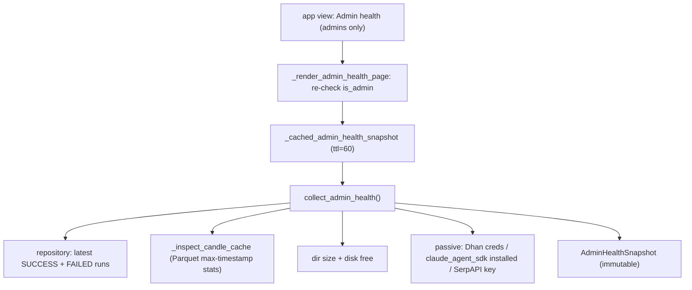

# LLD — Health monitoring (`backend/health.py` + admin page)

| | |
|---|---|
| **Component** | Passive operational health snapshot + admin-gated health page |
| **Source** | [`backend/health.py`](../../../backend/health.py), [`ui/health_page.py`](../../../ui/health_page.py) |
| **Layer** | Observability (`backend/`) + UI (`ui/`) |
| **Status** | Stable (OBS-002) |
| **Related** | [HLD](../high-level-design.md) · [observability.md](observability.md) · [authentication.md](authentication.md) · [storage-persistence.md](storage-persistence.md) · [data-quality.md](data-quality.md) · [app-orchestration.md](app-orchestration.md) · [security.md](security.md) |

## 1. Purpose & responsibilities

Answer an operator's questions — *"did the last scan finish? is cached data
current? are the optional providers configured?"* — using **only local reads**.
Opening the page must never consume provider quota or turn an outage into a slow
rerun.

- **`backend/health.py`** — `collect_admin_health()` builds an immutable `AdminHealthSnapshot` from scan-history queries, candle-cache file/Parquet-metadata inspection, and **passive** provider checks.
- **`ui/health_page.py`** — renders that snapshot for an authorized admin (cached 60s), with formatting helpers.

## 2. Position in the system

## 3. Public interface

| Symbol | Contract |
|---|---|
| `collect_admin_health(settings=None) -> AdminHealthSnapshot` | Passive snapshot; every exception boundary degrades (DB failure → `unavailable` service with **type only**, never a message). |
| `AdminHealthSnapshot` | frozen: last successful/failed scan (`ScanRunHealth`), latest data-quality run (`DataQualityRunHealth`, DATA-001), last data refresh, cached symbol count, latest candle date, unreadable-file count, cache/data sizes, disk free, `services`. |
| `DataQualityRunHealth` / `DataQualityFindingHealth` | Detached copy of the newest persisted DATA-001 receipt: per-run counts + a capped, redacted findings sample (`findings_truncated`/`total_findings` flag omission). |
| `ScanRunHealth` / `ServiceHealth` | Detached scalar copies (safe after session close) / `(name, status∈ready|warning|unavailable, detail)` (secret-safe). |
| `_render_admin_health_page(user, *, snapshot_loader=_cached_admin_health_snapshot)` | Renders; **re-checks `is_admin`** before anything. |
| `_cached_admin_health_snapshot()` | `@st.cache_data(ttl=60)`. |

## 4. Key design decisions & trade-offs

| Decision | Rationale | Alternative rejected |
|---|---|---|
| **Passive only — never call Dhan/Claude/SerpAPI** | Opening an ops page must not spend quota, hit rate limits, or hang on a provider outage. "Ready" = credentials present / SDK installed, explicitly *not* live-tested. | Live pings — quota burn, slow page. |
| **Data-quality summary reads the newest persisted receipt (DATA-001)** | Health scans recent runs for the latest `data_quality_json` and renders its counts + capped, redacted findings — it never re-validates candle data, keeping the page passive. | Re-run `validate_candles` on the page — slow, re-reads cache, not passive. |
| **Re-check `is_admin` inside the renderer** | The view selector hides the page, but a direct caller or an auth-disabled dev session (`user=None`) must still be blocked — defense in depth. | Rely on the menu only — bypassable. |
| **Never copy exception messages into health** | DB drivers/SDK setup errors echo URLs/credentials; only the exception **type** is shown; persisted failure text goes through the redactor. | Show `str(exc)` — leak. |
| **Parquet max-timestamp from row-group statistics** | Reading per-file min/max stats answers "how current?" far cheaper than loading every timestamp column; only stat-less files fall back to a column read. | Read full columns — slow on hundreds of files. |
| **Detached `ScanRunHealth`/`ServiceHealth` scalars** | ORM objects detach after `session_scope()`; copying scalars makes the snapshot safe to cache for 60s. | Hold ORM objects — `DetachedInstanceError`. |
| **60s snapshot cache** | Values change slowly; survives the reruns from clicking between views. | No cache — re-walk cache + re-query each rerun. |
| **Degrade per boundary, never crash** | One unreadable Parquet increments a count; a stat failure yields `None`; the page always renders. | Propagate — page dies on one bad file. |

## 5. Failure modes

- DB unreachable → `Database` service `unavailable` (type only); page still renders other sections.
- Corrupt Parquet → counted in `unreadable_cache_file_count` (+ a UI warning); healthy files still inspected.
- Snapshot collection raises → page shows `Could not collect health snapshot (<Type>)`.
- Non-admin / `None` user → "Admin access is required".

## 6. Testing

- [`tests/test_health.py`](../../../tests/test_health.py) — snapshot assembly, DB-failure degradation, Parquet inspection, passive provider checks.
- [`tests/test_app_health_page.py`](../../../tests/test_app_health_page.py) — admin guard, rendering, formatting helpers.

## 7. Extension points

A new dependency = a `_*_health(settings)` returning `ServiceHealth` added to the `services` tuple. A new metric = a field on `AdminHealthSnapshot` + a metric in the renderer. Keep the **passive** rule: configuration/installation checks only, never a live request.
