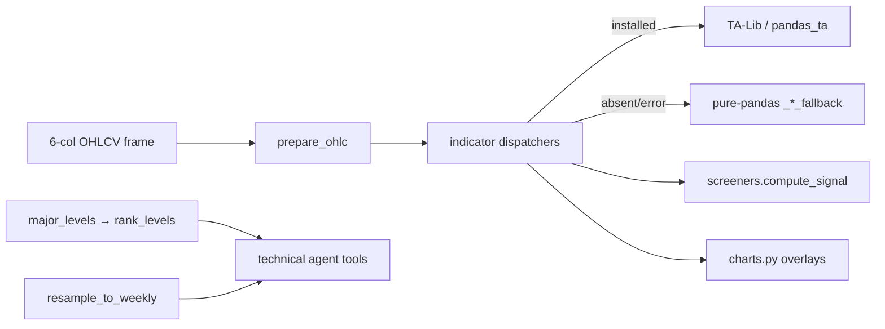

# LLD — Indicators (`backend/indicators.py`)

| | |
|---|---|
| **Component** | Technical-indicator library |
| **Source** | [`backend/indicators.py`](../../../backend/indicators.py) |
| **Layer** | Screening engine (`backend/`) |
| **Status** | Stable (+ ta-screener-expansion: level ranking, weekly resample) |
| **Related** | [HLD](../high-level-design.md) · [screener-framework.md](screener-framework.md) · [screener-catalog.md](screener-catalog.md) · [technical-analysis-ai.md](technical-analysis-ai.md) · [charts-visualization.md](charts-visualization.md) |

## 1. Purpose & responsibilities

One place for every indicator math the screeners and the AI agents use, with a
**dispatcher pattern**: try a fast battle-tested library (TA-Lib / pandas_ta),
fall back to a pure-pandas implementation if it is absent or errors. The app
behaves identically with or without the optional accelerators — just slower.

**Provides**: `prepare_ohlc` (the canonical "ready for math" cleaner); moving
averages (`ema`, `sma`); oscillators (`rsi`, `momentum`, `stochastic`);
`bollinger_bands`; `envelope`; Heikin Ashi (`build_heikin_ashi`); `supertrend`;
pivot detection (`pivot_lows`/`pivot_highs`); support/resistance (`major_levels`)
+ **relevance scoring** (`rank_levels`); Knoxville Divergence detectors;
**weekly resampling** (`resample_to_weekly`); and the **yearly Central Pivot
Range** (`yearly_cpr`).

## 2. Position in the system

## 3. Public interface (selected)

| Function | Returns / contract |
|---|---|
| `prepare_ohlc(df)` | Sorted oldest→newest, numeric-coerced, deduped-by-timestamp, NaN-dropped. The one definition reused by `BaseScanner.prepare_candles`. |
| `ema/sma(series, period)` · `rsi(series, period=14)` · `momentum(series, period=20)` · `volume_average` | Library-or-fallback; warm-up rows = NaN (`min_periods`). |
| `stochastic(high, low, close, k_period=5, k_smoothing=4, d_smoothing=3)` | `DataFrame[stoch_k, stoch_d]` (slow stochastic). |
| `bollinger_bands(close, period=20, std_multiplier=2.0)` | `[bb_middle, bb_upper, bb_lower]`, **population std (ddof=0)** both paths. |
| `envelope(close, period=200, percent=14.0, exponential=True)` | `[env_basis, env_upper, env_lower]`; no library has "envelope", so only the ±% offset is local. |
| `build_heikin_ashi(ohlc)` | + `ha_open/high/low/close`. |
| `supertrend(ohlc, atr_period=10, multiplier=2.0)` | + `atr, supertrend, supertrend_direction, supertrend_color`; **candle-type agnostic** (pass HA renamed to OHLC → SuperTrend on HA). |
| `pivot_lows/pivot_highs(series, left, right)` | Vectorized O(n) confirmed-pivot boolean mask; last `right` rows always False (need future bars). |
| `major_levels(frame, left=5, right=5, cluster_pct=2.0, min_touches=3)` | Clustered multi-touch S/R: `[{price, touches, kind}]`. |
| `rank_levels(frame, levels, band_pct=1.0, recency_halflife_bars=120, reaction_bars=5)` | Adds `relevance` (0..1 weighted: touches .25 / recency .25 / proximity .30 / volume .10 / reaction .10), `components`, `last_touch_bars_ago`, `distance_pct`, `flipped`. |
| `bullish_knoxville_divergence(...)` / `bullish_knoxville_divergences(...)` | Latest qualifying / all qualifying bullish divergences (pivot low + RSI oversold + momentum higher-low). |
| `resample_to_weekly(frame)` | Daily→weekly (`W-FRI`): open=first, high=max, low=min, close=last, volume=sum. No new data source. |
| `yearly_cpr(frame)` | Per-year Central Pivot Range (`pivot`/`tc`/`bc` + `prev_year_high`/`prev_year_low`) derived from the **previous** calendar year's H/L/C — the intraday PDH/PDL pivot convention applied yearly. Skips years whose predecessor is missing. |

## 4. Key design decisions & trade-offs

| Decision | Rationale | Alternative rejected |
|---|---|---|
| **Dispatcher: library primary, pandas fallback** | App runs identically with/without TA-Lib/pandas_ta (which need native builds); a library hiccup never crashes a scan (logged at DEBUG). | Hard dependency — install friction, fragile. |
| **One `prepare_ohlc`** | Every screener + chart starts from the same clean shape (sorted, numeric, deduped). | Per-screener cleaning — drift. |
| **Population std for Bollinger (ddof=0)** | Matches TA-Lib so library and fallback agree exactly. | pandas default sample std — wider bands, mismatch. |
| **Vectorized pivots (reverse-roll trick)** | O(n) vs the old O(n·left·right) per-candle loop; reusable by any divergence screener. | Nested loops — slow on 10y data. |
| **`major_levels` then separate `rank_levels`** | Finding zones (touches) is distinct from judging *current relevance* (proximity/recency); ranking is opt-in for the AI screener. | Bake relevance into major_levels — couples concerns. |
| **Weekly via resample, not new data** | Higher-timeframe context from existing daily candles — no extra Dhan calls. | Fetch weekly — more API/cache. |
| **SuperTrend candle-agnostic** | The HA SuperTrend screener reuses the same function by renaming HA→OHLC. | Separate HA SuperTrend — duplication. |

## 5. Failure modes

- Missing required OHLC column → `ValueError` naming the column.
- Library error mid-call → DEBUG log + pure-pandas fallback (transparent).
- Insufficient history → NaN warm-up rows; screeners skip (return `None`).

## 6. Testing

- [`tests/test_indicators.py`](../../../tests/test_indicators.py) — every indicator vs hand-checked fixtures, library/fallback parity.
- [`tests/test_patterns.py`](../../../tests/test_patterns.py) (price-action detectors live in [technical-analysis-ai.md](technical-analysis-ai.md)).

## 7. Extension points

Add an indicator as a `name()` dispatcher + `_name_fallback()` pair (keep the column schema identical across both). Reuse `pivot_lows/highs` for any new divergence/structure detector.
