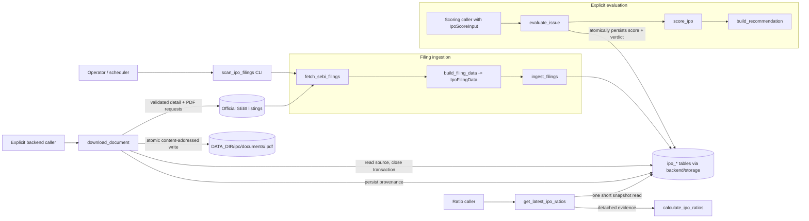

# LLD - IPO Screener (`backend/ipo/`)

| | |
|---|---|
| **Component** | IPO ingestion, document cache, manual evidence, financial ratios, scoring, and recommendation subsystem |
| **Source** | [`backend/ipo/`](../../../backend/ipo), [`backend/ipo/sources/sebi.py`](../../../backend/ipo/sources/sebi.py), [`backend/jobs/scan_ipo_filings.py`](../../../backend/jobs/scan_ipo_filings.py), [`backend/storage/ipo_repository.py`](../../../backend/storage/ipo_repository.py), [`backend/storage/models.py`](../../../backend/storage/models.py), [`migrations/versions/`](../../../migrations/versions) |
| **Layer** | Framework-free backend plus one admin-only Streamlit adapter |
| **Status** | Implemented: IPO-001 scoring through IPO-005 deterministic ratio derivation |
| **Related** | [HLD](../high-level-design.md) - [IPO-001](../ipo-001-domain-score-contract.md) - [IPO-002](../ipo-002-sebi-filing-ingestion.md) - [IPO-003](../ipo-003-document-downloader-cache.md) - [IPO-004](../ipo-004-manual-extraction-mvp.md) - [IPO-005](../ipo-005-ratio-engine.md) - [storage](storage-persistence.md) - [security](security.md) |

IPO-003's detailed cache and failure contract is documented in
[ipo-003-document-downloader-cache.md](../ipo-003-document-downloader-cache.md).

## 1. Purpose & responsibilities

The IPO Screener evaluates Indian IPOs from official source facts. Five landed
slices share one persistence model:

- **Domain & scoring (IPO-001)**: typed, framework-independent contracts, a fixed
  100-point PDF-weighted scorecard, a binary fail-closed verdict, and an immutable
  evaluation history.
- **Filing ingestion (IPO-002)**: a hardened, official-SEBI-only listing source
  and a headless job that inventories DRHP / RHP / final-offer filings into the
  issue/document tables.
- **Document cache (IPO-003)**: an explicit repository service that securely
  downloads registered DRHP/RHP PDFs into a verified content-addressed cache.
- **Manual evidence (IPO-004)**: an administrator form appends a complete,
  page-sourced financial profile from one verified cached DRHP/RHP.
- **Ratio engine (IPO-005)**: a pure Decimal service derives sixteen
  general-company ratios from the newest immutable profile and returns a typed
  value-or-reason receipt without persisting calculations.

**Non-responsibilities (deliberate, current scope)**
- IPO-002 never downloads prospectuses. IPO-003 downloads only through an
  explicit service call and still performs no PDF parsing or page counting.
- Ratios are not factor-score inference. The scorecard still consumes caller-supplied
  normalized 0-100 factor scores; mapping raw ratios into them is a later ticket.
- Streamlit remains outside `backend`; `ui/ipo_manual_page.py` is the narrow
  IPO-004 presentation adapter and repeats the admin guard.
- No scraping outside `backend/ipo/sources`, and no source other than SEBI yet.

## 2. Position in the system

The headless job orchestrates ingestion; evaluation is a separate, explicit call
that receives a complete `IpoScoreInput`. Persisted financial and subscription
facts are **not** automatically converted into factor scores, and filing ingestion
never triggers a recommendation. Both paths persist only through `backend/storage`.

## 3. Module boundaries

| Module | Responsibility | May import |
|---|---|---|
| `backend/ipo/models.py` | Frozen DTOs, enums, validation (URLs, money, hashes). | stdlib, `backend.security`, `backend.url_safety` |
| `backend/ipo/scorecard.py` | Fixed PDF weights, half-up rounding, missing-data receipt. | `models` |
| `backend/ipo/verdict.py` | Score bands, confidence, fail-closed override. | `models` |
| `backend/ipo/sources/sebi.py` | IPO-002 listing network I/O + hostile-HTML parsing. | `requests`, `bs4`, `models` |
| `backend/ipo/documents/downloader.py` | IPO-003 detail/PDF I/O, SSRF controls, streamed atomic cache. | `requests`, `bs4`, `models` |
| `backend/ipo/manual_extraction.py` | Frozen complete-entry DTOs, units, page validation, peers, canonical conversions. | stdlib, `models` |
| `backend/ipo/financials/ratio_engine.py` | Pure Decimal formulas, typed status receipts, reconciliation, source/price snapshot. | stdlib, `manual_extraction` |
| `backend/ipo/repository.py` | Typed transactions, ingestion identity/lifecycle, atomic evaluation. | `models`, `scorecard`, `verdict`, `scanning.result_contract`, `storage` |
| `backend/storage/ipo_repository.py` | Every SQLAlchemy statement for the `ipo_*` tables. | `sqlalchemy`, `storage.models` |
| `backend/jobs/scan_ipo_filings.py` | CLI boundary: windows, per-category loop, exit code, audits. | `ipo`, `audit`, `observability`, `storage.database` |
| `ui/ipo_manual_page.py` | Admin widgets, DTO conversion, prefill, latest profile, revision history. | `backend.ipo`, `backend.auth`, `streamlit` |

These rules are enforced by the AST guard
[`tests/test_ipo_contract_policy.py`](../../../tests/test_ipo_contract_policy.py):
no IPO module imports Streamlit, and network clients are allowed only under
`backend/ipo/sources` plus the exact IPO-003 downloader module.

## 4. Public interface

| Symbol | Contract |
|---|---|
| `score_ipo(IpoScoreInput) -> IpoScoreResult` | Applies the fixed weights; missing factors contribute zero and are never renormalized. |
| `build_recommendation(IpoScoreResult) -> IpoRecommendationResult` | Maps a score to the binary verdict + confidence; `.to_dict()` is the exact public JSON. |
| `evaluate_issue(issue_id, IpoScoreInput)` | Computes and atomically persists one immutable score/verdict pair. |
| `fetch_sebi_filings(category, from_date, to_date)` | Bounded fetch of one fixed SEBI category; returns frozen `SebiFiling` rows. |
| `build_filing_data(SebiFiling) -> IpoFilingData` | Derives display name, stable `sebi_company_key`, status, and the SHA-256 fingerprint. |
| `ingest_filings(filings, *, session_factory)` | Atomically creates/updates issues and documents for one category; returns `IpoIngestionSummary`. |
| `get_latest_filing_date()` | Global ingestion watermark (newest persisted `filing_date`). |
| `download_document(issue_id, document_id)` | Download or verify one registered DRHP/RHP with no database transaction held during network I/O. |
| `submit_manual_extraction(issue_id, data, entered_by_email=...)` | Rehash cached bytes outside a transaction, recheck source identity, and atomically append one immutable revision. |
| `get_manual_extraction` / `list_manual_extractions` / `get_latest_manual_profile` | Detached revision history plus the latest canonical raw-data bridge; no factor-score derivation. |
| `calculate_ipo_ratios(profile, price_band_high, issue_updated_at)` | Pure calculation of sixteen ratios with one explicit status receipt per metric. |
| `get_latest_ipo_ratios(issue_id)` | Reads issue + newest revision in one short transaction, detaches them, then calculates without persisting ratios. |
| CRUD: `create_/get_/list_/update_/delete_*` for issues, documents, financials, subscriptions. | Typed, detached records; never leak ORM rows. |

The scorecard and verdict tables (weights, 80/65 bands, confidence rules) are the
authority of [IPO-001 design](../ipo-001-domain-score-contract.md).

## 5. Persistence

Nine additive tables share the existing `Base`; full column rationale lives in
[storage-persistence.md](storage-persistence.md).

- `ipo_issues` is the cascade root. IPO-002 adds nullable, uniquely-indexed
  `sebi_company_key` and the `unknown` issue type.
- `ipo_documents` holds registered filing URLs; IPO-002 adds nullable
  `filing_date` and a uniquely-indexed 64-char `record_hash` (length-checked).
  IPO-003 adds nullable content digest/time/path/page fields plus a constrained
  `parse_status`; `page_count` remains null until a later parser exists.
- `ipo_financials`, `ipo_subscriptions` hold secret-safe normalized facts.
- `ipo_scores` (immutable factor inputs + total) pairs one-to-one with
  `ipo_recommendations` (immutable verdict).
- `ipo_manual_extractions` owns singleton facts and immutable provenance;
  `ipo_manual_financial_periods` owns exactly three annual rows; and
  `ipo_manual_peer_valuations` owns one or more allowlisted peer metric maps.
  IPO-005 adds nullable legacy-compatible source pairs for PBT/finance cost,
  total assets/current liabilities, and post-issue shares. New submissions
  require the complete group; legacy rows keep all additions null.

Migrations are additive and nullable, so manual / IPO-001 rows stay valid. The
IPO-002 downgrade refuses to run while any SEBI identity exists rather than
silently discarding fingerprints or reclassifying `unknown` issues. Schema-drift
detection is metadata-driven, so new columns are covered automatically.
The IPO-004 downgrade separately refuses while any manual revision exists.
The IPO-005 downgrade is narrower: it succeeds for legacy-only revisions but
refuses when any new ratio input would be discarded.

## 6. SEBI source: security posture

The IPO-002 source and exact IPO-003 downloader are the subsystem's two network
boundaries and treat every response as hostile:

- **Host lockdown**: fixed exact-match HTTPS allowlist (`sebi.gov.in`,
  `www.sebi.gov.in`); credentials and non-443 ports rejected.
- **Manual redirects**: `allow_redirects=False`; each hop's `Location` is
  re-validated through the same allowlist, capped at 3 hops.
- **Resource bounds**: 5s connect / 20s read timeouts, capped 2/5/10s retries on
  429 and 5xx, a polite inter-page delay, a streamed 2 MiB cap (plus
  `Content-Length` precheck), an HTML content-type check, and a 200-page ceiling.
- **Fail-closed parsing**: any malformed filing-like row aborts the whole
  category instead of producing a partial inventory; nested abridged-prospectus
  PDF anchors are ignored and never stored.
- **Secret-safe failures**: logs and the durable audit row store only the bounded
  date/category context and the exception **class**, never `str(exc)` or any
  response body. TLS verification is left on.
- **Download-specific controls**: IPO-003 additionally validates public DNS,
  accepts exactly one `/sebi_data/attachdocs/` iframe target, caps PDFs at
  50 MiB, verifies media type and `%PDF-` magic, and uses a contained temporary
  file plus fsync/atomic rename.

## 7. Ingestion identity & lifecycle

- **Company identity**: titles are NFKC-normalized; filing/addendum/corrigendum
  markers are stripped; the `sebi_company_key` case-folds, normalizes punctuation
  and `&`, and canonicalizes common corporate suffixes. Only an explicit `SME`
  token selects `sme`; everything else stays `unknown`.
- **Filing fingerprint**: SHA-256 over canonical JSON of `{company_key,
  document_type, filing_date, document_url}` - an ingestion identity, not a PDF
  content hash.
- **Monotonic status**: `drhp_filed -> rhp_filed -> open -> closed -> listed`.
  DRHP / RHP / final-offer rows target `drhp_filed` / `rhp_filed` / `closed`; an
  older or replayed filing never regresses a later state.
- **Matching**: issues by unique `sebi_company_key` (a single unclaimed
  same-name legacy row may be claimed once); documents by unique `record_hash`,
  then by canonical URL. A fingerprint or URL owned by a different issue is a
  validation conflict and never reparents the row.
- **Transactions**: each SEBI category is one atomic invocation; a conflict rolls
  back that category while already-committed categories stay durable.

## 8. Failure modes & recovery

- Per-category fetch/parse/persist failure -> structured `ipo_filing_category_failed`
  log + durable secret-safe audit row; other categories still commit; the command
  exits nonzero.
- Fatal pre-scan failure (schema bootstrap, invalid window) -> aborts before any
  fetch with a fatal log and nonzero exit.
- Recovery is a normal rerun: the default window starts 7 days before the newest
  stored `filing_date` (30 days back for an empty database) and ends today, so the
  overlap plus deterministic fingerprints make repeat ingestion idempotent.
- A document download failure clears trusted cache metadata and stores
  `download_failed`; retrying the explicit service call is safe and a verified
  cache hit performs no HTTP request.

## 9. Testing

- [`tests/test_ipo_models.py`](../../../tests/test_ipo_models.py),
  [`tests/test_ipo_scorecard.py`](../../../tests/test_ipo_scorecard.py),
  [`tests/test_ipo_verdict.py`](../../../tests/test_ipo_verdict.py) - domain
  contracts, weights, bands, and JSON shape.
- [`tests/test_ipo_sebi_source.py`](../../../tests/test_ipo_sebi_source.py) -
  parsing, identity normalization, redirect/host/content-type/size/page-cap guards.
- [`tests/test_ipo_sebi_models.py`](../../../tests/test_ipo_sebi_models.py),
  [`tests/test_ipo_sebi_ingestion.py`](../../../tests/test_ipo_sebi_ingestion.py) -
  filing contracts, monotonic status, legacy claim, ownership conflicts, idempotency.
- [`tests/test_scan_ipo_filings_job.py`](../../../tests/test_scan_ipo_filings_job.py) -
  windows, partial-failure exit codes, and secret-safe audits.
- [`tests/test_ipo_repository.py`](../../../tests/test_ipo_repository.py),
  [`tests/test_ipo_persistence_models.py`](../../../tests/test_ipo_persistence_models.py),
  [`tests/test_scan_storage_migrations.py`](../../../tests/test_scan_storage_migrations.py) -
  CRUD, constraints/uniqueness, cascades, migration upgrade/downgrade parity.
- [`tests/test_ipo_contract_policy.py`](../../../tests/test_ipo_contract_policy.py) -
  narrow network/UI boundaries plus the IPO teaching-docstring policy.
- [`tests/test_ipo_document_downloader.py`](../../../tests/test_ipo_document_downloader.py) -
  hostile URLs/HTML/PDFs, retries, caps, containment, atomic writes, and cache integrity.
- [`tests/test_ipo_ratio_engine.py`](../../../tests/test_ipo_ratio_engine.py) -
  exact formulas, losses, leverage/net cash, invalid denominators, legacy evidence,
  missing prices, and EPS/book-value reconciliation.

## 10. Extension points

- **More sources**: add NSE/BSE subscription or GMP adapters under
  `backend/ipo/sources/`, each behind its own host allowlist; the ingestion and
  scoring contracts stay unchanged.
- **Factor derivation**: a future ticket can combine IPO-005 receipts with qualitative
  evidence and subscription facts to produce reviewed 0-100 scorecard inputs.
- **Sector overrides**: banks/NBFCs, AMCs, insurers, and loss-making technology
  issuers need separately reviewed definitions rather than silent v1 substitutions.
- **Automation & UI**: `python -m backend.jobs.scan_ipo_filings` is manually
  runnable and scheduler-compatible, but IPO-002 does not add a scheduler,
  Render cron, Compose daemon, or Streamlit entrypoint. A future orchestration
  ticket can schedule it, and a later read-only IPO surface can render
  `IpoRecommendationResult.to_dict()`.

Any extension must preserve URL safety, never invent missing evidence, and route
all SQL through `backend/storage`.
