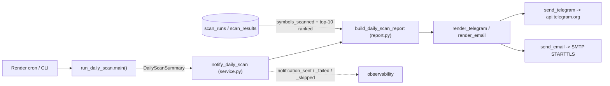

# LLD — Daily-scan notifications (`backend/notifications/`)

| | |
|---|---|
| **Component** | ALERT-001 — send a daily-scan summary to Telegram and/or email after the headless job runs. |
| **Source** | [`backend/notifications/`](../../../backend/notifications/) — `config.py`, `report.py`, `render.py`, `telegram_channel.py`, `email_channel.py`, `service.py`. |
| **Layer** | Backend, outbound side-effect (never imported by Streamlit). |
| **Status** | Stable (ALERT-001); admin preferences added (ALERT-002). Owner Codex / reviewer Claude. |
| **Related** | [app-orchestration / daily-scan-job](daily-scan-job.md) (the caller), [storage-persistence](storage-persistence.md) (read model), [security](security.md) (redaction + SSRF), [observability](observability.md) (events). |

## 1. Purpose & responsibilities

Turn the result of one headless daily scan ([`run_daily_scan`](../../../backend/jobs/run_daily_scan.py))
into an **opt-in** summary message and deliver it out-of-band so the user learns the
outcome without opening the app. The summary carries scan status, symbols scanned,
shortlisted count, the **top 10 ranked results**, a per-screener / failure summary, and a
link to the app; a failed run sends a failure alert. **ALERT-002** lets an admin turn the
alert on/off and choose **summary** (status + counts only) or **full** (also the top
results) content, and edit the (non-secret) destination at runtime — see §6.

**Boundaries.** It does not run scans, write scan state, or schedule anything. It is a
read-only consumer of the job's `DailyScanSummary` plus persisted history. It is
**best-effort**: a missing credential disables a channel and a send failure is logged,
never raised, so notifications can never change the scan job's exit code.

## 2. Position in the system

The job calls the service at **every** terminal path — normal completion and each
pre-scan failure (schema unavailable, bad config, unexpected crash) via a synthetic
fatal summary — so "a failed scan sends a failure alert" holds across the board.

## 3. Public interface

| Symbol | Contract |
|---|---|
| `notify_daily_scan(summary, *, settings=None, session_factory=session_scope, telegram_sender=…, email_sender=…) -> NotificationResult` | Build the report, render, and send to every **configured** channel. **Never raises.** Returns per-channel `ChannelResult`s; `result.skipped` is true when alerts are **disabled** (ALERT-002) or no channel is configured. Senders are injectable for tests. |
| `build_daily_scan_report(summary, *, settings, session_factory) -> DailyScanReport` | Materialise the summary (primitives only) from the job summary + one short DB read (`get_scan_runs`, plus `get_top_ranked_results` **only when content = full**). DB failure degrades to summary-only counts. |
| `render_telegram(report) -> str` / `render_email(report) -> (subject, body)` | Pure, ASCII, secret-safe (each string passes through `redact_text`). |
| `send_telegram(text, *, settings, session=None)` | POST to the fixed `api.telegram.org` host (SSRF-allowlisted), timeout, token only in the URL, exceptions scrubbed. Raises `TelegramSendError`. |
| `send_email(subject, body, *, settings, smtp_factory=smtplib.SMTP)` | STARTTLS → login → send; exceptions scrubbed. Raises `EmailSendError`. |
| `load_notification_settings(env=None) -> NotificationSettings` | Read the opt-in config; `telegram_configured` / `email_configured` gate each channel; `alerts_enabled` / `alert_content` carry the ALERT-002 preferences. |

## 4. Key design decisions & trade-offs

| Decision | Rationale | Alternative rejected |
|---|---|---|
| **Opt-in, best-effort, non-fatal** | Alerts are a convenience, not a production requirement; a notifier fault must never break a scheduled scan or its exit code. | Adding the creds to `validate_production_settings` — would force every deploy to configure alerts and could fail-closed on a notifier issue. |
| **Read top-N from persisted history** (`get_top_ranked_results`, score fallback) | One source of truth (JOB-003 read-model pattern); ranks by `final_score`, then numeric raw `confidence`, then stable unscored rows. The renderer labels the source so confidence is never confused with a final model score. | Threading result DataFrames out of the job - more plumbing, no persistence guarantee. |
| **Two secrets registered in `secret_values()`** (token, password) | One definition of "secret" so the shared SEC-002 filter masks them everywhere; the body is built only from non-secret fields and re-run through `redact_text`. | Per-module redaction — drifts from the central registry. |
| **Channels behind one interface, each config-gated** | Faithful to "email/Telegram"; the user enables either/both by setting creds. | One channel only — less flexible for the same code shape. |
| **Notify at every job terminal path via a synthetic summary** | "Failed scan sends failure alert" must hold even when the scan can't start (DB down, bad config, crash). | Hooking only the success path — silent on the failures that matter most. |
| **stdlib `smtplib` + pinned `requests`** | No new dependency (supply-chain policy). | An email/HTTP SDK — an avoidable pin. |
| **App-level preferences on the OBS-003 runtime-config rail** (ALERT-002) | Reuses validate/persist/apply/audit; the single shared alert has no per-user delivery, so prefs are app-level and admin-owned. Only non-secret destinations are editable; credentials stay env-only. | A per-user prefs store — incoherent with one destination; a bespoke settings page — duplicates OBS-003. |

## 5. Failure modes / degradation

- **Alerts disabled** (ALERT-002) → `notification_skipped` (`reason="disabled"`), no-op.
- **No channel configured** → `notification_skipped` logged, no-op.
- **One channel send fails** → `notification_failed` logged (redacted), the other channel still attempted, job exit code unchanged.
- **DB read fails while building the report** → caught; the alert still sends with the counts already in the summary (symbols/top-N omitted).
- **Telegram/SMTP/network error** -> wrapped in `TelegramSendError`/`EmailSendError` with the token/password scrubbed via `redact_text(extra_secrets=...)`.
- **Telegram redirect or tampered/unsafe host** -> unsafe hosts are refused by `is_safe_http_url(allowed_hosts={"api.telegram.org"})` before any request, and redirects are disabled so the bot-token URL is not followed to another origin.
- **Malformed email header env** -> CR/LF header values are wrapped as `EmailSendError` before any SMTP connection is opened.

## 6. Configuration & dependencies

Opt-in env vars (see [`Dependencies/.env.example`](../../../Dependencies/.env.example) and the
Render cron block in [`render.yaml`](../../../render.yaml)): `APP_URL`, `TELEGRAM_BOT_TOKEN`,
`TELEGRAM_CHAT_ID`, `SMTP_HOST`, `SMTP_PORT` (default 587), `SMTP_USER`, `SMTP_PASSWORD`,
`SMTP_FROM` (defaults to `SMTP_USER`), `ALERT_EMAIL_TO`, plus the ALERT-002 preferences
`ALERT_ENABLED` (default `true`) and `ALERT_CONTENT` (`summary`/`full`, default `full`).
Depends only on the stdlib (`smtplib`/`email`) and the already-pinned `requests`.

**Admin-editable at runtime (ALERT-002).** `ALERT_ENABLED`, `ALERT_CONTENT`, and the two
non-secret destinations `TELEGRAM_CHAT_ID` / `ALERT_EMAIL_TO` are whitelisted in
`EDITABLE_CONFIG_KEYS`, so an admin changes them from the settings page (validated,
audited, applied live, and replayed on restart by `apply_config_overrides` — which the
daily job now calls too). Credentials (`TELEGRAM_BOT_TOKEN`, `SMTP_PASSWORD`,
`SMTP_HOST`/`SMTP_USER`) stay environment-only. See [audit-log.md](audit-log.md) and the
[ALERT-002 ADR](../alert-002-alert-preferences.md).

## 7. Testing

[`tests/test_notifications_config.py`](../../../tests/test_notifications_config.py) (config gating + secret registration),
`test_notifications_render.py` (fields, score-source labels, redaction), `test_notifications_channels.py`
(fake HTTP/SMTP: payload, STARTTLS order, redirect refusal, header validation, token/password never leaked, SSRF guard),
`test_notifications_report.py` (seeded DB: totals, partial-failure counts, score fallback, top-10 cap),
`test_notifications_service.py` (skip / one-channel-fails-non-fatal / failure alert / sender-secret redaction), and
`test_notifications_job_wiring.py` (completion plus schema/config/crash failure alerts; the
job applies config overrides), and `test_config_service_alert_prefs.py` (admin edits of the
alert prefs persist / apply / replay; bad destinations rejected). ALERT-002 cases also
extend the config / service / render / report files above (disabled skip, summary omits the
results list).

## 8. Extension points

- **New channel** (Slack, webhook): add a `*_channel.py` sender + a `*_configured` flag and one branch in `service.py`; rendering/report are reused.
- **Per-screener or HTML emails**: extend `render.py` only — the report is rendering-agnostic.
- **Richer ranking**: once RANK-002 populates `final_score`, the top-N naturally prefers that score while keeping confidence fallback for older runs.
