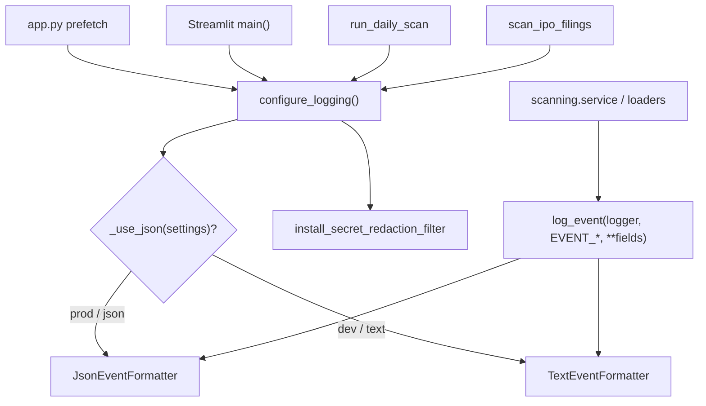

# LLD — Observability (`backend/observability`)

| | |
|---|---|
| **Component** | Structured, secret-safe logging |
| **Source** | [`backend/observability/__init__.py`](../../../backend/observability/__init__.py) |
| **Layer** | Foundation (leaf utility — imports only stdlib + config + security) |
| **Status** | Stable (OBS-001) |
| **Related** | [HLD](../high-level-design.md) · [configuration.md](configuration.md) · [security.md](security.md) · [scan-service-and-provenance.md](scan-service-and-provenance.md) · [daily-scan-job.md](daily-scan-job.md) · [health-monitoring.md](health-monitoring.md) · [audit-log.md](audit-log.md) |

## 1. Purpose & responsibilities

Give every entrypoint (Streamlit UI, `python app.py` prefetch, daily scan,
forward-return compute, and IPO filing inventory jobs) **one identical logging
setup** that emits **named, structured, secret-safe** events — readable text in
development, one JSON object per line in production.

**Responsibilities**
- Define the stable event-name constants (`EVENT_SCAN_STARTED`, `EVENT_EXTERNAL_API_FAILED`, …).
- `log_event(...)` — attach an event name + searchable `**fields` to a `LogRecord`.
- Two formatters (`TextEventFormatter`, `JsonEventFormatter`) rendering the same record.
- `configure_logging(...)` — idempotent root-logger setup + redaction filter install.

**Non-responsibilities**
- Decides *how* to render, not *what* to emit — callers choose the event + level + fields.
- Does not implement masking; it calls [security.md](security.md) `redact_text` / `install_secret_redaction_filter`.

## 2. Position in the system

## 3. Public interface

| Symbol | Contract |
|---|---|
| `log_event(logger, event, *, level=INFO, exc_info=False, **fields)` | Emit one named event; `event` + `fields` ride on the record via `extra=` (private attrs `event`, `structured_fields`). |
| `configure_logging(*, settings=None, extra_secrets=None, stream=None)` | Idempotent: refresh formatter+level, never stack handlers; install redaction filter. |
| `TextEventFormatter` | `time LEVEL logger: message | k=v k=v`, whole line `redact_text`-ed. |
| `JsonEventFormatter` | One JSON object/line: `timestamp, level, logger, [event], message, <fields…>`, `+error_type/traceback` on exceptions; whole string `redact_text`-ed. Field-vs-reserved-key collisions namespaced as `field_<key>`. |
| `EVENT_*` constants | Stable names; referencing a constant turns a typo into an `ImportError`. |

## 4. Event catalog (levels)

| Event | Level | When |
|---|---|---|
| `scan_started` / `scan_completed` | INFO | scan begins / persists |
| `scan_partial` | WARNING | usable rows but some symbols failed |
| `scan_failed` | ERROR | screener/header/persistence failure (safe phase + exception **type** only) |
| `symbol_scan_failed` | WARNING | one symbol failed to load/compute |
| `external_api_failed` | WARNING | a Dhan candle fetch failed |
| `candle_data_quality_warning` | WARNING | a frame passed with warning-only quality findings (codes only; DATA-001) |
| `candle_data_quality_failed` | WARNING | a frame was quarantined for a fatal quality finding before scanning (codes only; DATA-001) |
| `auth_denied` | WARNING | signed-in email not on allowlist (logs the email, never the list) |
| `daily_job_started` / `daily_job_completed` | INFO/ERROR | headless command lifecycle |
| `daily_job_config_loaded` / `daily_job_config_invalid` | INFO/ERROR | JOB-002 YAML schedule |
| `ipo_filing_scan_started` / `ipo_filing_scan_completed` | INFO/ERROR | aggregate IPO inventory lifecycle and final exit status |
| `ipo_filing_category_completed` | INFO | one DRHP/RHP/final-offer category committed |
| `ipo_filing_category_failed` | ERROR | one category failed; also written as a durable system audit row |
| `ipo_document_download_completed` | INFO | one DRHP/RHP was verified on disk; bounded ids, byte count, and cache-hit flag only |
| `ipo_document_download_failed` | WARNING | one download failed; stable error code and document identifiers only, also audited |
| `ipo_manual_extraction_submitted` | INFO | one immutable admin revision committed; issue/extraction/document ids and period/peer counts only, also audited |
| `data_refresh_started` / `data_refresh_completed` | INFO/ERROR | universe/candle prefetch lifecycle |
| `login_success` / `login_denied` | INFO/WARNING | OBS-003 audit: sign-in accepted / rejected (also persisted) |
| `manual_scan_started` / `export_downloaded` / `admin_page_accessed` | INFO | OBS-003 audit: user actions (also persisted) |
| `config_changed` | INFO | OBS-003 audit: admin changed a runtime setting (also persisted) |

> The OBS-003 events above are emitted here **and** written to the durable
> `audit_logs` table by the [audit recorder](audit-log.md); the recorder routes
> metadata through the same redactor before either sink.

IPO failure events follow the same sink rule but deliberately persist only
bounded category/date context and exception class. Response bodies, exception
messages, and fetched URLs are never included. Successful categories emit a log
event only; they do not create durable audit noise.

IPO-003 download failures follow the stricter same rule: the durable audit stores
only issue id, document id/type, and the downloader's stable error code. It never
stores the filing/PDF URL, query string, response body, temporary path, or raw
exception text. Successful downloads remain structured-log events only.

IPO-004 submission events similarly exclude financial values, narrative objects,
URLs, hashes, and local paths. The extraction row itself is the authoritative
user/time/document/page receipt if the best-effort audit sink is unavailable.
IPO-005 reuses that submission event for its newly sourced facts and adds no
ratio-calculation event: ratio reads are deterministic and side-effect free, and
logging their values would add sensitive financial noise without lifecycle value.

## 5. Key design decisions & trade-offs

| Decision | Rationale | Alternative rejected |
|---|---|---|
| **Leaf module — imports almost nothing** | Importing only stdlib + `config` + `security` keeps the dependency direction one-way and avoids cycles (scan/loader/app import *it*, never the reverse). | Convenience imports — import cycles. |
| **Event names as constants** | Typo → `ImportError`, not a silently un-searchable log line. | Bare strings — drift, unsearchable. |
| **Same record → two formatters** | Dev readability + prod machine-readability from one `log_event` call. | Two log calls / two APIs — divergence. |
| **`configure_logging` idempotent** | Streamlit reruns the script top-to-bottom every interaction; must refresh, never stack handlers. | `logging.basicConfig` per rerun — duplicate handlers. |
| **Redact at the formatter too** | Fields are appended *after* the logging filter runs, so formatter-level `redact_text` is the guarantee that field values/tracebacks stay safe. | Filter only — appended fields could leak. |
| **Failures at WARNING/ERROR** | Default `LOG_LEVEL=WARNING` still surfaces degraded/failed runs; set INFO for the full stream. | Everything INFO — failures invisible at default level. |

## 6. Configuration

Driven by [configuration.md](configuration.md): `LOG_LEVEL` (default `WARNING`, `SCANNER_DEBUG=1` shortcut) and `LOG_FORMAT` (`auto` → JSON in production / text in dev; `json`/`text` force one).

## 7. Testing

- [`tests/test_observability.py`](../../../tests/test_observability.py) — event rendering (text + JSON), level mapping, idempotent setup, redaction integration, field/reserved-key collision handling.

## 8. Extension points

Add a new event: declare an `EVENT_*` constant + `__all__` entry, then call
`log_event(logger, EVENT_X, level=…, **fields)` at the site. No formatter change
is needed — unknown fields serialize automatically. Document the event in this
catalog and update the HLD when it introduces a system-wide lifecycle.
