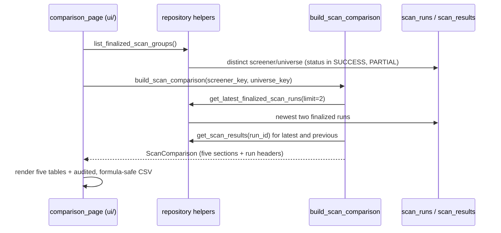

# LLD — Scan comparison (`backend/scanning/comparison.py`)

| | |
|---|---|
| **Component** | Latest-vs-previous shortlist comparison read model derived from persisted scan history |
| **Source** | [`backend/scanning/comparison.py`](../../../backend/scanning/comparison.py); repository helpers in [`backend/storage/repository.py`](../../../backend/storage/repository.py) (`get_latest_finalized_scan_runs`, `list_finalized_scan_groups`); surfaced by [`ui/comparison_page.py`](../../../ui/comparison_page.py) (see [ui-pages.md](ui-pages.md)) |
| **Layer** | Read model (pure derivation over `scan_runs`/`scan_results`) + two repository queries |
| **Status** | Stable (JOB-003) |
| **Related** | [HLD](../high-level-design.md) · [ui-pages.md](ui-pages.md) · [storage-persistence.md](storage-persistence.md) · [scan-service-and-provenance.md](scan-service-and-provenance.md) · [daily-scan-job.md](daily-scan-job.md) · [audit-log.md](audit-log.md) · [security.md](security.md) |

## 1. Purpose & responsibilities

Answer one product question — *"how did today's shortlist change from the previous
run?"* (JOB-003) — without storing anything new. The scan-history tables already
persist every finalized shortlist, so comparison is a **read model**: it derives an
immutable view from the two most recent finalized runs of one screener/universe pair
and classifies symbols into five sections for the Streamlit page and CSV export.

**Boundaries**
- Pure derivation: reads through the repository, never writes, never re-runs a scan.
- No new table and **no migration** — it is a view over `scan_runs`/`scan_results`.
- Framework-free: `backend/` never imports Streamlit; the page in `ui/` consumes this
  model (rendering, filters, and the audited CSV download live there — see
  [ui-pages.md](ui-pages.md)).

## 2. Position in the system

## 3. Public interface

| Symbol | Contract |
|---|---|
| `build_scan_comparison(session, *, screener_key, universe_key) -> ScanComparison` | Compare the newest finalized run with the previous finalized run for the pair. Raises `ValueError` when **no** finalized run exists for the pair. |
| `ScanComparison` | Frozen: `latest_run`, `previous_run` (`None` when only one finalized run exists), and the five sections `new_today`, `repeated_from_yesterday`, `dropped_today`, `improved_score`, `degraded_score`. `.to_export_frame()` flattens all sections into one stable, CSV-ready `DataFrame`. |
| `ComparisonRow` | Frozen per-symbol latest/previous state: ratings, signal dates, closes, scores, `score_source`, `score_delta`, reasons. |
| `ComparisonRun` | Frozen run header (id, started/finished UTC strings, status, screener/universe keys, `symbols_scanned`, `shortlisted`) — safe to use after the session closes. |
| `get_latest_finalized_scan_runs(session, *, screener_key, universe_key, limit=2)` | Newest `SUCCESS`/`PARTIAL` runs for the pair, newest first (id tie-break). |
| `list_finalized_scan_groups(session) -> list[tuple[str, str]]` | Distinct `(screener_key, universe_key)` pairs that have at least one finalized run, for the page's filters. |

**Sections (the five JOB-003 dashboard buckets)**

| Section | Membership |
|---|---|
| New today | symbol in latest, not in previous |
| Repeated from yesterday | symbol in both |
| Dropped today | symbol in previous, not in latest |
| Improved score | repeated symbol with `score_delta > 0` |
| Degraded score | repeated symbol with `score_delta < 0` |

## 4. Key design decisions & trade-offs

| Decision | Rationale | Alternative rejected |
|---|---|---|
| **Read model, no new table/migration** | Finalized shortlists are already persisted; deriving the comparison keeps one source of truth and avoids schema/migration drift. | A `scan_comparisons` table — redundant, needs backfill, can disagree with history. |
| **Finalized-only (`SUCCESS`/`PARTIAL`)** | A `RUNNING` row is still being written; a `FAILED` run is not a trustworthy shortlist. | Compare any latest rows — flicker mid-run, compare against junk. |
| **"Today/yesterday" = latest/previous finalized, not calendar days** | Manual UI scans and the scheduled daily job stay comparable through one model regardless of wall-clock timing. | Strict date filters — manual re-runs and off-days break the comparison. |
| **Score-source matching for deltas** | `final_score` and raw `confidence` have different semantics; a delta is computed only when both runs expose a score via the **same** source (`final_score`, else raw `confidence`). Unparseable / non-finite values → `None`. | Subtract unlike scores — misleading up/down trend. |
| **Filter options from history, not the live registry** | Renamed/deleted screeners stay inspectable, and a broken screener module cannot take down the read-only view. | Read the live registry — misses historical pairs, can crash on import. |
| **Symbols normalized (trim + uppercase) before set comparison** | The same instrument from two runs must match deterministically. | Raw strings — case/whitespace splits one symbol into two. |
| **Frozen dataclasses returned to the UI** | The page renders after `session_scope` closes; plain immutable values avoid `DetachedInstanceError` and accidental mutation. | Hand ORM rows to the UI — lazy-load crashes post-session. |

## 5. Failure modes / degradation

- No finalized run for the pair → `build_scan_comparison` raises `ValueError`; the page surfaces a friendly message (it lists only pairs with history, so this is a TOCTOU edge).
- Exactly one finalized run → `previous_run is None`, all sections empty, `to_export_frame()` is empty; the page shows a "need at least two runs" notice.
- Schema missing/outdated (drift) → the repository read raises `OperationalError`; the page shows the `alembic upgrade head` hint (see [storage-persistence.md](storage-persistence.md)).
- Repeated symbol whose scores cannot be compared (missing, or different sources) → stays in *Repeated*, excluded from *Improved*/*Degraded* (`score_delta is None`).

## 6. Configuration & dependencies

No environment variables or settings. Dependencies: SQLAlchemy (session/queries) and
pandas (the export frame). The CSV download itself is rendered and audited by the UI
page using the shared `ui/common._csv_safe` (formula-injection escaping) and
`record_audit_event` (`EVENT_EXPORT_DOWNLOADED`) — see [ui-pages.md](ui-pages.md).

## 7. Testing

- [`tests/test_scan_comparison.py`](../../../tests/test_scan_comparison.py) — new/repeated/dropped classification, score fallback + source matching (incl. `NaN`/garbage and mismatched-source exclusion), stable export-frame columns and per-section rows, and the single-finalized-run case.
- [`tests/test_app_comparison_page.py`](../../../tests/test_app_comparison_page.py) — filter-option mapping, formula-safe CSV, download-filename sanitization, export audit metadata, schema-error handling, and the one-run notice.
- [`tests/test_scan_storage_repository.py`](../../../tests/test_scan_storage_repository.py) — `get_latest_finalized_scan_runs` ordering/status filter and `list_finalized_scan_groups` distinctness.
- View wiring (selector option + dispatch) is covered in [`tests/test_app_orchestration.py`](../../../tests/test_app_orchestration.py).

## 8. Extension points

A new comparison section belongs in `backend/scanning/comparison.py` first (derive the
rows + add the field to `ScanComparison` and `to_export_frame`), then
`ui/comparison_page.py` renders it — never the reverse. A new score source extends
`_result_score` (return the value + a stable source label); the source-matching rule
then keeps deltas honest automatically.
