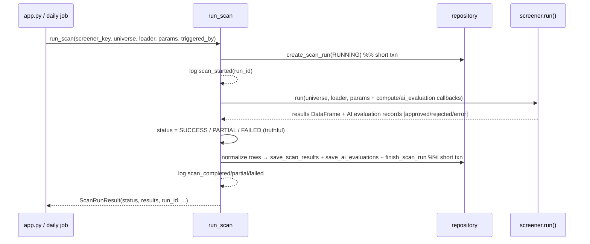

# LLD — Scan service & provenance contract

| | |
|---|---|
| **Component** | Scan orchestration lifecycle + typed result/provenance normalization |
| **Source** | [`backend/scanning/service.py`](../../../backend/scanning/service.py), [`backend/scanning/result_contract.py`](../../../backend/scanning/result_contract.py) |
| **Layer** | Screening engine ↔ persistence seam (`backend/`) |
| **Status** | Stable (SCAN-003 service · PROV-001B strict result contract · PROV-002 deterministic receipts · PROV-003 AI verdict receipts) |
| **Related** | [HLD](../high-level-design.md) · [screener-framework.md](screener-framework.md) · [storage-persistence.md](storage-persistence.md) · [scan-run-persistence.md](../scan-run-persistence.md) · [data-quality.md](data-quality.md) · [observability.md](observability.md) · [security.md](security.md) |

## 1. Purpose & responsibilities

`run_scan(...)` is the **one entry point** that wraps any screener execution
(Streamlit UI *and* the headless daily job) in the persistence + observability
lifecycle: create header → run → save results + AI evaluation receipts → finish —
and never raises, returning a **truthful** terminal status (`SUCCESS`/`PARTIAL`/`FAILED`).

`result_contract.py` is the **contract boundary** that turns a flexible screener
row into a secret-safe, JSON-safe persistence copy with a canonical
`provenance_json` envelope, **without mutating the DataFrame the UI renders**. As
of PROV-001B it is *strict*: a row missing `symbol` or complete provenance is
rejected rather than persisted.

**Non-responsibilities**
- The service never imports Streamlit (so the daily job reuses it verbatim).
- The contract validates/normalizes provenance (including the AI receipt shape) but never calls the model or fetches evidence — the AI agents build the receipt and pass it through (see [technical-analysis-ai.md](technical-analysis-ai.md), [sixty-seven-ka-funda-ai.md](sixty-seven-ka-funda-ai.md)).

## 2. Position in the system

## 3. Public interface

### `service.py`
| Symbol | Contract |
|---|---|
| `run_scan(*, screener_key, universe_key, scan_name=None, run_callable, universe_df, data_loader, params, triggered_by="ui", session_factory=session_scope)` | Orchestrate one scan; returns `ScanRunResult`; never raises for screener/DB failure. |
| `ScanRunResult` | frozen: `status`, `results` (the **unchanged** screener DataFrame), `run_id|None`, `compute_failures`, `rejected_result_rows`, `ai_validation_failures` (AI-004), `error_message`. |
| `RunCallable` / `SessionFactory` | Type aliases; `session_factory` injectable for tests. |

**Lifecycle nuances**: header is a separate short transaction (visible immediately, no lock held during the scan); params snapshot drops callables; `data_snapshot_date` derived from `end_date`; a copy of `params` is made (never mutate the caller's dict — UI reuses it for charts); `compute_failure_callback` **and** `ai_evaluation_callback` are wired so the service decides SUCCESS vs PARTIAL and streams AI verdict receipts to `save_ai_evaluations`; terminal events emitted only after the durable write, with `phase` (`create_header`/`screener`/`persistence`). **Truthful terminal state**: a persistence failure (or all result rows rejected) downgrades the run to `FAILED`; some rows rejected → `PARTIAL`. **AI-004 (AC3)**: the AI screeners tag a verdict that still fails strict validation within the configured attempt budget with `phase="ai_validation"` in that callback; `run_scan` counts those into `ScanRunResult.ai_validation_failures`, an `ai_validation_failures=N` field on the terminal `scan_*` event, and an attempt-budget-neutral clause in `error_message` — so "the AI was unavailable" reads differently from "the AI returned unparseable output".

### `result_contract.py`
| Symbol | Contract |
|---|---|
| `normalize_screener_row(row, *, screener_key, params=None, data_snapshot_date=None) -> dict` | Deep JSON-safe copy + canonical `provenance_json`. **Strict (PROV-001B)**: requires non-blank `symbol` **and** provenance with a valid `source`, non-empty `triggered_rules`, and non-empty scalar `indicator_values`; raises `ResultContractError` otherwise. |
| `normalize_secret_safe_json` / `normalize_indicator_values` / `sanitize_evidence_url` | Public boundary helpers: recursively JSON-safe + secret-masked values; scalar-only indicator map; credential/query/fragment-stripped, SSRF-screened evidence URL. |
| `ScreenerResult` (+`final_score`) / `SignalProvenance` / `RuleCheck` | Typed deterministic-result domain models. |
| `AIProvenance` / `EvidenceReference` / `AIEvaluationRecord` | Typed **PROV-003** AI-receipt models: model name, semantic prompt version, prompt/evidence/context SHA-256, sanitized URLs, verdict/confidence/reason; `AIEvaluationRecord` is the callback payload persisted to `ai_evaluations`. |
| `SignalSource = "deterministic"\|"ai"\|"hybrid"` · `AIEvaluationOutcome = "approved"\|"rejected"\|"error"` · `ResultContractError` | |

## 4. Provenance envelope (v1)

`provenance_json` = `{screener_key, screener_version, triggered_rules[], indicator_values{scalar}, params_snapshot{}, data_snapshot_date?, source, notes?, ai?}`. Under PROV-001B, `source`, `triggered_rules`, and `indicator_values` are **required** — the strict contract drops a row that lacks them. `source` is validated against the typed `SignalSource` `Literal`, never guessed. For AI screeners the `ai` block is a full `AIProvenance` receipt (model, prompt version + SHA-256, per-source evidence SHA-256, input-context hash, verdict/confidence/reason). Unknown existing keys are preserved; legacy `rules` is copied into `triggered_rules`. `raw_result_json` keeps the complete normalized row; `provenance_json` is the standardized "show your work" envelope.

## 5. Key design decisions & trade-offs

| Decision | Rationale | Alternative rejected |
|---|---|---|
| **`run_scan` never raises** | Streamlit/daily job get one predictable `ScanRunResult`; operators still get tracebacks in logs. | Propagate — UI crash / job stack trace. |
| **Persistence is best-effort** | The screener result is the primary job; a DB failure is logged and results still returned. Header failure ⇒ `run_id=None`, scan still runs. | Mandatory persistence — DB outage blocks scanning. |
| **Two short transactions (header, then results)** | RUNNING row visible immediately; no DB lock held while candles compute (safe for long scans + SQLite). | One long txn — lock contention. |
| **Normalize a *copy*, late** | Editing the persistence tree can't add columns or swap pandas/NumPy values in the live DataFrame mid-render. Deferred to the write step. | Normalize in place / early — corrupts UI frame. |
| **Redact + mask secret-named keys before store** | Scan history is durable; a token in a param/field/provider message must not become a long-lived DB secret. Uses shared `is_secret_key_name`/`redact_text`. | Store raw — durable leak. |
| **Skip one unusable row, fail only if all fail** | A single NaN-symbol merge bug shouldn't erase history for the whole run; all-fail is systemic and raised. | All-or-nothing — fragile audit. |
| **Strict JSON (`allow_nan=False` posture)** | Generic JSON blobs normalize NaN/Inf to `null`; required provenance `indicator_values` are stricter and reject non-finite numbers so the bad row is dropped. Decimal→str (lossless), dates→ISO, NumPy `.item()`. Typed columns remain the numeric source of truth. | Store floats/NaN — non-standard JSON, rounding. |
| **`source` required + validated** | Every screener stamps `source` (`deterministic`/`ai`/`hybrid`) via `build_provenance`, validated against the typed `Literal`; an unknown label raises rather than being coerced. | Guess/infer — untrustworthy audit. |
| **Strict contract before the DataFrame** | `BaseScanner.build_result_frame` validates/normalizes each row at emit time and drops contract failures (PROV-001B); persistence re-validates. | Lenient store — silent bad provenance. |
| **AI receipts are tamper-evident, not raw** | The `ai` block stores hashes + sanitized URLs + a semantic prompt version, never raw scraped/model text; the verdict cache feeding it is HMAC-signed (see [security.md](security.md)). | Store raw evidence — durable leak + unverifiable. |
| **Truthful terminal status** | A persistence failure forces `FAILED`; contract-rejected rows yield `PARTIAL` (some) / `FAILED` (all). | Best-effort "success" — false audit. |
| **Candle data-quality receipt (DATA-001)** | After the run, `_data_quality_receipt` summarizes the loader's per-symbol quality reports into a bounded, redacted `data_quality_json` (counts + fatal-first capped findings). Fatal candle symbols escalate `SUCCESS`→`PARTIAL`, or `→FAILED` when no usable symbols remain; counters ride the completion event. See [data-quality.md](data-quality.md). | Ignore loader quality signals — bad/stale data scanned with no record. |

## 6. Failure modes

- Header insert fails → `run_id=None`, `scan_failed phase=create_header` logged, scan continues.
- Screener raises → `FAILED`, generic type-only message, traceback logged.
- Result / AI-evaluation persistence fails → run marked `FAILED` (type-only message, not stuck RUNNING); in-memory results still returned to the UI.
- Rows fail the contract → dropped and counted (`rejected_result_rows`); some → `PARTIAL`, all → `FAILED`.
- AI verdict still malformed within the configured attempt budget → the screener emits an `error` `AIEvaluationRecord` (persisted for audit) **and** a `phase="ai_validation"` compute failure. The technical-analysis screener keeps an eligible deterministic gate-only row, so a mixed run can remain `PARTIAL`; the 67 ka funda screener produces no result row. `ai_validation_failures` is reported in either case.
- Fatal candle quality (DATA-001) → the loader already quarantined the frame (`phase="data_quality"`); the run downgrades to `PARTIAL`, or `FAILED` when no usable symbols remain, and the receipt records the (redacted) finding codes.

## 7. Testing

- [`tests/test_scan_run_integration.py`](../../../tests/test_scan_run_integration.py), [`tests/test_daily_scan_job.py`](../../../tests/test_daily_scan_job.py) — full lifecycle, status transitions.
- [`tests/test_result_contract.py`](../../../tests/test_result_contract.py) — normalization, redaction, source validation, JSON safety.
- [`tests/test_observability.py`](../../../tests/test_observability.py) — event emission/levels.
- [`tests/test_ai_validation.py`](../../../tests/test_ai_validation.py) — the AI-004 retry helper (retry-then-succeed, exhaustion → `AIValidationError`, no retry on SDK/usage-limit); [`tests/test_scan_service.py`](../../../tests/test_scan_service.py) records `ai_validation_failures`.

## 8. Extension points

The `ai` receipt and the `ai_evaluations` ledger are in place (PROV-003); richer evidence rides in `EvidenceReference`/`AIProvenance` with no schema change. RANK-* will populate `final_score` (column already reserved). New triggered-rule detail rides in `RuleCheck` without breaking older readers.
