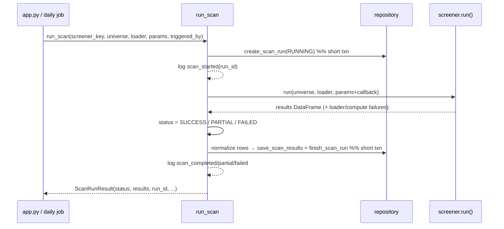

# LLD — Scan service & provenance contract

| | |
|---|---|
| **Component** | Scan orchestration lifecycle + typed result/provenance normalization |
| **Source** | [`backend/scanning/service.py`](../../../backend/scanning/service.py), [`backend/scanning/result_contract.py`](../../../backend/scanning/result_contract.py) |
| **Layer** | Screening engine ↔ persistence seam (`backend/`) |
| **Status** | Stable (SCAN-003 service · PROV-001A result/provenance contract). PROV-002 per-screener receipts: not yet on `main`. |
| **Related** | [HLD](../high-level-design.md) · [screener-framework.md](screener-framework.md) · [storage-persistence.md](storage-persistence.md) · [scan-run-persistence.md](../scan-run-persistence.md) · [observability.md](observability.md) · [security.md](security.md) |

## 1. Purpose & responsibilities

`run_scan(...)` is the **one entry point** that wraps any screener execution
(Streamlit UI *and* the headless daily job) in the persistence + observability
lifecycle: create header → run → save results → finish — and never raises.

`result_contract.py` is the **compatibility boundary** that turns a flexible
screener row into a secret-safe, JSON-safe persistence copy with a canonical
`provenance_json` envelope, **without mutating the DataFrame the UI renders**.

**Non-responsibilities**
- The service never imports Streamlit (so the daily job reuses it verbatim).
- The contract never inspects AI prompts/output (reserved for PROV-003).

## 2. Position in the system

## 3. Public interface

### `service.py`
| Symbol | Contract |
|---|---|
| `run_scan(*, screener_key, universe_key, scan_name=None, run_callable, universe_df, data_loader, params, triggered_by="ui", session_factory=session_scope)` | Orchestrate one scan; returns `ScanRunResult`; never raises for screener/DB failure. |
| `ScanRunResult` | frozen: `status`, `results` (the **unchanged** screener DataFrame), `run_id|None`, `compute_failures`, `error_message`. |
| `RunCallable` / `SessionFactory` | Type aliases; `session_factory` injectable for tests. |

**Lifecycle nuances**: header is a separate short transaction (visible immediately, no lock held during the scan); params snapshot drops callables; `data_snapshot_date` derived from `end_date`; a copy of `params` is made (never mutate the caller's dict — UI reuses it for charts); `compute_failure_callback` wired so the service decides SUCCESS vs PARTIAL; terminal events emitted only after the durable write, with `phase` (`create_header`/`screener`/`persistence`).

### `result_contract.py`
| Symbol | Contract |
|---|---|
| `normalize_screener_row(row, *, screener_key, params=None, data_snapshot_date=None) -> dict` | Deep JSON-safe copy + canonical `provenance_json`; **requires non-blank `symbol`**; validates explicit `source`. |
| `ScreenerResult` / `SignalProvenance` / `RuleCheck` / `AIProvenance` | Typed domain dataclasses (the target shape). |
| `SignalSource = "deterministic"|"ai"|"hybrid"` · `ResultContractError` | |

## 4. Provenance envelope (v1)

`provenance_json` = `{screener_key, screener_version?, triggered_rules[], indicator_values{scalar}, params_snapshot{}, data_snapshot_date?, source?, notes?, ai?}`. Unknown existing keys are preserved; legacy `rules` is copied into `triggered_rules` (old key kept); `source` is **never guessed** (stays `null` for legacy rows). `raw_result_json` keeps the complete normalized row; `provenance_json` is the standardized "show your work" envelope.

## 5. Key design decisions & trade-offs

| Decision | Rationale | Alternative rejected |
|---|---|---|
| **`run_scan` never raises** | Streamlit/daily job get one predictable `ScanRunResult`; operators still get tracebacks in logs. | Propagate — UI crash / job stack trace. |
| **Persistence is best-effort** | The screener result is the primary job; a DB failure is logged and results still returned. Header failure ⇒ `run_id=None`, scan still runs. | Mandatory persistence — DB outage blocks scanning. |
| **Two short transactions (header, then results)** | RUNNING row visible immediately; no DB lock held while candles compute (safe for long scans + SQLite). | One long txn — lock contention. |
| **Normalize a *copy*, late** | Editing the persistence tree can't add columns or swap pandas/NumPy values in the live DataFrame mid-render. Deferred to the write step. | Normalize in place / early — corrupts UI frame. |
| **Redact + mask secret-named keys before store** | Scan history is durable; a token in a param/field/provider message must not become a long-lived DB secret. Uses shared `is_secret_key_name`/`redact_text`. | Store raw — durable leak. |
| **Skip one unusable row, fail only if all fail** | A single NaN-symbol merge bug shouldn't erase history for the whole run; all-fail is systemic and raised. | All-or-nothing — fragile audit. |
| **Strict JSON (`allow_nan=False` posture)** | NaN/Inf → `null`; Decimal→str (lossless), dates→ISO, NumPy `.item()`. Typed columns remain the numeric source of truth. | Store floats/NaN — non-standard JSON, rounding. |
| **`source` not inferred** | A wrong deterministic/ai/hybrid label is worse than `null`, so legacy rows stay `null`. No screener sets `source` on `main` today; PROV-002/003 will populate it. | Guess — untrustworthy audit. |

## 6. Failure modes

- Header insert fails → `run_id=None`, `scan_failed phase=create_header` logged, scan continues.
- Screener raises → `FAILED`, generic type-only message, traceback logged.
- Result persistence fails → run marked `FAILED` with type-only message (history not stuck RUNNING); in-memory results still returned.
- Row fails contract → skipped (logged); all rows failing → `ResultContractError`.

## 7. Testing

- [`tests/test_scan_run_integration.py`](../../../tests/test_scan_run_integration.py), [`tests/test_daily_scan_job.py`](../../../tests/test_daily_scan_job.py) — full lifecycle, status transitions.
- [`tests/test_result_contract.py`](../../../tests/test_result_contract.py) — normalization, redaction, source validation, JSON safety.
- [`tests/test_observability.py`](../../../tests/test_observability.py) — event emission/levels.

## 8. Extension points

PROV-003 expands the reserved `ai` block (model/prompt/evidence) inside `provenance_json` with no schema change. RANK-* populates `final_score`. New triggered-rule detail rides in `RuleCheck` without breaking older readers.
