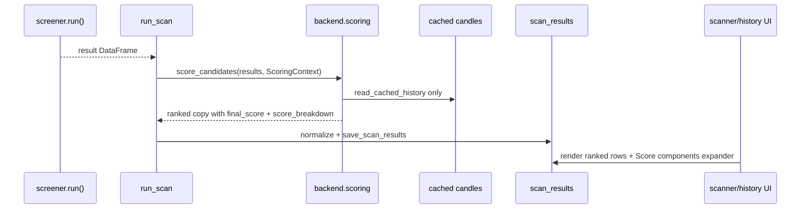

# LLD - Ranking scorer (`backend/scoring/`)

| | |
|---|---|
| **Component** | Deterministic scan-result ranking layer |
| **Source** | [`backend/scoring/`](../../../backend/scoring), [`config/scoring_model.yaml`](../../../config/scoring_model.yaml), [`backend/scanning/service.py`](../../../backend/scanning/service.py), [`ui/common.py`](../../../ui/common.py) |
| **Layer** | Screening engine annotation step |
| **Status** | Implemented (RANK-002) |
| **Related** | [HLD](../high-level-design.md) - [RANK-001 design](../rank-001-final-scoring-model.md) - [scan-service-and-provenance.md](scan-service-and-provenance.md) - [ui-pages.md](ui-pages.md) - [storage-persistence.md](storage-persistence.md) |

## 1. Purpose & responsibilities

The ranking scorer annotates each shortlisted result with a deterministic
`final_score` on a 0-100 scale. It also writes an auditable `score_breakdown`
receipt into row provenance so users can see which components were available.

The scorer is additive:
- it never filters rows;
- it keeps `reason` and screener-specific columns visible;
- it persists the public score through the existing `scan_results.final_score`
  column; and
- it stores component detail in existing `provenance_json`, so no schema
  migration is needed.

**Non-responsibilities**
- No live Dhan fetches. Liquidity/risk read only existing cached candles via
  `DailyDataLoader.read_cached_history(...)`.
- No fundamental or valuation scores yet. Those remain RANK-003 scope.
- No portfolio-aware allocation logic. This layer only ranks the current
  shortlist.

## 2. Position in the system



## 3. Public interface

| Symbol | Contract |
|---|---|
| `ScoringConfig` | Frozen dataclass with model version, weights, liquidity/risk windows, volatility cap, and freshness half-life. |
| `load_scoring_config(path=None)` | Null-safe YAML loader. Missing, malformed, null, non-finite, or negative values fall back to defaults and weights normalize deterministically. |
| `ScoringContext(universe_key, universe_df, data_loader, data_snapshot_date, config)` | Runtime context supplied by the scan that just ran. Reuses the in-memory universe and data loader to avoid new external calls. |
| `score_candidates(results, *, context)` | Returns a ranked copy of `results` with `final_score` and provenance `score_breakdown`. The input DataFrame and nested provenance dicts are not mutated. |

## 4. Scoring model

Components follow the RANK-001 formula:

| Component | Source | Score behavior |
|---|---|---|
| `technical` | `confidence` first, then known deterministic strength/proximity fields | Cross-sectional min-max; equal/single present values score neutral 50. |
| `liquidity` | Cached trailing `mean(volume * close)`, log-scaled | Cross-sectional min-max; missing cache/volume/window drops the component. |
| `risk` | Cached trailing log-return volatility | Absolute `100 * clamp(1 - sigma / risk_vol_cap, 0, 1)`. |
| `freshness` | Stored `data_snapshot_date - signal_date` | Absolute exponential decay; never uses wall-clock time. |

For each row:

```text
final_score = sum(component_score * effective_weight)
```

where `effective_weight` is the configured weight renormalized over only the
components present for that row. If no components are computable, the row stays
present and `final_score` is null.

The receipt shape is:

```json
{
  "model_version": "rank-1.0",
  "scale": "0-100",
  "final_score": 87.06,
  "components": {"freshness": 87.06},
  "weights_effective": {"freshness": 1.0},
  "coverage": ["freshness"],
  "missing": ["technical", "liquidity", "risk"]
}
```

## 5. Failure modes

- Scoring raises inside `run_scan` -> `scan_scoring_failed` warning event,
  null `final_score` column, rows/status/persistence continue.
- Missing cached candles -> liquidity/risk omitted for that row.
- Malformed result numbers -> the affected component is treated as missing.
- Empty result frame -> returned unchanged except for an empty `final_score`
  column when needed.

## 6. UI behavior

The scanner results table and scan-history details sort by `final_score`
descending, with null scores last and stable tie ordering. `final_score` is shown
as an ordinary numeric column. Raw `reason` text and screener-specific columns
remain in the table.

The raw provenance and `score_breakdown` dict are hidden from the main table and
CSV exports. A compact **Score components** expander shows Symbol, Final score,
Technical, Liquidity, Risk, Freshness, Coverage, and Missing. CSV exports keep
`final_score` but drop raw provenance/breakdown dicts.

## 7. Testing

- [`tests/test_scoring_components.py`](../../../tests/test_scoring_components.py)
  covers normalizers and pure component math.
- [`tests/test_scoring_config.py`](../../../tests/test_scoring_config.py)
  covers missing/malformed/null YAML and safe weight normalization.
- [`tests/test_scoring_model.py`](../../../tests/test_scoring_model.py)
  covers aggregation, renormalization, deterministic ordering, cache-only reads,
  immutable inputs, and preserved raw columns.
- [`tests/test_scan_service.py`](../../../tests/test_scan_service.py)
  covers persistence of `final_score`/`score_breakdown` and non-fatal scoring
  failure logging.
- [`tests/test_ui_common.py`](../../../tests/test_ui_common.py),
  [`tests/test_app_history_page.py`](../../../tests/test_app_history_page.py),
  and [`tests/test_app_orchestration.py`](../../../tests/test_app_orchestration.py)
  cover sorting helpers, component-frame extraction, CSV hiding, history row
  shaping, and app re-exports.

## 8. Extension points

RANK-003 can add `fundamental` and `valuation` components by extending the
config, component extraction, and receipt order while keeping the same
renormalized-weight contract. Per-screener weights should be added as explicit
config, not inferred from screener names.
