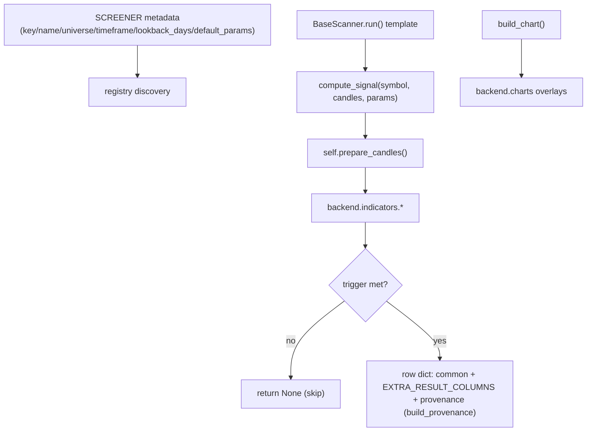

# LLD — Screener catalog (`screeners/`)

| | |
|---|---|
| **Component** | The strategy layer — one file per screener |
| **Source** | [`screeners/`](../../../screeners) (11 strategies) |
| **Layer** | Strategy (`screeners/` — the deliberate boundary vs `backend/` plumbing) |
| **Status** | Stable (+ golden-snapshot regression tests) |
| **Related** | [HLD](../high-level-design.md) · [screener-framework.md](screener-framework.md) · [indicators.md](indicators.md) · [charts-visualization.md](charts-visualization.md) · [technical-analysis-ai.md](technical-analysis-ai.md) · [sixty-seven-ka-funda-ai.md](sixty-seven-ka-funda-ai.md) · [fundamentals-ai.md](fundamentals-ai.md) |

## 1. Purpose & responsibilities

Each file is a self-contained trading strategy: a `BaseScanner` subclass (see
[screener-framework.md](screener-framework.md)) declaring `SCREENER` metadata,
`EXTRA_RESULT_COLUMNS`, `compute_signal(...)`, and an optional `build_chart(...)`.
The strategy decides **what to look for**; all plumbing (data, loop, errors,
persistence, charts) is inherited or composed from `backend/`.

**The boundary**: strategy logic lives here; no Dhan/SDK/DB code. Every screener
ends with module-level back-compat aliases (`SCREENER`, `RESULT_COLUMNS`, `run`,
`build_chart`) via `export_module_compat`.

## 2. Catalog

| Screener (key) | Universe | Type | Trigger (one line) |
|---|---|---|---|
| **Heikin Ashi SuperTrend** (`heikin_ashi_supertrend`) | `fno` | deterministic | Daily HA close crosses the SuperTrend line. |
| **Bollinger Band Reversal** (`bollinger_band_reversal`) | `fno` | deterministic | Daily outer-band rejection candle. |
| **Bollinger Lower Band** (`bollinger_lower_band`) | `hemant_super_45` | deterministic | Close at/below/near lower Bollinger(200, 2.5). |
| **Envelope** (`envelope`) | `hemant_super_45` | deterministic | Close at/below lower Envelope (200-EMA, 14%) — ≥14% below the 200 EMA. |
| **Envelope + Knoxville** (`envelope_knoxville_buy`) | `hemant_super_45` | deterministic | Near lower Envelope **and** a recent bullish Knoxville Divergence (BarsBack 20, RSI 14). |
| **Stochastic Swing** (`stochastic_swing`) | `nifty_500` | deterministic | Fresh %K/%D cross out of OS/OB, confirmed by SMA200 trend + recent 5EMA/200SMA cross. BUY **or** SELL. |
| **52 Week High/Low (Ceyhun)** (`week52_low_ceyhun`) | `hemant_super_45` | deterministic | Close within tolerance (2%) of the trailing 252-day low in the last 10 days. |
| **20% Up Green Candles (Lovevanshi)** (`green_candles_20pct_up`) | `hemant_super_good_union` | deterministic | Run of consecutive green candles (≤20) moving >20% low→high. |
| **CPR Yearly Reversal** (`cpr_yearly`) | `nifty_500` | deterministic | Yearly CPR central pivots descending 3 straight years (this < last < 2y-ago) **and** a weekly close reclaiming the previous year's high. Chart = weekly candles + yearly CPR lines. |
| **67 Ka Funda (AI)** (`sixty_seven_ka_funda`) | `hemant_super_good_200_union` | **hybrid (gate + AI)** | ≥67% fall from ATH (≥100% upside) gate, then a Claude verifier approves a BUY on evidence. → [sixty-seven-ka-funda-ai.md](sixty-seven-ka-funda-ai.md) |
| **Technical Analysis (AI)** (`technical_analysis`) | `hemant_super_good_union` | **hybrid (gate + AI)** | Cheap pivot/pattern gate, then a Claude agent confirms a bullish setup with tools. → [technical-analysis-ai.md](technical-analysis-ai.md) |

(Universe keys: see [universe-management.md](universe-management.md). The Check Fundamentals per-row agent — [fundamentals-ai.md](fundamentals-ai.md) — is invoked from the UI on a shortlisted row, not a screener itself.)

## 3. Anatomy of a screener (the contract in practice)

**Worked example — `Envelope`** ([screeners/envelope.py](../../../screeners/envelope.py)): `prepare_candles` → `indicators.envelope(200, 14%)` → skip if history < period or basis NaN → BUY when `close ≤ env_lower`; extras `env_basis/env_lower/env_upper/pct_below_basis`; chart = candles+volume with envelope overlay. The simplest template.

**Worked example — `StochasticSwing`** ([screeners/stochastic_swing.py](../../../screeners/stochastic_swing.py)): enriches with SMA200/EMA5/Stochastic + freshness flags; BUY/SELL on cross-from-zone + trend + fresh EMA/SMA cross; module constants `STOP_LOSS_PCT=3%`, `TARGET_PCT=5%`, `MAX_CONFIRMATION_AGE=7d` (fixed rules, not UI knobs); 3-pane chart. A good multi-indicator template.

## 4. Key design decisions & trade-offs

| Decision | Rationale |
|---|---|
| **Shortlist, not advice** | Screeners omit non-matches (return `None`) rather than emit HOLD; output is "what to look at today". |
| **Fixed risk rules as module constants** | Strategy-brief invariants (e.g. 3%/5%) live in the file, not `default_params`, so they aren't mistaken for UI knobs. |
| **`lookback_days` mostly advisory** | The app feeds ~10y cached candles; the value mainly drives the sidebar "Lookback" display + warm-up sanity. |
| **AI-screener degradation differs by screener** | When the Claude Agent SDK/SerpAPI is unavailable, **Technical Analysis** still emits a gate-only BUY (`source="deterministic"`) for deterministic setups (at-support / fresh double bottom / bullish FVG / order block — *not* a bare breakout); **67 Ka Funda** has **no** gate-only fallback — it logs a compute failure, emits an `error` AI receipt, and skips the candidate (→ partial run). Approved AI rows are `source="hybrid"`. |
| **Warm-up handled by skipping** | NaN indicator during warm-up → return `None`, never raise (per-symbol resilience). |
| **Per-screener provenance (PROV-002)** | Every `compute_signal` returns a `provenance` receipt via `self.build_provenance(triggered_rules=…, indicator_values=…, source=…)` — deterministic screeners use `source="deterministic"`; approved AI-confirmed rows use `source="hybrid"` with an `ai` receipt; Technical Analysis gate-only fallback rows remain `source="deterministic"`. `build_result_frame` validates it (strict contract) and the persistence layer expands it into `provenance_json`. See [scan-service-and-provenance.md](scan-service-and-provenance.md). |

## 5. Failure modes

- Bad candle frame for one symbol → caught by the `run()` template, logged (redacted), surfaced in "Run details"; scan continues (→ `partial`).
- AI dependency missing → Technical Analysis falls back to a gate-only BUY; 67 Ka Funda emits an `error` AI receipt and skips the candidate (partial run). Neither crashes the scan; both decisions stay auditable in `ai_evaluations`.

## 6. Testing

- [`tests/test_real_screeners.py`](../../../tests/test_real_screeners.py) — each screener against fixtures.
- [`tests/test_screener_golden_outputs.py`](../../../tests/test_screener_golden_outputs.py) + [`tests/golden/`](../../../tests/golden) — **golden-snapshot** regression catching output drift (refresh with `UPDATE_GOLDEN=1`).
- Per-strategy tests (e.g. `test_universe_builder`, `test_patterns`, AI-screener tests).

## 7. Extension points

Drop `screeners/my_screener.py` (a `BaseScanner` subclass) — it auto-registers on next start (see README "Adding your own screener"). Use `envelope.py` as the simplest template, `envelope_knoxville_buy.py` for a multi-indicator example.
