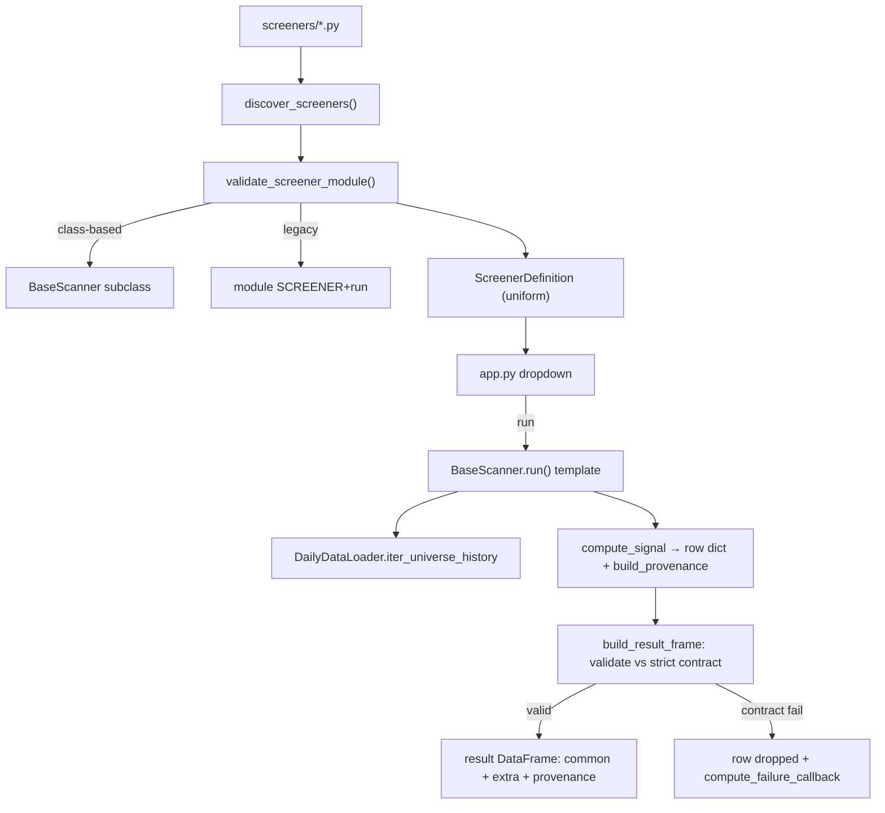

# LLD — Screener framework (base class + registry)

| | |
|---|---|
| **Component** | The screener plugin system |
| **Source** | [`backend/scanner_base.py`](../../../backend/scanner_base.py), [`backend/screener_registry.py`](../../../backend/screener_registry.py) |
| **Layer** | Screening engine (`backend/`) |
| **Status** | Stable (BaseScanner refactor · PROV-002 provenance · PROV-001B strict contract) |
| **Related** | [HLD](../high-level-design.md) · [screener-catalog.md](screener-catalog.md) · [indicators.md](indicators.md) · [data-acquisition.md](data-acquisition.md) · [scan-service-and-provenance.md](scan-service-and-provenance.md) |

## 1. Purpose & responsibilities

Make "a screener is one file in `screeners/`" literally true. The framework
provides the **common contract** every strategy obeys and the **auto-discovery**
that turns a dropped-in file into a UI dropdown option — with zero edits to the
registry or `app.py`.

**`scanner_base.BaseScanner`** — the ABC every strategy subclasses: defines the
common result schema (+ a reserved trailing `provenance` column, `PROVENANCE_COLUMN`),
the per-symbol `run(...)` template (fetch → evaluate → validate → collect),
per-symbol exception capture, and small helpers (`prepare_candles`, `coerce_param`,
`empty_result`, `build_provenance`, `build_chart`).

**`screener_registry`** — discovers, validates, and normalizes every screener
module into a uniform `ScreenerDefinition`, supporting both class-based
(preferred) and legacy module-based screeners.

> **PROV-002 (implemented):** each `compute_signal` returns a per-row receipt under
> the reserved `provenance` column, built by `BaseScanner.build_provenance(...)`
> (`triggered_rules` + scalar `indicator_values` + a validated `source`, stamped with
> the screener key and `SCREENER_VERSION`). `run()` routes rows through
> `build_result_frame`, which validates them against the strict result contract
> (PROV-001B) and drops any that fail; the persistence layer then expands the
> receipt into the canonical `provenance_json`. See [scan-service-and-provenance.md](scan-service-and-provenance.md).

## 2. Position in the system

## 3. Public interface

### `BaseScanner` (ABC)
| Member | Contract |
|---|---|
| `SCREENER: ClassVar[dict]` | Metadata (key/name/description/universe/timeframe/lookback_days/default_params). Required. |
| `EXTRA_RESULT_COLUMNS: ClassVar[list]` | Appended to `COMMON_RESULT_COLUMNS = [symbol, rating, signal_date, close, reason]`. |
| `compute_signal(symbol, candles, params) -> dict|None` | **@abstractmethod** — the strategy rule; returns a row dict (incl. a `provenance` value from `build_provenance`) or `None` to skip. |
| `SCREENER_VERSION: ClassVar[str]` | Stamped into every provenance receipt; bump when rule logic changes so historical provenance stays interpretable. |
| `build_provenance(*, triggered_rules, indicator_values, source="deterministic", notes=None, ai=None) -> dict` | Build the reserved `provenance` receipt; validates `source` against the typed `Literal`, requires non-empty rules + scalar indicators, redacts notes, normalizes an optional `AIProvenance` receipt. |
| `run(universe_df, data_loader, params) -> DataFrame` | Template: prefers streaming `iter_universe_history`, falls back to batch; per-symbol errors logged+captured (redacted); rows pass through `build_result_frame`. |
| `build_result_frame(rows, *, compute_failure_callback=None) -> DataFrame` | Validate each row against the strict contract (PROV-001B), **drop** failures (logged + callback, `phase="result_contract"`), return the fixed schema. |
| `prepare_candles` | Delegates to `indicators.prepare_ohlc` (one definition of "ready for math"). |
| `coerce_param(params, key, cast)` | Read param with default fallback + type coercion; `KeyError` if neither exists. |
| `result_columns` / `empty_result()` | `COMMON_RESULT_COLUMNS` + extras + trailing `PROVENANCE_COLUMN`, dedup-ordered / correctly-shaped empty frame. |
| `build_chart(candles, params) -> dict|None` | Optional Lightweight-Charts spec; default `None`. |

`export_module_compat(scanner)` bundles module-level aliases (`SCREENER`, `RESULT_COLUMNS`, `run`, `build_chart`) for legacy test imports.

### `screener_registry`
| Symbol | Contract |
|---|---|
| `discover_screeners(package_name="screeners")` | Import every non-`_` module, validate, return `{key: ScreenerDefinition}` sorted by display name; duplicate key → error. |
| `validate_screener_module(module)` | Class-based or legacy → one `ScreenerDefinition`. |
| `ScreenerDefinition` | frozen: key, name, description, universe, timeframe, lookback_days, default_params, module_name, run, build_chart. |
| `REQUIRED_METADATA_KEYS` | Validated metadata fields. |
| `ScreenerRegistryError` | Contract violation. |

## 4. Key design decisions & trade-offs

| Decision | Rationale | Alternative rejected |
|---|---|---|
| **ABC with `@abstractmethod compute_signal`** | "Forgot to implement the strategy" fails at instantiation/discovery, not as a silent empty shortlist at runtime. | Duck typing — late, confusing failures. |
| **Fixed `COMMON_RESULT_COLUMNS` prefix** | UI badge logic, chart symbol pick, CSV download rely on these 5 columns regardless of screener. | Free-form output — UI special-cases per screener. |
| **Provenance is mandatory (PROV-001B/002)** | `build_result_frame` validates each row's `provenance` (`source` + `triggered_rules` + scalar `indicator_values`) and drops failures; a screener that forgets provenance yields an empty/`PARTIAL` run, never silent bad audit data. | Optional provenance — empty/untrustworthy receipts. |
| **Template `run(...)`, rarely overridden** | One scan shape (one row per signal, empty frame on no match) keeps the UI simple. | Per-screener loops — duplication, drift. |
| **Streaming-first with batch fallback** | Large universes compute per-symbol without holding all candles in memory; old loaders still work. | Batch only — memory pressure. |
| **Per-symbol try/except (redacted) + continue** | One bad candle frame must not kill the whole scan; failures surface in "Run details" via a callback. | Fail whole scan — fragile. |
| **Discovery only counts classes defined *in* the module** | `__module__` check stops an imported `BaseScanner` from being mistaken for a screener. | Any subclass — false positives. |
| **Accept legacy module-based screeners** | Backwards compatibility with older tests/screeners; same `ScreenerDefinition` either way. | Force rewrite — churn. |
| **Duplicate key → hard error** | Ambiguous result ownership / filenames; refuse rather than guess. | Last-wins — silent shadowing. |

## 5. Failure modes

- Missing metadata key / bad `run` signature / non-callable `build_chart` → `ScreenerRegistryError` with a precise message (caught at discovery, surfaced in the UI).
- Abstract subclass (no `compute_signal`) → `TypeError` wrapped as `ScreenerRegistryError`.
- Per-symbol compute failure → logged WARNING + `compute_failure_callback` row; scan continues (→ `partial` via the scan service).
- Row with missing/invalid provenance → dropped by `build_result_frame` (logged + `compute_failure_callback`, `phase="result_contract"`); the run becomes `PARTIAL`/`FAILED`.

## 6. Testing

- [`tests/test_scanner_base.py`](../../../tests/test_scanner_base.py) — contract, helpers, run template, error capture.
- [`tests/test_screener_registry.py`](../../../tests/test_screener_registry.py) — discovery, validation, both patterns, duplicate keys.

## 7. Extension points

Drop `screeners/my_screener.py` with a `BaseScanner` subclass (set `SCREENER`, `EXTRA_RESULT_COLUMNS`, implement `compute_signal` returning a row **with `provenance=self.build_provenance(...)`**, optionally `build_chart`). It appears in the UI on next start. See the README "Adding your own screener" section and [screener-catalog.md](screener-catalog.md).
