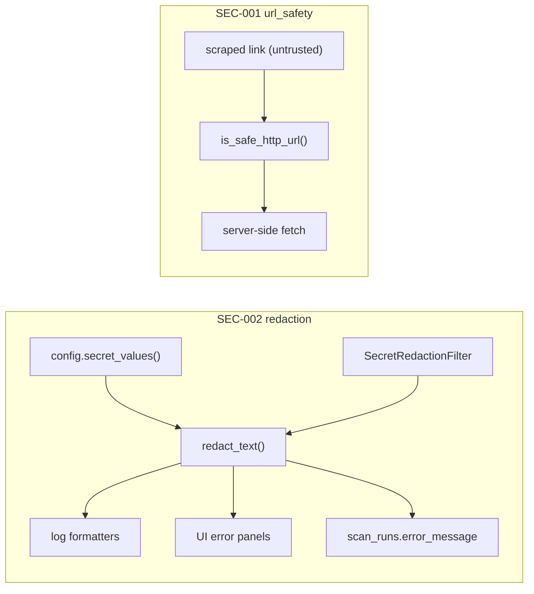

# LLD — Security (secret redaction + SSRF guardrails)

| | |
|---|---|
| **Component** | Cross-cutting security utilities |
| **Source** | [`backend/security/redaction.py`](../../../backend/security/redaction.py), [`backend/security/__init__.py`](../../../backend/security/__init__.py), [`backend/url_safety.py`](../../../backend/url_safety.py) |
| **Layer** | Foundation (leaf utilities, best-effort, never raise on the safety path) |
| **Status** | Stable (SEC-001 URL safety · SEC-002 redaction) |
| **Related** | [HLD](../high-level-design.md) · [configuration.md](configuration.md) · [observability.md](observability.md) · [fundamentals-ai.md](fundamentals-ai.md) · [sixty-seven-ka-funda-ai.md](sixty-seven-ka-funda-ai.md) |

## 1. Purpose & responsibilities

Two independent guardrails that keep the app safe by default:

1. **Secret redaction (SEC-002)** — mask credentials before any text reaches a
   log handler, a UI error panel, or a persisted `scan_runs.error_message`.
2. **SSRF guardrails (SEC-001)** — decide whether a URL scraped from an untrusted
   public page is safe for the server to fetch, refusing loopback / private /
   link-local / metadata addresses.

**Non-responsibilities**
- Does not own *what* gets logged (that is [observability.md](observability.md)) — only how it is masked.
- Does not store secrets — it reads them from [configuration.md](configuration.md) `secret_values()` defensively.

## 2. Position in the system

## 3. Public interface

### Redaction — `backend/security/redaction.py`
| Symbol | Contract |
|---|---|
| `redact_text(text, *, extra_secrets=None)` | Mask configured secrets + token shapes. Non-strings returned unchanged. **Order: exact configured values → DB-URL password → `Authorization: Bearer` → generic `key=value`.** |
| `redact_exception(exc, *, extra_secrets=None)` | `"<ClassName>: <redacted message>"` — class name kept (useful + safe), message scrubbed. |
| `SecretRedactionFilter(logging.Filter)` | Masks `record.getMessage()`, clears `record.args`, precomputes redacted `exc_text`/`stack_info`. `add_secrets()` merges later-known secrets (e.g. OIDC). |
| `install_secret_redaction_filter(logger=None, *, extra_secrets=None)` | Idempotent; attaches one filter to the logger **and its handlers** (so child-logger records that propagate are still covered). |
| `is_secret_key_name(name)` | True when a *field name* looks credential-shaped (normalizes case/separators; matches `SECRET_KEY_NAME_PARTS` + suffix list). Used by PROV-001A to redact persisted result keys. |
| `SECRET_KEY_NAME_PARTS` | Canonical normalized vocabulary of secret-ish field names. |

### URL safety — `backend/url_safety.py`
| Symbol | Contract |
|---|---|
| `is_safe_http_url(url, *, allowed_hosts=None, resolve_dns=False)` | Require http(s), no embedded credentials, optional exact host allowlist, public host. `resolve_dns=True` before real fetches. |
| `hostname_looks_public(hostname)` | Cheap pre-DNS screen: rejects `localhost`/`*.localhost`, IP literals in non-global ranges. |
| `hostname_resolves_public(hostname)` | Resolves via `getaddrinfo`; **every** answer must be global (closes DNS-rebinding). Resolution failure ⇒ unsafe. |

## 4. Key design decisions & trade-offs

| Decision | Rationale | Alternative rejected |
|---|---|---|
| **Redaction is best-effort, never raises** | `_configured_secret_values()` wraps the settings import in `try/except` so redaction still works even when settings parsing is the thing failing. | Strict — would turn the safety net into a new crash. |
| **Longest-secret-first replacement** | Masking a long DB URL before a short client id embedded in it avoids half-redacted output. | Arbitrary order — partial leaks. |
| **Specific shapes before generic** | DB-URL/`Bearer` passes keep useful context (scheme, host, header name) that a blanket `key=value` pass would mangle. | Single regex — loses operator context. |
| **High-signal `_SECRET_NAME` vocabulary** | Including vague words like "api key" would hide *useful* messages such as "Invalid API key". | Broad list — over-redaction. |
| **Min secret length ≥ 4 (`_clean_secret`)** | Tiny accidental values create more false positives than protection. | Mask everything — noise. |
| **Filter masks `getMessage()` + clears `args`** | A `LogRecord` stores template + args separately; redacting only `msg` lets a handler re-interpolate the secret later. | Redact `msg` only — leak via deferred formatting. |
| **URL safety fails closed on resolution error** | A legitimate production fetch uses a resolvable, public host. | Allow on error — SSRF bypass. |
| **One shared `is_secret_key_name`** | Same definition protects log redaction *and* persisted scan history — add a name once, both benefit. | Two vocabularies — drift. |

## 5. Failure modes / degradation

- Settings import failing → redaction silently proceeds with only `extra_secrets` + regex shapes.
- Unknown/exotic value types passed to `redact_text` → returned unchanged (defensive in UI paths where input may be `None`).
- `is_safe_http_url` on a malformed URL → `False`.

## 6. Testing

- [`tests/test_secret_redaction.py`](../../../tests/test_secret_redaction.py) — key/value, Bearer, DB-URL password, logging filter, `is_secret_key_name`.
- [`tests/test_url_safety.py`](../../../tests/test_url_safety.py) — loopback/private/link-local rejection, allowlist, DNS resolution path.
- [`tests/test_supply_chain_policy.py`](../../../tests/test_supply_chain_policy.py) — dependency posture.

## 7. Extension points

Add a new credential shape by extending `_SECRET_NAME` / the specific regexes in `redaction.py`, and add the field-name form to `SECRET_KEY_NAME_PARTS`. Add a new allowed scrape host by passing `allowed_hosts=` at the call site, not by widening the global policy.
