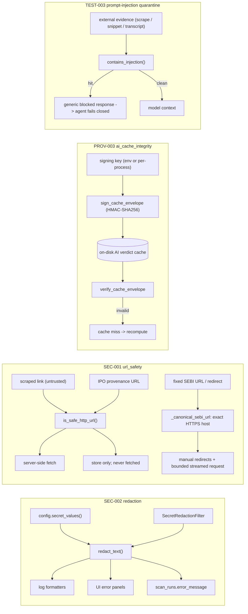

# LLD — Security (secret redaction + SSRF guardrails + AI cache integrity)

| | |
|---|---|
| **Component** | Cross-cutting security utilities |
| **Source** | [`backend/security/redaction.py`](../../../backend/security/redaction.py), [`backend/security/prompt_injection.py`](../../../backend/security/prompt_injection.py), [`backend/security/__init__.py`](../../../backend/security/__init__.py), [`backend/url_safety.py`](../../../backend/url_safety.py), [`backend/ai_cache_integrity.py`](../../../backend/ai_cache_integrity.py) |
| **Layer** | Foundation (leaf utilities, best-effort, never raise on the safety path) |
| **Status** | Stable (SEC-001 URL safety · SEC-002 redaction · PROV-003 AI cache integrity · TEST-003 prompt-injection quarantine) |
| **Related** | [HLD](../high-level-design.md) · [configuration.md](configuration.md) · [observability.md](observability.md) · [scan-service-and-provenance.md](scan-service-and-provenance.md) · [storage-persistence.md](storage-persistence.md) · [ipo-screener.md](ipo-screener.md) · [fundamentals-ai.md](fundamentals-ai.md) · [technical-analysis-ai.md](technical-analysis-ai.md) · [sixty-seven-ka-funda-ai.md](sixty-seven-ka-funda-ai.md) |

## 1. Purpose & responsibilities

Four independent guardrails keep the app safe by default:

1. **Secret redaction (SEC-002)** — mask credentials before any text reaches a
   log handler, a UI error panel, or a persisted `scan_runs.error_message`.
2. **SSRF guardrails (SEC-001)** — decide whether a URL scraped from an untrusted
   public page is safe for the server to fetch, refusing loopback / private /
   link-local / metadata addresses. Fixed-source clients may narrow this further:
   IPO-002 accepts only exact HTTPS SEBI hosts and validates every redirect itself.
3. **AI cache integrity (PROV-003)** — HMAC-sign each durable AI verdict-cache
   envelope and verify it before reuse, so a tampered/forged cache entry is
   rejected and recomputed instead of trusted. Plus the AI-evidence boundary:
   evidence URLs are sanitized (credentials/query/fragment stripped, SSRF-screened)
   and only hashes + labels are stored — never raw scraped/model text.
4. **Prompt-injection quarantine (TEST-003)** — one shared engine the AI agents
   run over external evidence (Screener.in scrapes, SerpAPI snippets, PDF concall
   transcripts) *before* it reaches a model context. On a hit the tool returns a
   generic blocked response (never the hostile text) and the agent fails closed.

**Non-responsibilities**
- Does not own *what* gets logged (that is [observability.md](observability.md)) — only how it is masked.
- Does not store secrets — it reads them from [configuration.md](configuration.md) `secret_values()` defensively.

## 2. Position in the system

## 3. Public interface

### Redaction — `backend/security/redaction.py`
| Symbol | Contract |
|---|---|
| `redact_text(text, *, extra_secrets=None)` | Mask configured secrets + token shapes. Non-strings returned unchanged. **Order: exact configured values → DB-URL password → `Authorization: Bearer` → generic `key=value`.** |
| `redact_exception(exc, *, extra_secrets=None)` | `"<ClassName>: <redacted message>"` — class name kept (useful + safe), message scrubbed. |
| `SecretRedactionFilter(logging.Filter)` | Masks `record.getMessage()`, clears `record.args`, precomputes redacted `exc_text`/`stack_info`. `add_secrets()` merges later-known secrets (e.g. OIDC). |
| `install_secret_redaction_filter(logger=None, *, extra_secrets=None)` | Idempotent; attaches one filter to the logger **and its handlers** (so child-logger records that propagate are still covered). |
| `is_secret_key_name(name)` | True when a *field name* looks credential-shaped (normalizes case/separators; matches `SECRET_KEY_NAME_PARTS` + suffix list). Used by PROV-001A to redact persisted result keys. |
| `SECRET_KEY_NAME_PARTS` | Canonical normalized vocabulary of secret-ish field names. |

### URL safety — `backend/url_safety.py`
| Symbol | Contract |
|---|---|
| `is_safe_http_url(url, *, allowed_hosts=None, resolve_dns=False)` | Require http(s), no embedded credentials, optional exact host allowlist, public host. `resolve_dns=True` before real fetches. |
| `hostname_looks_public(hostname)` | Cheap pre-DNS screen: rejects `localhost`/`*.localhost`, IP literals in non-global ranges. |
| `hostname_resolves_public(hostname)` | Resolves via `getaddrinfo`; **every** answer must be global (closes DNS-rebinding). Resolution failure ⇒ unsafe. |

**IPO-002 source-specific enforcement.** `backend/ipo/sources/sebi.py` does not
turn an arbitrary stored URL into a request. Its request destinations originate
from fixed category/AJAX constants; `_canonical_sebi_url` rejects non-HTTPS
schemes, credentials, non-443 ports, and any host outside `sebi.gov.in` /
`www.sebi.gov.in`. Redirects are followed manually through that same check. The
shared `is_safe_http_url` still validates issue/document provenance at the model
boundary, where those URLs are stored but not fetched.

**IPO-003 document-specific enforcement.** A stored filing URL becomes a request
only inside `backend/ipo/documents/downloader.py`. The downloader repeats the
exact HTTPS host/port/credential checks, requires every DNS answer to be global,
and manually validates each redirect. Detail HTML is capped at 2 MiB and must
yield exactly one official `/sebi_data/attachdocs/` iframe target. PDF responses
are capped at 50 MiB, streamed rather than buffered, and checked for an allowed
media type plus `%PDF-` magic before publication. Stored paths are untrusted:
they must be relative to `DATA_DIR`, remain contained after resolution, and
cross no symlink. The cache directory is validated before any response bytes are
written, then the final digest path is validated independently. Temporary files
are cleaned on every failure and become visible only through same-directory
atomic rename after hashing and fsync. Persistence compare-and-sets the detached
source URL/type, so a concurrent provenance correction cannot inherit stale
bytes.

### AI cache integrity — `backend/ai_cache_integrity.py`
| Symbol | Contract |
|---|---|
| `sign_cache_envelope(envelope, *, key)` | Return a copy carrying `integrity_hmac_sha256` over the canonical JSON of the whole envelope (signature field removed first). |
| `verify_cache_envelope(envelope, *, key)` | `True` only on a length/type-checked, constant-time (`hmac.compare_digest`) match; non-dict / missing sig / non-finite JSON → `False`. |
| `get_ai_cache_signing_key()` | Operator key from `SCANNER_AI_CACHE_SIGNING_KEY`, else a per-process random key (secure by default; a restart invalidates the disk cache). |

### IPO-004 manual-entry enforcement

The page is hidden behind the admin-only `MANAGE_IPO_DATA` capability and repeats
the role check. Actor email and UTC time come from trusted server state, never
editable widgets. Submission accepts only an issue-owned DRHP/RHP whose contained
regular file rehashes to the stored SHA-256; no network fallback occurs. The
service then compares document type, URL, hash, and relative path again inside
the insertion transaction. Strict DTOs allowlist peer metrics, bound narrative
text, require finite decimals/pages, and prevent arbitrary browser mappings from
reaching ORM fields. Stored narratives render as ordinary Streamlit text, never
unsafe HTML; logs/audits contain ids and counts only.

### Evidence sanitization — `backend/scanning/result_contract.py`
| Symbol | Contract |
|---|---|
| `sanitize_evidence_url(value)` | Redact, SSRF-screen (`is_safe_http_url`), and strip credentials/query/fragment — the only URL form stored in an AI receipt. |

### Prompt-injection quarantine — `backend/security/prompt_injection.py`
| Symbol | Contract |
|---|---|
| `contains_injection(value)` | Recursively scan external evidence (strings, dict keys+values, list items, and one record's sibling fields joined) for model-directed instructions. Caller excludes app-owned fields (e.g. `source_policy`). |
| `normalize_external_text(value)` | Canonicalize for matching only (recorded evidence is untouched): NFKC, strip `Cf`/zero-width, fold Cyrillic/Greek homoglyphs to Latin, collapse whitespace. |
| `BLOCKED_EVIDENCE_RESPONSE` / `BLOCKED_EVIDENCE_TEXT` | Generic, payload-free responses the tools hand the model in place of blocked JSON / transcript text. |

**Defense-in-depth, not the backstop.** Regex detection is one layer and is
*deliberately* incomplete. The controls that actually hold the line are
structural and apply to both AI agents: the strict structured-output schema
(AI-004), the verdict invariants (`approved` requires all core flags), the
one-symbol tool binding, the HMAC-signed cache, and **fail-closed evaluation**.
A regex miss does not mean a model can be steered into a self-contradictory
"approved" verdict.

**Documented residual limitations (accepted).** The scanner is tuned for the
real threat (English-language, instruction-shaped text in scraped pages) while
avoiding false positives on benign financial prose. It does **not** claim to
catch: non-English instructions; base64/URL/HTML-entity-encoded payloads;
instructions padded beyond the pattern proximity windows; or an instruction
split across a leaf string and a deeply nested sibling. These are intentionally
left to the structural backstops above rather than chased with ever-broader
regexes (which raise the false-positive rate and block legitimate evaluations).

## 4. Key design decisions & trade-offs

| Decision | Rationale | Alternative rejected |
|---|---|---|
| **Redaction is best-effort, never raises** | `_configured_secret_values()` wraps the settings import in `try/except` so redaction still works even when settings parsing is the thing failing. | Strict — would turn the safety net into a new crash. |
| **Longest-secret-first replacement** | Masking a long DB URL before a short client id embedded in it avoids half-redacted output. | Arbitrary order — partial leaks. |
| **Specific shapes before generic** | DB-URL/`Bearer` passes keep useful context (scheme, host, header name) that a blanket `key=value` pass would mangle. | Single regex — loses operator context. |
| **High-signal `_SECRET_NAME` vocabulary** | Including vague words like "api key" would hide *useful* messages such as "Invalid API key". | Broad list — over-redaction. |
| **Min secret length ≥ 4 (`_clean_secret`)** | Tiny accidental values create more false positives than protection. | Mask everything — noise. |
| **Filter masks `getMessage()` + clears `args`** | A `LogRecord` stores template + args separately; redacting only `msg` lets a handler re-interpolate the secret later. | Redact `msg` only — leak via deferred formatting. |
| **URL safety fails closed on resolution error** | A legitimate production fetch uses a resolvable, public host. | Allow on error — SSRF bypass. |
| **Fixed sources narrow destinations locally** | IPO-002 knows its complete destination set, so exact HTTPS SEBI host/port checks plus manual redirects are stronger and easier to audit than accepting every otherwise-public host. | Widen the shared URL helper or trust `requests` redirects — broader SSRF and redirect surface. |
| **Downloaded bytes are content-addressed** | IPO-003 verifies SHA-256 before persisting provenance; cache hits are rehashed and corrupt entries are replaced. | Trust a URL-derived filename or database path without verification — cache poisoning and false provenance. |
| **One shared `is_secret_key_name`** | Same definition protects log redaction *and* persisted scan history — add a name once, both benefit. | Two vocabularies — drift. |
| **AI verdict cache is HMAC-signed** | A disk cache is writable; an HMAC over the full envelope (constant-time verify) means a forged/edited entry is rejected and recomputed, never served as a real verdict. The signing key is in `secret_values()` so it is itself redacted. | Unsigned cache — forgeable "approved" verdicts. |
| **Store hashed evidence, not raw text** | AI receipts persist SHA-256 hashes + sanitized URLs + labels; raw scraped pages / model responses are never written to durable history. | Persist raw evidence — durable leak, unverifiable. |
| **Receipt cross-checked against the verdict** | Persistence rejects a receipt whose `validated_verdict_json` contradicts the trusted fields, so model output can't rewrite the audit record. | Trust model JSON — forgeable audit. |
| **One shared prompt-injection engine (TEST-003)** | The 67 Ka Funda and Check Fundamentals agents import the same `contains_injection` / normalization, so the two screeners never drift apart on what counts as hostile. | Per-agent copies of the regexes — inconsistent coverage, silent drift. |
| **Quarantine fails closed, preserves evidence for audit only** | A hit blocks the *whole* payload to the model and the run yields an error receipt (no verdict, no cache write); the raw evidence survives only in the request-local audit collector. Matches "unsafe outputs fail closed". | Surgically strip the instruction and pass the rest — more bypass-prone; or drop the evidence entirely — no forensics. |
| **Prompt-injection failures are non-retryable** | Re-running re-fetches the same poisoned page, so injection raises *outside* the AI-004 validation-retry loop. | Retry on injection — wasted Agent SDK credit, identical outcome. |
| **Normalize for matching, never mutate recorded evidence** | Homoglyph/zero-width folding defeats obfuscation without altering the bytes preserved for audit. | Normalize in place — corrupts the forensic record. |

## 5. Failure modes / degradation

- Settings import failing → redaction silently proceeds with only `extra_secrets` + regex shapes.
- Unknown/exotic value types passed to `redact_text` → returned unchanged (defensive in UI paths where input may be `None`).
- `is_safe_http_url` on a malformed URL → `False`.
- A SEBI redirect changes host/scheme/port, embeds credentials, omits `Location`,
  or exceeds three hops → the category fetch raises and persists nothing.
- SEBI HTML exceeds 2 MiB, is not HTML, exceeds 200 pages, or contains a malformed
  filing-like row → the category fails closed rather than storing a partial view.

## 6. Testing

- [`tests/test_secret_redaction.py`](../../../tests/test_secret_redaction.py) — key/value, Bearer, DB-URL password, logging filter, `is_secret_key_name`.
- [`tests/test_url_safety.py`](../../../tests/test_url_safety.py) — loopback/private/link-local rejection, allowlist, DNS resolution path.
- [`tests/test_ai_cache_integrity.py`](../../../tests/test_ai_cache_integrity.py) — tamper detection, key binding, non-finite rejection.
- [`tests/test_prompt_injection.py`](../../../tests/test_prompt_injection.py) — the shared corpus (blocked detected / benign not), Unicode + homoglyph normalization, and the recursive key/list/sibling scan. The two AI agents add their own quarantine + fail-closed tests on top ([fundamentals-ai.md](fundamentals-ai.md), [sixty-seven-ka-funda-ai.md](sixty-seven-ka-funda-ai.md)).
- [`tests/test_supply_chain_policy.py`](../../../tests/test_supply_chain_policy.py) — dependency posture.
- [`tests/test_ipo_sebi_source.py`](../../../tests/test_ipo_sebi_source.py) —
  source-specific host/redirect checks, retries/timeouts, content type, response
  and page caps, hostile HTML parsing, and resource closure with fake sessions.

## 7. Extension points

Add a new credential shape by extending `_SECRET_NAME` / the specific regexes in
`redaction.py`, and add the field-name form to `SECRET_KEY_NAME_PARTS`. Add a new
allowed scrape host at the call site; a fixed-source adapter such as IPO should
own an even narrower exact-host redirect policy rather than widening the global
helper. Tighten prompt-injection coverage only with matching blocked and benign
fixtures in [`tests/fixtures/ai_prompt_injection_cases.json`](../../../tests/fixtures/ai_prompt_injection_cases.json).
