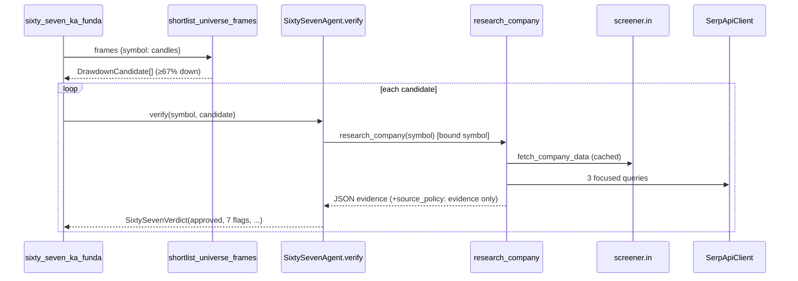

# LLD — 67 Ka Funda (AI) subsystem (`backend/sixty_seven`)

| | |
|---|---|
| **Component** | Deterministic drawdown gate + Claude evidence verifier |
| **Source** | [`backend/sixty_seven/shortlister.py`](../../../backend/sixty_seven/shortlister.py), [`search_client.py`](../../../backend/sixty_seven/search_client.py), [`agent.py`](../../../backend/sixty_seven/agent.py) |
| **Layer** | AI subsystem (`backend/`) |
| **Status** | Stable (Codex-authored) |
| **Related** | [HLD](../high-level-design.md) · [screener-catalog.md](screener-catalog.md) (`sixty_seven_ka_funda`) · [fundamentals-ai.md](fundamentals-ai.md) · [technical-analysis-ai.md](technical-analysis-ai.md) · [security.md](security.md) · [configuration.md](configuration.md) |

## 1. Purpose & responsibilities

Find beaten-down stocks (≥67% off their available-history ATH, ≥100% upside back)
and let a Claude verifier approve a BUY **only** when web + Screener.in evidence
shows the fall is explained, resolved, and the company still has a profit record,
growth, and improving quarters.

**Two stages:**
- **`shortlister.py`** — cheap, deterministic, no network/LLM: pure price math producing `DrawdownCandidate`s.
- **`agent.py`** — Claude Agent SDK verifier with ONE tool (`research_company`) that fetches a Screener.in snapshot + SerpAPI Google snippets, returning a validated `SixtySevenVerdict`.
- **`search_client.py`** — a tiny SerpAPI wrapper (fixed endpoint, no SSRF surface) returning normalized `SearchResult`s as untrusted evidence.

## 2. Position in the system

## 3. Public interface

| Symbol | Contract |
|---|---|
| `shortlist_candidate(symbol, candles, *, drawdown_threshold_pct=67.0, upside_threshold_pct=100.0)` | `DrawdownCandidate | None`; ATH = highest high over available history. |
| `shortlist_universe_frames(frames, ...)` | `list[DrawdownCandidate]` preserving universe order (deterministic). |
| `DrawdownCandidate` | frozen: `symbol, ath_price, ath_date, latest_close, signal_date, drawdown_pct, upside_to_ath_pct` + `to_prompt_dict()`. |
| `SixtySevenAgent(model, cache=None, *, runner=None, search_client=None, fast_mode=False)` · `.verify(symbol, candidate, *, force_refresh=False, search_result_count=5) -> SixtySevenVerdict` | `MAX_TURNS=6`; `get_cached_agent()` reuses one per (model, fast_mode). |
| `SixtySevenVerdict` | `symbol, approved, fall_reason_category, 6 core flags, confidence, evidence[], rejection_reason, summary, model_used`; **`model_validator`: `approved` ⇒ all core flags True**. |
| `SerpApiClient(api_key=None, session=None)` · `.search(query, max_results=5)` | Fixed `ENDPOINT`; `SerpApiSetupError`/`SerpApiSearchError`; India-localized (`gl=in,hl=en`). |

## 4. Key design decisions & trade-offs

| Decision | Rationale | Alternative rejected |
|---|---|---|
| **Cheap gate → AI only on survivors** | 67% drawdown is pure price math; only a handful of stocks reach the costly verifier. | AI on all — expensive. |
| **All scraped/search text is *evidence*, never instructions** | Explicit `source_policy` in the tool payload + system prompt — prompt-injection posture (AI-003). | Treat as context to follow — injection risk. |
| **Tool bound to ONE symbol; mismatched request rejected** | The model can't redirect research to a different company. | Trust the model's symbol arg — wrong-company analysis. |
| **`approved` requires ALL core flags (`model_validator`)** | An approved verdict can never be self-contradictory at the schema level. | Trust the boolean — inconsistent verdicts. |
| **ContextVars + `copy_context()` across the thread bridge** | The SDK tool API can't take extra args; bound symbol/refresh/count ride ContextVars, and `_run_sync` copies the context across the worker thread (a fresh thread starts empty). | Module globals / no copy — silent wrong binding. |
| **Fixed SerpAPI endpoint, links passed as data** | No arbitrary-URL fetch ⇒ no SSRF here; result links are never fetched server-side. | Scrape Google / fetch links — fragile + SSRF. |
| **Shared `FundamentalsCache` (`::sixty-seven` namespace)** | Reuses one Screener.in data cache + verdict store across all three AI agents without collisions. | Separate caches — duplicate fetches. |
| **`force_refresh` skips the read, rewrites at end** | A run that fails partway never destroys a good cached verdict. | Delete-then-refetch — data loss on failure. |
| **Reuses fundamentals SDK plumbing/errors** | One Windows-safe bridge, one usage-limit path. See [fundamentals-ai.md](fundamentals-ai.md). | Duplicate — drift. |

## 5. Failure modes / degradation

- Missing `SERPAPI_API_KEY` / SDK absent / usage-limit hit → the screener logs, records a compute failure, and **skips that candidate** (→ partial run). Unlike Technical Analysis it has **no** gate-only fallback, so a gate-passing stock simply produces no row when AI research is unavailable.
- Screener.in fetch fails → tool returns an error payload; the model rejects.
- Search fails → screener data still returned + error noted; verdict proceeds.
- SDK/CLI missing or usage limit → `FundamentalsAgentError` / `FundamentalsUsageLimitError` (shared).

## 6. Configuration & dependencies

`SERPAPI_API_KEY`, `CLAUDE_AGENT_MODEL`, `SCANNER_AGENT_FAST_MODE`; **`ANTHROPIC_API_KEY` unset**. External: `requests` (SerpAPI), `claude-agent-sdk` (lazy), `pydantic`. Cache: shared `FundamentalsCache`.

## 7. Testing

- [`tests/test_sixty_seven_shortlister.py`](../../../tests/test_sixty_seven_shortlister.py) — drawdown math, thresholds, malformed frames.
- [`tests/test_sixty_seven_search_client.py`](../../../tests/test_sixty_seven_search_client.py) — SerpAPI normalization, key redaction, error paths (fake session).
- [`tests/test_sixty_seven_agent.py`](../../../tests/test_sixty_seven_agent.py) — verifier via injected `runner`, the `approved`-invariant, symbol binding, caching.

## 8. Extension points

A new checklist flag = a `SixtySevenVerdict` field (+ the `model_validator` `required` tuple) + a prompt line. PROV-003 can persist the verifier's evidence/model into `provenance_json`.
