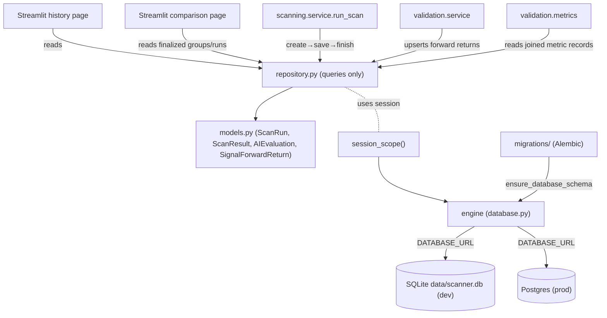

# LLD — Storage & persistence (scan history)

| | |
|---|---|
| **Component** | Scan-run persistence (engine, session, repository, migrations) |
| **Source** | [`backend/storage/models.py`](../../../backend/storage/models.py), [`backend/storage/database.py`](../../../backend/storage/database.py), [`backend/storage/repository.py`](../../../backend/storage/repository.py), [`migrations/`](../../../migrations) |
| **Layer** | Persistence (`backend/`) |
| **Status** | Stable (SCAN-001 schema · SCAN-002 DB layer · SCAN-004 `symbols_scanned` · JOB-003 finalized comparison helpers · PROV-003 `ai_evaluations` · OBS-003 `audit_logs`/`app_config` · VALID-001/002 `signal_forward_returns` · VALID-003A/004 aggregate and dashboard read models · AUTH-003 `user_roles`) |
| **Related** | **[scan-run-persistence.md](../scan-run-persistence.md)** (full SCAN-001 design) · [scan-002-handoff.md](../scan-002-handoff.md) · [scan-service-and-provenance.md](scan-service-and-provenance.md) · [validation.md](validation.md) · [ui-pages.md](ui-pages.md) · [HLD](../high-level-design.md) |

> **This LLD summarizes the *current* persistence layer and how it is used.** The
> authoritative schema rationale (column-by-column design, why `Numeric` not float,
> enum-as-CHECK, index choices, cascade) lives in the existing
> **[scan-run-persistence.md](../scan-run-persistence.md)** — read it for the deep "why".

## 1. Purpose & responsibilities

Record every scan execution and its shortlisted rows so the app can later answer
*"why was this stock shortlisted on date D?"* without re-running today's data,
universe, or model.

**Three sub-layers (strict direction):**
1. **`models.py`** — table *shapes* only (`Base`, `ScanRun`, `ScanResult`, `SignalForwardReturn`, `AIEvaluation`, `AuditLog`, `AppConfig`, `UserRole`, `ScanStatus`, `ForwardReturnStatus`, `BigIntPrimaryKey`). No connections.
2. **`database.py`** — *where* data lives: engine, `SessionLocal`, `session_scope()`, SQLite pragmas, `ensure_database_schema()` (auto-migrate).
3. **`repository.py`** — the *only* place that builds queries; typed read/write helpers. Does **not** own sessions.

## 2. Position in the system

## 3. Schema (summary — see [scan-run-persistence.md](../scan-run-persistence.md) for full detail)

**`scan_runs`** (1) ──< **`scan_results`** (many), **`scan_results`** (1) ──< **`signal_forward_returns`** (many), and **`scan_runs`** (1) ──< **`ai_evaluations`** (many); child FKs use `ON DELETE CASCADE`.

- `scan_runs` (audit header): `id`, `started_at`/`finished_at` (tz-aware UTC), `status` (`running`/`success`/`partial`/`failed`, stored as CHECK-backed VARCHAR), `screener_key`, `universe_key`, `params_json`, `data_snapshot_date`, `app_version`, `git_commit_sha`, `triggered_by`, `error_message`, **`symbols_scanned`** (SCAN-004), **`data_quality_json`** (nullable; DATA-001 candle-quality receipt — see [data-quality.md](data-quality.md)).
- `scan_results` (shortlist line item): `id`, `run_id` (FK), `symbol`, `signal_date`, `close_price` (`Numeric`), `rating`, `final_score` (`Numeric`, reserved for RANK-*), `reason`, `raw_result_json`, `provenance_json`, `created_at`.
- `signal_forward_returns` (VALID-001/002 validation row): `id`, `result_id` (FK to `scan_results`), `horizon_days`, `status` (`pending`/`computed`/`insufficient_data`), entry/exit dates and prices, stock return, benchmark return, excess return, MAE/MFE, `computed_at`, `created_at`.
- `ai_evaluations` (**PROV-003** AI verdict ledger — approved/rejected/error): `id`, `run_id` (FK), `symbol`, `signal_date`, `outcome` (CHECK), `verdict_label`, `confidence` (`Numeric(8,4)`), `model_name`, `prompt_version`, `validated_verdict_json`, `provenance_json` (the trusted receipt), `created_at`. Full column table in [scan-run-persistence.md §3.3](../scan-run-persistence.md).

Indexes: `scan_runs(status, screener_key, universe_key)`, `scan_results(run_id, symbol, symbol+signal_date)`, `signal_forward_returns(status)` with unique `(result_id, horizon_days)`, and `ai_evaluations(run_id, symbol, outcome)`.

**OBS-003 standalone tables** (no FK to `scan_runs`):
- `audit_logs` (user-action trail): `id`, `created_at` (tz-aware UTC), `event` (String), `user_email` (nullable — NULL for system actions), `metadata_json` (redacted). Indexes on `created_at`, `event`, `user_email`.
- `app_config` (admin runtime overrides): `key` (PK env-var name), `value` (Text), `updated_at`, `updated_by`.

**AUTH-003 standalone table** (no FK):
- `user_roles` (durable role assignments): `email` (PK, normalized lowercase), `role` (String + CHECK `viewer`/`analyst`/`admin`), `assigned_by` (nullable), `created_at`/`updated_at`. Full design: [auth-003-role-model.md](../auth-003-role-model.md).

Full design: [obs-003-audit-log.md](../obs-003-audit-log.md).

## 4. Public interface (`repository.py`)

| Function | Contract |
|---|---|
| `create_scan_run(session, *, screener_key, universe_key, params, data_snapshot_date, app_version, git_commit_sha, triggered_by, symbols_scanned)` | Insert RUNNING header; `flush()` populates `run.id` without committing. |
| `save_scan_results(session, run, rows)` | Map screener dicts → `ScanResult`; renames `close`→`close_price`; stores full row in `raw_result_json`; folds `provenance`/`provenance_json` (re-`normalize_secret_safe_json`-ed). |
| `save_ai_evaluations(session, run, records)` | Validate + persist AI receipts (`AIEvaluationRecord`/mappings) → `ai_evaluations`. `_build_ai_evaluation` enforces full SHA-256 hashes, tz-aware UTC, confidence range, sanitized evidence URLs, and **cross-checks `validated_verdict_json` against the trusted receipt** so model output can't contradict the audit record. |
| `finish_scan_run(session, run, *, status, error_message=None)` | Stamp `finished_at` + final status. |
| `get_latest_scan_runs(session, limit=50, *, screener_key, universe_key, status, started_from, started_to, triggered_by, symbol)` | Filtered newest-first; `symbol` uses an EXISTS subquery (case-insensitive, exact); `(started_at desc, id desc)` deterministic order. |
| `get_latest_finalized_scan_runs(session, *, screener_key, universe_key, limit=2)` | JOB-003 comparison candidates for one pair; only `SUCCESS` / `PARTIAL`, ordered `(started_at desc, id desc)`. |
| `list_finalized_scan_groups(session)` | Sorted distinct `(screener_key, universe_key)` pairs that have at least one finalized run; drives comparison-page filter options. |
| `get_scan_results(session, run_id)` | Ordered `(symbol, id)`. |
| `get_ai_evaluations(session, run_id)` | AI receipts for a run, ordered `(symbol, id)`. |
| `count_scan_results_for_runs(session, run_ids)` | One grouped COUNT; every id present (0 default). |
| `list_distinct_{screener,universe}_keys`, `list_distinct_triggered_by_values` | History-page filter options (read from history, not the live registry). |
| `get_signals_needing_forward_returns(session, *, horizons, limit=None)` | VALID-002 selection query: non-null `signal_date` rows whose requested horizons are missing or still `pending`; eager-loads the parent run for universe resolution. |
| `upsert_forward_return(session, *, result_id, point, benchmark=None)` | Idempotent `(result_id, horizon_days)` insert/update into `signal_forward_returns`; terminal rows get `computed_at`, pending rows stay retryable. |
| `get_forward_return_metric_records(session, *, screener_key, universe_key, horizon_days, signal_date_from, signal_date_to)` | VALID-003A read-only join across `scan_runs`, `scan_results`, and `signal_forward_returns` (`SUCCESS`/`PARTIAL` runs only); date filters are inclusive over `scan_results.signal_date`. |
| `create_audit_log_entry(session, *, event, user_email, metadata)` | Insert one `audit_logs` row; metadata routed through `normalize_secret_safe_json` (OBS-003). |
| `get_recent_audit_logs(session, limit=100, *, event, user_email)` | Newest-first audit rows; optional event + case-insensitive email filters; `(created_at desc, id desc)` order. |
| `list_distinct_audit_events(session)` | Distinct event names for the audit viewer's filter. |
| `get_config_overrides(session)` / `set_config_override(session, *, key, value, updated_by)` | Read all overrides as `{key: value}`; upsert one and return the previous value (OBS-003). |
| `get_user_role` / `set_user_role` / `delete_user_role` / `list_user_roles` / `count_user_role_admins` | AUTH-003 `user_roles` access: email-normalized read; upsert/delete returning the previous role; list (email-sorted) and admin count for the last-admin guard. |

Type-coercion helpers (`_as_date`, `_as_decimal`, `_as_optional_str`, `_is_missing`, plus `_full_sha256`/`_as_utc_datetime` for receipts) keep typed columns strongly typed; `normalize_secret_safe_json` (from `result_contract`) makes every JSON blob JSON-safe + secret-masked (Decimal→str, dates→ISO, NumPy `.item()`, NaN→NULL).

## 5. Key design decisions & trade-offs (current-state highlights)

| Decision | Rationale |
|---|---|
| **`ensure_database_schema()` auto-migrates on startup, once per process** | Fresh checkout needs no manual `alembic upgrade`; guarded by a lock (Streamlit reruns + worker threads). Builds the Alembic `Config` **programmatically** (no `alembic.ini`) so `migrations/env.py` doesn't `fileConfig`-reset the root logger and discard the SEC-002 redaction filter. |
| **Migration failure is non-fatal** | Logged (URL credentials redacted) and returns `False`; scan persistence is best-effort ("continue without history") rather than crashing startup. |
| **SQLite pragmas per connection** | `foreign_keys=ON` (enforce cascade), `busy_timeout=5000` (wait, don't error on lock), `journal_mode=WAL` (history page reads while a scan writes). |
| **`session_scope()` per unit of work** | Streamlit reruns top-to-bottom; never hold a session across reruns. Commit on clean exit, rollback on exception. |
| **Repository owns no sessions** | Lets the scan service wrap create→run→save→finish in one transaction. |
| **Finalized comparison helpers reuse scan history** | JOB-003 derives latest-vs-previous sections from existing `scan_runs` / `scan_results`; no migration or materialized comparison table is needed. |
| **JSON columns are the evolution seam** | `raw_result_json` + `provenance_json` let one schema serve deterministic and AI screeners with no per-screener table; PROV-* evolves the envelope without a migration. See [scan-service-and-provenance.md](scan-service-and-provenance.md). |
| **AI receipts validated against the verdict** | `save_ai_evaluations` rejects a receipt whose `validated_verdict_json` contradicts the trusted fields (symbol / model / verdict / confidence / `approved`); only hashes + sanitized URLs are stored, never raw scraped/model text. | 

## 6. Migrations

[`migrations/`](../../../migrations) (root-level, kept out of the lint target). Revisions are chained linearly through `…obs003_create_audit_logs` (OBS-003, creates `audit_logs` + `app_config`), `20260618valid001_create_signal_forward_returns` (VALID-001, creates `signal_forward_returns` + `scan_results(symbol, signal_date)`), and `20260623auth003_create_user_roles` (AUTH-003, creates `user_roles`). `migrations/env.py` reads the URL from `get_database_url()` (no hardcoded URL). A drift test guards ORM-vs-migration sync.

## 7. Failure modes

- No DB tables yet → `ensure_database_schema()` creates them; if it fails, scans run but skip history (logged).
- DB lock contention → `busy_timeout` waits; WAL allows concurrent read.
- Bad/exotic value in a result row → the strict `result_contract` normalizer raises `ResultContractError`; the scan service drops that row (counted as rejected) rather than persisting malformed JSON.
- Invalid AI receipt (bad hash, contradictory verdict) → `save_ai_evaluations` raises; the run is marked `FAILED` by the service.
- Forward-return rerun sees an existing pending row → `upsert_forward_return` updates it in place; the unique `(result_id, horizon_days)` constraint prevents duplicates.

## 8. Testing

- [`tests/test_scan_persistence_models.py`](../../../tests/test_scan_persistence_models.py) — schema round-trip, enum value, Decimal precision, cascade.
- [`tests/test_scan_storage_database.py`](../../../tests/test_scan_storage_database.py) — engine/pragmas/session_scope.
- [`tests/test_scan_storage_repository.py`](../../../tests/test_scan_storage_repository.py) — CRUD + filters.
- [`tests/test_scan_comparison.py`](../../../tests/test_scan_comparison.py) — JOB-003 read-model classification, score fallback/source matching, one-run state, and stable export columns.
- [`tests/test_scan_storage_migrations.py`](../../../tests/test_scan_storage_migrations.py) — `alembic upgrade head` + drift guard (covers `audit_logs`/`app_config`).
- [`tests/test_audit_repository.py`](../../../tests/test_audit_repository.py) — OBS-003 audit + config-override CRUD, filters, redaction.
- [`tests/test_forward_return_service.py`](../../../tests/test_forward_return_service.py) — VALID-002 service orchestration + idempotent persistence.
- [`tests/test_validation_metrics.py`](../../../tests/test_validation_metrics.py) — VALID-003A/004 aggregate and dashboard read models over stored forward returns.

## 9. Extension points

`final_score` is reserved for RANK-* and JOB-003 compares it before falling back to numeric `raw_result_json["confidence"]` when both runs use the same score source. VALID-003A/004 aggregates `signal_forward_returns` into hit rate, median/average return, benchmark-relative metrics, MAE/MFE, best/worst signals, return distribution, monthly signal counts, and sector concentration without changing the per-signal schema. Sector labels are best-effort local metadata and fall back to `Unknown` when current universe CSVs lack sector columns. The PROV-003 `ai_evaluations` ledger is in place and richer AI evidence rides in its `provenance_json` without a flag-day. A schema change is a real change: add an Alembic migration **and** update `models.py` **and** [scan-run-persistence.md](../scan-run-persistence.md).
