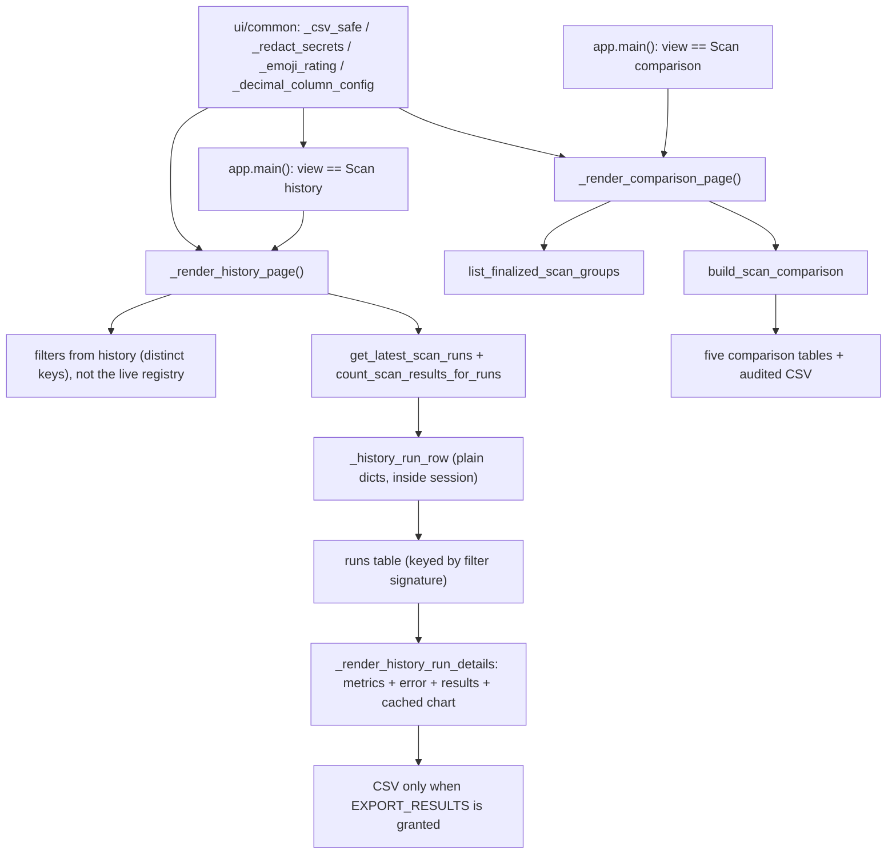

# LLD — UI pages (`ui/`)

| | |
|---|---|
| **Component** | Scan-history, comparison, validation, IPO manual entry, and shared UI helpers |
| **Source** | [`ui/history_page.py`](../../../ui/history_page.py), [`ui/comparison_page.py`](../../../ui/comparison_page.py), [`ui/validation_page.py`](../../../ui/validation_page.py), [`ui/common.py`](../../../ui/common.py) |
| **Layer** | UI (`ui/`) |
| **Status** | Stable (SCAN-004 history · JOB-003 comparison · REF-001 split · VALID-003B/004 validation dashboard · RANK-002 score display · AUTH-003 capability gating) |
| **Related** | [HLD](../high-level-design.md) · [app-orchestration.md](app-orchestration.md) · [scan-comparison.md](scan-comparison.md) · [storage-persistence.md](storage-persistence.md) · [scan-service-and-provenance.md](scan-service-and-provenance.md) · [charts-visualization.md](charts-visualization.md) · [health-monitoring.md](health-monitoring.md) · [security.md](security.md) · [audit-log.md](audit-log.md) |

> The `ui/` package also contains [`chart_cache.py`](charts-visualization.md) (charts), [`health_page.py`](health-monitoring.md) (admin health), and the OBS-003 admin pages [`audit_page.py` + `config_page.py`](audit-log.md) (Audit log viewer + runtime settings form) — documented in their own LLDs. The scanner page itself lives in [`app.py`](app-orchestration.md). This LLD covers the **scan-history page**, the **scan-comparison page**, the **validation dashboard**, and the **shared display helpers** in `ui/common.py`.

## 1. Purpose & responsibilities

- **`history_page.py`** — the SCAN-004 **read-only** audit view: filter recorded runs, inspect persisted results, and render a selected symbol from local cached candles using the historical screener/universe and persisted parameters. An analyst/admin may also download the audited CSV; viewers never construct its bytes or button. Pure data-shaping helpers are separated from rendering so they unit-test without a browser.
- **`comparison_page.py`** — the JOB-003 **read-only** comparison view: choose a finalized screener/universe pair, compare the latest finalized run with the immediately previous finalized run, and render New today / Repeated from yesterday / Dropped today / Improved score / Degraded score sections. Its audited formula-safe CSV is analyst/admin-only.
- **`validation_page.py`** — the VALID-003B/004 **read-only** Validation / Signal Performance dashboard: filter stored forward-return metrics by screener / universe / horizon / signal-date and render the screener-level summary table, return distribution, win rate by horizon, benchmark-relative rows, monthly signal counts, sector concentration, and best/worst signals. Its CSV export is analyst/admin-only. It reads through `summarize_validation_dashboard()` only — no raw SQL — and never triggers a forward-return compute pass from the UI. Same pure-helper / render split as the history page.
- **`ui/common.py`** — display helpers needed by the scanner and read-only pages (which must not import each other or `app.py`): CSV-injection escaping, secret-redaction wrapper, BUY/SELL emoji badges, decimal column config, score sorting/component extraction, and provenance/receipt-column hiding.

- **`ipo_manual_page.py`** - the IPO-004 **admin-only** write view: choose an
  issue and cached DRHP/RHP, transcribe three annual periods plus sourced
  singleton/peer facts, append an immutable revision, and inspect latest/history.
  Browser mappings become strict backend DTOs; SQL and cache verification remain
  outside the UI.

## 2. Position in the system

## 3. Public interface

### `history_page.py`
`_render_history_page(*, can_export)` (the view) · `_render_history_run_details(row, *, symbol_filter="", can_export)` · `_render_history_chart(row, symbols)` (historical registry/universe resolution + cache-only shared chart renderer) · pure helpers `_history_filter_kwargs(...)` (widgets → repository filters), `_history_filter_signature(...)` (filter hash for table widget key), `_history_run_row(run, shortlisted)`, `_history_runs_frame(rows, *, error_redactor)`, `_format_utc_timestamp`, `_format_run_duration`, `_as_utc`. Status badges `_HISTORY_STATUS_BADGES`; preview cap `_HISTORY_ERROR_PREVIEW_CHARS=80`.

### `comparison_page.py`
`_render_comparison_page(*, can_export)` (the view) · pure helpers `_comparison_screener_options(groups)`, `_comparison_universe_options(groups, screener_key)`, `_comparison_export_csv(frame)`, `_section_frame(rows)`, `_decimal_value(value)`. It reads options through `list_finalized_scan_groups()` and comparison rows through `build_scan_comparison()`; export bytes are built only when `can_export` is true.

### `validation_page.py`
`_render_validation_page(*, can_export)` (the view) · pure helpers `_validation_filter_kwargs(...)` (widgets → dashboard kwargs), `_validation_summary_frame(summary)` (summary → 18-column display frame), `_validation_distribution_frame(...)`, `_validation_horizon_frame(...)`, `_validation_benchmark_frame(...)`, `_validation_time_series_frame(...)`, `_validation_sector_frame(...)`, `_validation_best_worst_frame(...)`, `_validation_summary_csv(...)`, `_format_pct(value)` (4-dp `Decimal` → `"x.xx%"`, `None` → em-dash), `_format_signal(signal)` (best/worst → `"SYMBOL x.xx% (date)"`). Export payload creation requires `can_export`. Column contract `_SUMMARY_COLUMNS`. Empty states: no rows yet / no rows for filters / no computed rows yet / benchmark-excess unavailable.

### `ui/common.py`
`_csv_safe(df)` / `_escape_cell` (formula-injection escaping) · `_redact_secrets(text)` (wraps `redact_text` + `auth_secret_values`) · `_emoji_rating(df)` (BUY/SELL badges) · `_decimal_column_config(df)` (2-dp display) · `_sort_results_by_final_score(df)` (score-desc, nulls-last, stable) · `_score_components_frame(df)` (compact RANK-002 receipt display) · `_drop_provenance(df)` (drops internal `provenance`, `provenance_json`, and raw `score_breakdown` columns from table + CSV; `final_score` remains exported).

## 4. Key design decisions & trade-offs

| Decision | Rationale | Alternative rejected |
|---|---|---|
| **Pure helpers split from rendering** | History and validation filter/frame helpers test without Streamlit, while render-level tests still prove the service-call plumbing. | Inline in the render fn — untestable and easier to miswire. |
| **Filter options from history, not the live registry** | A deleted/renamed screener's history stays inspectable; a broken screener module can't take down the audit view. | Use `discover_screeners` — couples audit to live code. |
| **Convert ORM → plain dicts inside the session** | After `session_scope()` closes, touching lazy attrs (esp. `run.results`) raises `DetachedInstanceError`; capture everything while open. | Pass ORM objects to render — detached errors. |
| **Table keyed by filter signature** | Streamlit keeps selection by widget key; a new filter set mints a fresh table so a stale row-2 selection can't open the wrong run. | Reuse key — wrong-run selection. |
| **Comparison options from finalized history** | JOB-003 must compare persisted `SUCCESS` / `PARTIAL` shortlists, including renamed/deleted screeners, and should not trigger live screener discovery. | Use live registry — misses historical pairs and can fail due broken screener code. |
| **Score deltas require matching score sources** | `final_score` and raw `confidence` can have different semantics; the UI shows both values but computes improved/degraded only when both sides use the same source. | Compare unlike scores — misleading trend. |
| **Read-only + relies on WAL** | SCAN-002 enabled SQLite WAL so this view stays usable while a scan (e.g. the daily job) writes concurrently. | Block on writer — page hangs. |
| **Historical chart is cache-only** | Viewers need a practical chart path without gaining scan capability. The selected persisted run resolves its old screener/universe and reads existing candle cache only; missing old code/data becomes a friendly message rather than a broker fetch or page failure. | Re-run/fetch data from History — mutates state and bypasses `RUN_SCAN`. |
| **Export gating happens before payload construction** | `st.download_button` receives bytes at render time, so viewer paths return before building CSV data or rendering the button on every export surface. | Hide/disable only the button after constructing data — incomplete enforcement and wasted work. |
| **Redact full message *before* truncating** | Truncating a long bare secret first could leave a prefix the exact-value redactor no longer matches. | Truncate then redact — partial leak. |
| **`symbols_scanned=None` shows "—"** | Pre-SCAN-004 runs didn't store it; an em-dash beats a misleading `0`. | Show 0 — wrong. |
| **CSV formula-injection escaping** | A cell starting `=`/`+`/`-`/`@`/tab executes when opened in Excel/Sheets; prefix with `'` (idempotent). | Raw CSV — spreadsheet code execution. |
| **Ranked result tables keep receipts compact** | Scanner and history result tables sort by `final_score`, keep raw `reason` visible, and expose component details in a Score components expander. CSV exports keep the numeric score but drop raw provenance/receipt dicts. | Show raw dict columns — noisy UI/CSV and harder spreadsheet use. |
| **`OperationalError` → friendly migrate hint** | Fresh/outdated DB is the common cause; tell the operator to run `alembic upgrade head`. | Raw traceback — confusing. |

## 5. Failure modes

- DB not migrated → caught `OperationalError`, shows the `alembic upgrade head` hint. The validation page catches both the filter-option read and the later metrics-summary read because a partially migrated DB can fail at either point.
- No runs / no match / only one finalized comparison run → contextual info message.
- Stale selection index → bounds-checked, render skipped (with the signature key as belt-and-braces).
- Failed/partial run → full **redacted** error shown prominently; results table still attempted.
- Historical screener/universe removed or cached candles unavailable → friendly info/error;
  persisted tables remain usable and no remote fetch is attempted.

## 6. Testing

- [`tests/test_app_history_page.py`](../../../tests/test_app_history_page.py) — filter mapping, signature stability, row shaping, run details, redaction/truncation order, viewer export denial, and cache-only historical charts.
- [`tests/test_app_comparison_page.py`](../../../tests/test_app_comparison_page.py) — finalized-pair option mapping, empty states, table rendering, formula-safe CSV, export audit metadata, viewer export denial, and friendly schema-error handling.
- [`tests/test_app_validation_page.py`](../../../tests/test_app_validation_page.py) — VALID-003B/004 percentage/signal formatting, filter mapping, summary/dashboard frame shaping, render-level `summarize_validation_dashboard` plumbing, CSV-safe export/audit, viewer export denial, friendly schema-error handling, and empty-state copy. View wiring (selector options + dispatch) is covered in [`tests/test_app_orchestration.py`](../../../tests/test_app_orchestration.py).
- [`tests/test_app_ipo_manual_page.py`](../../../tests/test_app_ipo_manual_page.py) - admin guard, empty state, exact decimal adapters, peer-row handling, and actor-spoofing boundary.
- `ui/common` helpers are exercised via the scanner and history page tests (`test_app_orchestration.py`, `test_ui_common.py`, golden CSV checks).

## 7. Extension points

A new history filter = a widget + a branch in `_history_filter_kwargs` (+ the repository filter) + include it in the signature. A new comparison section belongs in `backend/scanning/comparison.py` first, then `ui/comparison_page.py` renders it. A new shared display helper belongs in `ui/common.py`, never imported across page modules.
