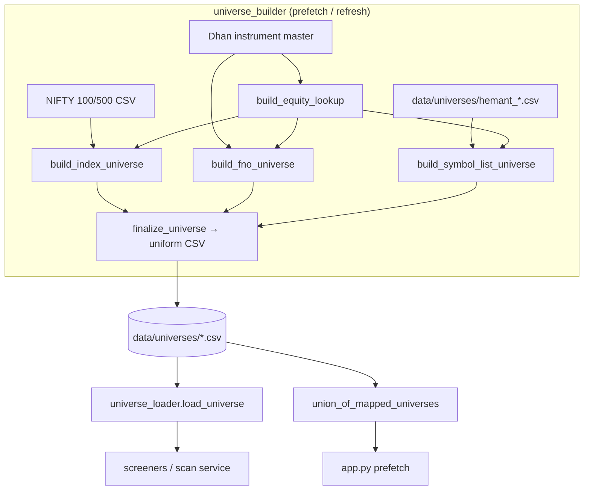

# LLD — Universe management

| | |
|---|---|
| **Component** | Stock-universe build + load |
| **Source** | [`backend/universe_builder.py`](../../../backend/universe_builder.py), [`backend/universe_loader.py`](../../../backend/universe_loader.py) |
| **Layer** | Data plumbing (`backend/`) |
| **Status** | Stable |
| **Related** | [HLD](../high-level-design.md) · [configuration.md](configuration.md) · [data-acquisition.md](data-acquisition.md) · [screener-framework.md](screener-framework.md) · [health-monitoring.md](health-monitoring.md) |

## 1. Purpose & responsibilities

A **universe** is the list of stocks a screener is allowed to scan. This component
**builds** the universe CSVs (resolving human symbols → Dhan `security_id`) and
**loads/summarizes** them at runtime.

**Builder responsibilities**
- Download official constituent CSVs (NIFTY 100/500) and Dhan's instrument master (size-capped, HTTPS-verified).
- Map every symbol to its **NSE cash-equity** `security_id` (even for F&O-derived universes).
- Handle local "Hemant" source lists + composite `union_of` universes + manual symbol aliases.
- Write a uniform CSV shape with a `mapping_status` column; keep unmapped rows visible.
- Keep only the latest dated Dhan instrument-master snapshot in `Dependencies/`.

**Loader responsibilities**
- Open a universe CSV, validate required columns, normalize text.
- `mapped_only(...)`, per-universe status (rows/mapped/mtime), and `union_of_mapped_universes` (one row per mapped security across all universes — what the prefetch iterates).

## 2. Position in the system

## 3. Public interface

### Builder
`UNIVERSE_CONFIG` (the single registry of every universe key) · `refresh_universe_files(keys=None, ...)` (the orchestrator: routes each key to `fno` / `union_of` / `source_file` / index branch) · `load_instrument_master` · `build_equity_lookup` · `build_index_universe` · `build_fno_universe` · `build_symbol_list_universe` · `finalize_universe` · `download_csv` (capped at `MAX_DOWNLOAD_BYTES=50MB`) · `prune_old_instrument_master_snapshots` · `universe_file_path` · `strip_fno_suffix` / `normalize_manual_symbol`.

### Loader
`REQUIRED_UNIVERSE_COLUMNS = [symbol, security_id, exchange_segment, instrument_type]` · `load_universe(key, dir)` · `mapped_only(df)` · `list_known_universes()` · `universe_status(key)` / `all_universe_statuses()` · `union_of_mapped_universes(dir)`.

### Universe keys
`nifty_100`, `nifty_500`, `fno`, `hemant_super_45`, `hemant_good_45`, `hemant_good_200`, `hemant_super_good_union` (Super 45 ∪ Good 45), `hemant_super_good_200_union` (Super 45 ∪ Good 45 ∪ Good 200).

## 4. Key design decisions & trade-offs

| Decision | Rationale | Alternative rejected |
|---|---|---|
| **Always map to NSE cash-equity IDs** | Daily screeners need the listed-equity candle even when the universe is derived from derivatives. | Use contract IDs — wrong candle series. |
| **Keep unmapped rows + `mapping_status`** | A symbol that didn't resolve stays visible for debugging in the status table rather than silently vanishing. | Drop unmapped — invisible data gaps. |
| **One Dhan master snapshot per refresh, prune the rest** | Write-then-prune ordering guarantees a failed download never deletes the last usable master. | Prune-then-write — could leave zero snapshots. |
| **Dedupe union by `security_id`, not symbol** | The same security id is always the same Dhan instrument; symbol strings can collide. | Dedupe by symbol — possible double fetch. |
| **Local Hemant lists, not remote** | No stable public CSV endpoint; pinned source lists live beside generated files. | Hardcode in Python — harder to edit. |
| **`source_symbol` retained on custom universes** | Preserves the original Google-Doc token (e.g. `UTLTRACEMCO`) after alias mapping to `ULTRACEMCO`. | Overwrite symbol — loses provenance. |
| **Legacy `SEM_*` column normalization** | Accept old and new Dhan master schemas via `LEGACY_COLUMN_CANDIDATES`. | Hard-code current names — breaks on old files. |
| **Don't alphabetize custom lists** | Pinned-list order may be meaningful to the reviewer. | Always sort — loses intent. |

## 5. Failure modes

- Missing universe CSV → `FileNotFoundError` pointing at `python app.py`.
- Missing required column → `ValueError` naming the column/file.
- Oversized/hostile download → `ValueError` before/while streaming (cap enforced two ways: advertised `Content-Length` + running byte count).
- `universe_status` swallows CSV errors into an `error` field so the UI panel never crashes.

## 6. Testing

- [`tests/test_universe_builder.py`](../../../tests/test_universe_builder.py) — equity lookup, F&O/index/symbol-list builders, union composition, snapshot pruning, size cap.

## 7. Extension points

Add a universe by adding one `UNIVERSE_CONFIG` entry (`file_name` + `display_name` + one of `source_url`/`source_file`/`union_of`); `refresh_universe_files` routes it automatically and screeners reference the new key in their metadata.
