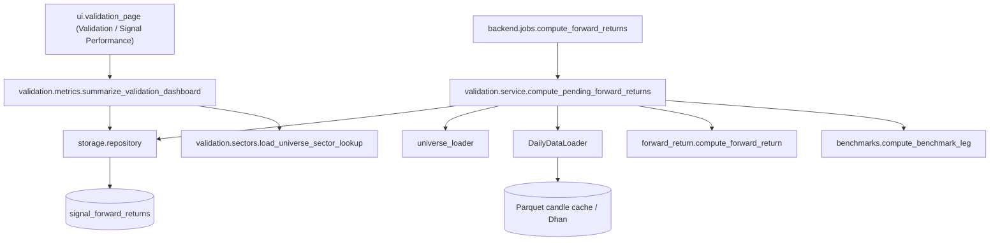

# LLD - Forward-return validation

| | |
|---|---|
| **Component** | Historical signal validation (VALID-002 / VALID-004) |
| **Source** | [`backend/validation/`](../../../backend/validation), [`backend/storage/repository.py`](../../../backend/storage/repository.py), [`backend/jobs/compute_forward_returns.py`](../../../backend/jobs/compute_forward_returns.py) |
| **Layer** | Backend service + pure calculation + aggregate/dashboard read models + headless job |
| **Status** | Implemented for per-signal forward-return rows, backend aggregate metrics, the read-only Validation / Signal Performance dashboard, and the headless forward-return compute job |
| **Related** | [VALID-001 design](../valid-001-forward-return-validation.md), [VALID-002 handoff](../valid-002-handoff.md), [storage-persistence](storage-persistence.md), [ui-pages](ui-pages.md) |

## 1. Purpose & Responsibilities

VALID-002 fills `signal_forward_returns` for stored `scan_results` rows. It measures what happened after a signal without re-running the screener:

- entry is the next trading day's open;
- exit is the close at `signal_index + horizon_days`;
- trading days are counted from the symbol's candle frame, not calendar days;
- benchmark return is aligned to the same entry and exit dates when a verified benchmark instrument exists.

VALID-003A adds a backend read model over those stored rows. It groups by screener, universe, and horizon, then reports counts, hit rate, average/median returns, benchmark-relative metrics when present, average MAE/MFE, and best/worst signals.

VALID-003B/004 render and extend that read model in a **read-only** Streamlit page ([`ui/validation_page.py`](../../../ui/validation_page.py), `Validation / Signal Performance` in the top selector): filters -> `summarize_validation_dashboard()` -> summary table, return distribution, win rate by horizon, benchmark-relative performance, monthly signal counts, sector concentration, best/worst signals, CSV export, and clear empty states. The page never triggers a compute pass.

VALID-004 adds the headless operator job:

```bash
python -m backend.jobs.compute_forward_returns --limit 500
```

The job bootstraps schema, builds the Dhan-backed loader, calls `compute_pending_forward_returns()`, commits through `session_scope()`, and exits non-zero only for fatal setup/batch failures. It is schedulable but not wired into Render as a second cron in this task.

## 2. Position In The System



## 3. Public Interface

| Function | Contract |
|---|---|
| `compute_forward_return(candles, signal_date, horizon_days, *, as_of=None)` | Pure calculation over one OHLC frame. Returns `ForwardReturnPoint` with `computed`, `pending`, or `insufficient_data`. |
| `compute_benchmark_leg(candles, *, entry_date, exit_date, benchmark_key)` | Pure benchmark return over the exact stock entry/exit dates; missing dates return null prices/return. |
| `benchmark_for_universe(universe_key)` | Returns a `BenchmarkSpec` only when its Dhan index `security_id` is configured. Blank production IDs intentionally return `None`. |
| `compute_pending_forward_returns(session, loader, *, as_of=None, horizons=(20, 60, 120), limit=None)` | Loads eligible stored signals, resolves instruments, computes each horizon, and upserts rows idempotently. |
| `python -m backend.jobs.compute_forward_returns --limit 500` | Headless VALID-004 operator/scheduler entrypoint. Bootstraps schema, calls the service above, prints a secret-safe summary, and returns scheduler-friendly exit codes. |
| `get_signals_needing_forward_returns(...)` / `upsert_forward_return(...)` | Repository-only query/write helpers for missing/pending rows and `(result_id, horizon_days)` upserts. |
| `summarize_validation_metrics(session, *, screener_key=None, universe_key=None, horizon_days=None, signal_date_from=None, signal_date_to=None)` | Read-only aggregate metrics over stored forward-return rows. Filters by `scan_results.signal_date` inclusively, de-duplicates reruns (latest run wins), and returns typed `ValidationSummary` / `ValidationMetricRow` objects. |
| `summarize_validation_dashboard(..., sector_lookup=None)` | Read-only dashboard aggregate over the same de-duplicated rows: summary metrics, return buckets, horizon win rates, benchmark-relative rows, monthly signal counts, and sector concentration. |
| `load_universe_sector_lookup(universe_keys)` | Best-effort local metadata helper. Reads universe CSVs for `sector` / `industry` / `macro_sector` / `sector_name`; missing metadata becomes `Unknown` in dashboard concentration rows. |
| `get_forward_return_metric_records(...)` | Repository-only joined read of `scan_runs`, `scan_results`, and `signal_forward_returns` (`SUCCESS`/`PARTIAL` runs only) for metrics aggregation. |

## 4. Missing-Data, Benchmark, And Sector Policy

- `COMPUTED`: entry/exit bars exist and `exit_date <= as_of`.
- `PENDING`: the exit date is after `as_of`, or the candle frame is recently incomplete within the 7-calendar-day data-lag grace window.
- `INSUFFICIENT_DATA`: the signal date is absent, prices are invalid, symbol mapping is missing, or the required future bar is still absent after the grace window.
- Loader failures are retryable and stored as `PENDING`, not terminal `INSUFFICIENT_DATA`.
- Benchmark IDs are not guessed. Until verified Dhan `IDX_I` IDs are configured, stock returns compute and benchmark/excess fields remain null.
- Aggregate hit rate is `forward_return_pct > 0` over computed rows with stored returns only. Pending and insufficient rows stay visible as counts but never count as losses.
- Average/median forward, excess, MAE, and MFE metrics use fixed-point `Decimal` values; missing benchmark/excess values are ignored, and empty metric sets return null instead of zero.
- Aggregates read only `SUCCESS`/`PARTIAL` runs: a `RUNNING` run is still in flight and a `FAILED` run aborted before producing a trustworthy result set.
- The same signal can be measured by more than one run. Metrics de-duplicate by `(screener, universe, symbol, signal_date, horizon)` keeping the most recent run (`started_at`, then `run_id`), so a rerun never double-counts a signal.
- Sector concentration is best-effort over local metadata only. Current committed universe CSVs mostly lack sector fields, so rows fall back to `Unknown` rather than inventing labels.
- The read model loads matching rows and reduces them in Python to keep `Decimal` and median math exact. At much larger history volumes this is the natural pivot point to SQL aggregates or a pre-rollup table.

## 5. Testing

- [`tests/test_forward_return_calculator.py`](../../../tests/test_forward_return_calculator.py) covers pure math, trading-day gaps, as-of gating, stale missing data, and benchmark date alignment.
- [`tests/test_forward_return_service.py`](../../../tests/test_forward_return_service.py) covers service orchestration, benchmark degradation, missing mapping, and idempotency.
- [`tests/test_compute_forward_returns_job.py`](../../../tests/test_compute_forward_returns_job.py) covers the VALID-004 CLI argument parsing, schema-before-compute order, injected service call, operator summary, and fatal setup handling.
- [`tests/test_validation_metrics.py`](../../../tests/test_validation_metrics.py) covers VALID-003A/004 grouping, filters, pending/insufficient handling, Decimal aggregate metrics, missing excess values, dashboard buckets/time series/sector concentration, and best/worst selection.
- [`tests/test_validation_sectors.py`](../../../tests/test_validation_sectors.py) covers local sector metadata extraction and the empty-metadata fallback.
- [`tests/test_scan_storage_repository.py`](../../../tests/test_scan_storage_repository.py) covers the repository selection/upsert helpers and the joined metric-record helper.
- [`tests/test_app_validation_page.py`](../../../tests/test_app_validation_page.py) covers the VALID-003B/004 page helpers (percentage/signal formatting, dashboard service plumbing, CSV-safe export/audit, empty + mixed-status states, and table sections); view wiring is covered in [`tests/test_app_orchestration.py`](../../../tests/test_app_orchestration.py).
