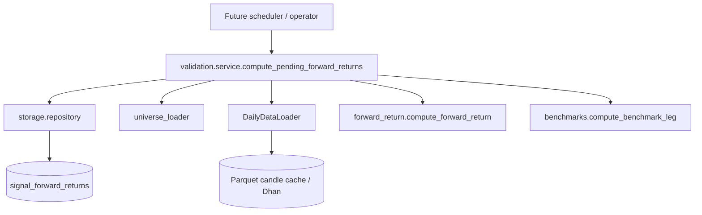

# LLD - Forward-return validation

| | |
|---|---|
| **Component** | Historical signal validation (VALID-002) |
| **Source** | [`backend/validation/`](../../../backend/validation), [`backend/storage/repository.py`](../../../backend/storage/repository.py) |
| **Layer** | Backend service + pure calculation |
| **Status** | Implemented for per-signal forward-return rows; aggregate metrics/UI remain VALID-003 |
| **Related** | [VALID-001 design](../valid-001-forward-return-validation.md), [VALID-002 handoff](../valid-002-handoff.md), [storage-persistence](storage-persistence.md) |

## 1. Purpose & responsibilities

VALID-002 fills `signal_forward_returns` for stored `scan_results` rows. It measures what happened after a signal without re-running the screener:

- entry is the next trading day's open;
- exit is the close at `signal_index + horizon_days`;
- trading days are counted from the symbol's candle frame, not calendar days;
- benchmark return is aligned to the same entry and exit dates when a verified benchmark instrument exists.

This component does not schedule itself, render UI, or compute aggregate hit-rate/median/sector metrics. Those are VALID-003 concerns.

## 2. Position in the system

## 3. Public interface

| Function | Contract |
|---|---|
| `compute_forward_return(candles, signal_date, horizon_days, *, as_of=None)` | Pure calculation over one OHLC frame. Returns `ForwardReturnPoint` with `computed`, `pending`, or `insufficient_data`. |
| `compute_benchmark_leg(candles, *, entry_date, exit_date, benchmark_key)` | Pure benchmark return over the exact stock entry/exit dates; missing dates return null prices/return. |
| `benchmark_for_universe(universe_key)` | Returns a `BenchmarkSpec` only when its Dhan index `security_id` is configured. Blank production IDs intentionally return `None`. |
| `compute_pending_forward_returns(session, loader, *, as_of=None, horizons=(20, 60, 120), limit=None)` | Loads eligible stored signals, resolves instruments, computes each horizon, and upserts rows idempotently. |
| `get_signals_needing_forward_returns(...)` / `upsert_forward_return(...)` | Repository-only query/write helpers for missing/pending rows and `(result_id, horizon_days)` upserts. |

## 4. Missing-data and benchmark policy

- `COMPUTED`: entry/exit bars exist and `exit_date <= as_of`.
- `PENDING`: the exit date is after `as_of`, or the candle frame is recently incomplete within the 7-calendar-day data-lag grace window.
- `INSUFFICIENT_DATA`: the signal date is absent, prices are invalid, symbol mapping is missing, or the required future bar is still absent after the grace window.
- Loader failures are retryable and stored as `PENDING`, not terminal `INSUFFICIENT_DATA`.
- Benchmark IDs are not guessed. Until verified Dhan `IDX_I` IDs are configured, stock returns compute and benchmark/excess fields remain null.

## 5. Testing

- [`tests/test_forward_return_calculator.py`](../../../tests/test_forward_return_calculator.py) covers pure math, trading-day gaps, as-of gating, stale missing data, and benchmark date alignment.
- [`tests/test_forward_return_service.py`](../../../tests/test_forward_return_service.py) covers service orchestration, benchmark degradation, missing mapping, and idempotency.
- [`tests/test_scan_storage_repository.py`](../../../tests/test_scan_storage_repository.py) covers the new repository selection/upsert helpers.
