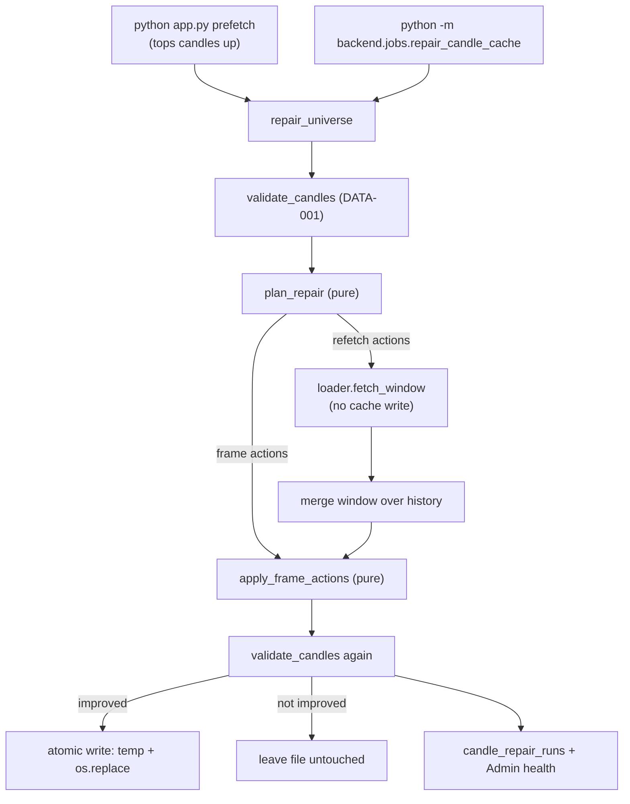

# DATA-002 — Candle cache repair

| | |
|---|---|
| **Ticket** | DATA-002 |
| **Status** | Implemented |
| **Depends on** | [DATA-001 candle quality](components/data-quality.md) |
| **Source** | [`backend/data_quality/repair.py`](../../backend/data_quality/repair.py), [`backend/data_quality/cache_repair.py`](../../backend/data_quality/cache_repair.py), [`backend/jobs/repair_candle_cache.py`](../../backend/jobs/repair_candle_cache.py) |
| **Related** | [data-acquisition](components/data-acquisition.md) · [health-monitoring](components/health-monitoring.md) · [storage-persistence](components/storage-persistence.md) |

## 1. Problem

DATA-001 gave the app eyes but no hands. `validate_candles` runs at the loader
boundary during a *scan*, and everything it can do is defensive: quarantine the
symbol as a `phase="data_quality"` failure, log the codes, and fold counts into
`scan_runs.data_quality_json`. Nothing ever repaired the cached parquet, and the
`python app.py` prefetch topped candles up without ever validating what it wrote.

The consequence is silent and permanent: **a corrupt cache file stays corrupt
forever, and its symbol is dropped from every scan without the operator noticing.**

Measured against a real 577-file cache on 2026-08-17, *no file was clean*:

| Code | Severity | Symbols | What the rows actually showed |
|---|---|---|---|
| `STALE_LATEST_CANDLE` | warn | 577 | 570 stopped at the same date; 7 stragglers were weeks further behind |
| `DUPLICATE_DATE` | **fatal** | 18 | Two distinct sub-classes — see §3 |
| `CALENDAR_DATE_GAP` | warn | 7 | 28–63 day holes in 2017-era illiquid counters; looks like genuine history |
| `SUSPICIOUS_OVERNIGHT_PRICE_GAP` | warn | 6 | Mostly a *symptom* of the duplicate problem, not an independent defect |
| `OPEN/CLOSE_OUTSIDE_RANGE` | **fatal** | 1 | One bar with `low == high` but `open` below it — killing all 2 477 days |

19 symbols were fatally dirty and being dropped from every scan.

## 2. Design principle: never invent a price

Every rule in this subsystem serves one constraint. There is no interpolation, no
clamping, no swapping a high and a low to make a bar "valid", and no split
adjustment. A repair is only ever one of three honest moves:

1. **Remove redundancy** — drop rows carrying no information.
2. **Ask the vendor again** — DhanHQ is the authority for anything ambiguous.
3. **Drop what cannot be trusted** — and only *after* step 2 has been tried, so a
   day is never discarded while a good copy might still be available.

Anything that could plausibly be real vendor data is left alone and reported as
`NO_ACTION_VENDOR_DATA`.

## 3. The duplicate-date split (why one rule was not enough)

The 18 duplicate-date symbols needed opposite treatments:

- **Exact duplicates** (13 symbols) — byte-identical rows for the same date.
  De-duplicating costs *zero trading days*, so it is always safe and needs no
  network. One file carried 1 238 redundant rows.
- **Conflicting duplicates** (5 symbols) — the same date with *different prices*.
  One held 4 395 rows where ten years is ~2 470, and another's series jumped
  19.60 → 6.80 → 1.25 → 5.40. These are two price series merged into one file,
  caused by symbol renames. No row-level edit is honest; the file is re-downloaded.

**The trap this design exists to avoid:** one file had the same OHLC twice with
volumes `164 890` then `2 245`. The loader's existing merge rule
`drop_duplicates(keep="last")` would keep the `2 245` row — the partial intraday
snapshot, i.e. the wrong bar. A naive dedupe makes that file *worse*.

Hence `DEDUPE_CONFLICTING_KEEP_MAX_VOLUME`: a final end-of-day bar's volume can
never be below a partial snapshot of the same session. It is opt-in, runs only
after the vendor has had its chance, and **only touches groups that disagree on
volume alone** — two rows quoting different prices are left duplicated rather
than stitched into a series that never existed.

## 4. Structure

The split is deliberate: **`repair.py` decides, `cache_repair.py` does.** The
planner is pure — no disk, no network, never mutates its input — which is what
makes every rule testable with a three-row DataFrame instead of a broker session.

`fetch_window` is a new `DailyDataLoader` method. Every pre-existing fetch path
writes what it downloads straight to the symbol's parquet, which would truncate a
ten-year file to the repaired window; `fetch_window` does the network half only
and lets the caller own the result.

## 5. Finding → action mapping

| Finding | Action |
|---|---|
| `EMPTY_FRAME`, `MISSING_REQUIRED_COLUMNS`, `MISSING_DATE_AXIS` | `REFETCH_FULL` |
| `INVALID_DATE` | `DROP_UNPARSEABLE_DATES` + `REFETCH_WINDOW` over the frame's extent |
| `DUPLICATE_DATE`, all groups identical | `DEDUPE_EXACT_ROWS` (offline) |
| `DUPLICATE_DATE`, any group conflicting | `REFETCH_FULL` |
| `INVALID_NUMERIC_VALUE`, `HIGH_BELOW_LOW`, `OPEN/CLOSE_OUTSIDE_RANGE`, `NEGATIVE_VOLUME` | `REFETCH_WINDOW` over the affected dates, then `DROP_IMPOSSIBLE_BARS` |
| `STALE_LATEST_CANDLE` | `REFETCH_WINDOW` for the tail — subject to the stale guard in §6 |
| `CALENDAR_DATE_GAP` | `REFETCH_WINDOW` per gap; an empty answer proves the gap is real |
| `SUSPICIOUS_OVERNIGHT_PRICE_GAP` | `NO_ACTION_VENDOR_DATA` — never auto-adjusted |

## 6. Guardrails

| Guard | Why |
|---|---|
| **Drop budget measured in trading days, not rows** (`MAX_DROPPED_DATE_RATIO = 0.02`, floor `MAX_DROPPED_DATES_FLOOR = 3`) | De-duplicating 1 238 redundant rows costs zero days and must always be allowed; discarding real days must not. The floor keeps a single bad bar fixable in a short history, where one day can exceed 2%. Tripping the budget leaves the file untouched — a known-dirty file an operator can inspect beats a hollowed-out one. |
| **Write only on genuine improvement** (`_is_improvement`) | A frame that got re-sorted while staying just as broken is churn: it bumps the mtime, invalidating chart caches, and buys nothing. This makes "unrepairable means untouched" a real invariant. Judged on *fatal* count first, because a legitimate repair can trade a fatal finding for a warning (dropping a bar leaves a one-day hole). |
| **Atomic write** (temp file + `os.replace`) | An interrupted repair can never leave a half-written cache file. |
| **Stale guard** | The prefetch passes its per-symbol top-up statuses in, so a symbol Dhan just answered is not asked again. Standalone runs fall back to the loader's existing `.checked` marker. Without this a full universe would spend one pointless request per symbol — 577 of them. |
| **`.repaired` sidecar** (`REPAIR_RETRY_AFTER_DAYS = 7`) | A symbol whose dirt lives in the vendor's own data would otherwise re-download its whole history on every app launch, forever. |
| **Refetch circuit breaker** (`MAX_CONSECUTIVE_REFETCH_FAILURES = 5`) | Found during verification: an expired access token fails identically for every symbol. Without the breaker one bad credential costs one wasted request per symbol on every launch. |
| **Cache-only mode short-circuit** | With no credentials the offline half still runs; symbols that need only the vendor are reported `skipped` with one clear reason instead of a wall of identical fetch errors. |

## 7. Failure modes

- Unreadable parquet → `failed` outcome, file untouched, pass continues.
- Fetch exception → recorded (redacted), offline repairs still applied, symbol
  reported `unrepairable` if nothing improved.
- Repair leaves findings → `partially_repaired` (some resolved) or `unrepairable`
  (none), never reported as success.
- Receipt persistence fails → logged warning only; the disk repair already
  happened and must not be undone by a database hiccup.
- Repair raises during prefetch → caught in `app.repair_candle_cache_assets`,
  reported, and Streamlit still launches.

## 8. Verified behaviour

Run against a copy of the real 577-file cache, with no network available:

| Check | Result |
|---|---|
| Fatal symbols | **19 → 5** (the 5 are the conflicting-duplicate files needing a vendor refetch) |
| Rows removed | 1 284, across 13 dedupes + 1 impossible bar |
| Trading days lost to a dedupe | **0** (e.g. 3 714 → 2 476 rows, 2 476 → 2 476 days) |
| The impossible bar | Exactly one day dropped; that symbol's fatal findings cleared |
| Second consecutive run | No writes, no re-downloads (idempotent) |
| Stray `.tmp` files | None |

## 9. Persistence

`candle_repair_runs` (migration `20260817data002`) holds one row per pass:
counts, plus a bounded, redacted `receipt_json` (`schema_version=1`, capped at
`MAX_RECEIPT_OUTCOMES = 25`, most-actionable first). Admin health renders the
newest row passively — it never re-validates or re-repairs anything.

A separate table rather than a column on `scan_runs` because a repair is not a
scan: it runs during the prefetch, before any screener executes, and has its own
counts. Hanging it off a scan row would mean inventing a synthetic scan for every
morning's cleanup.
