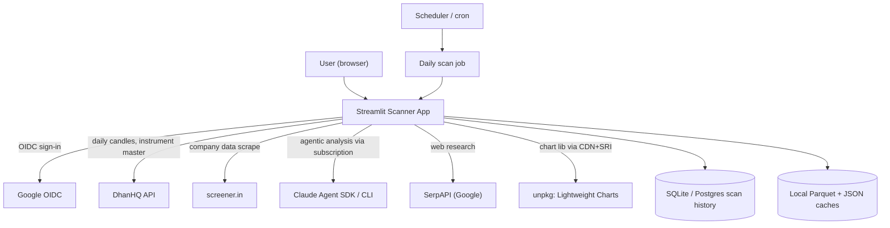
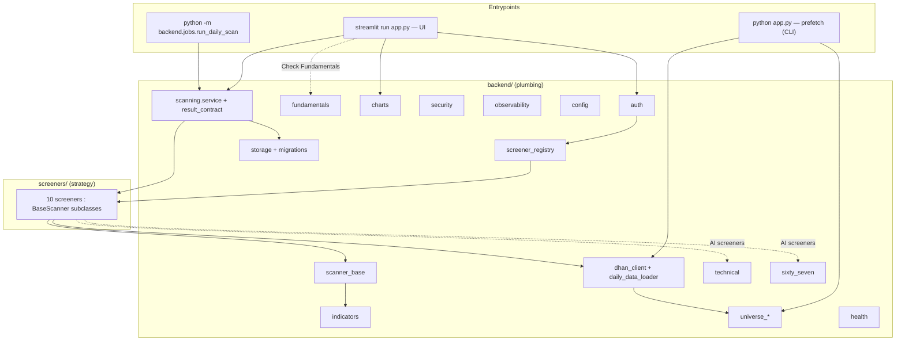
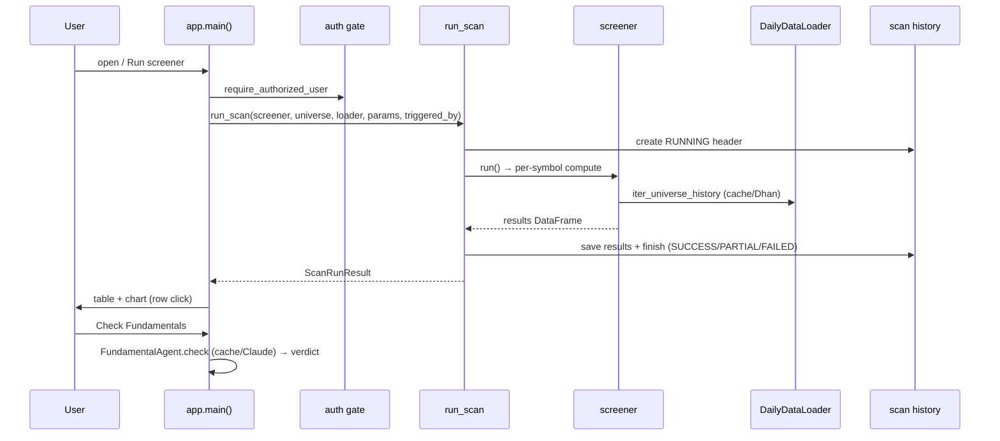
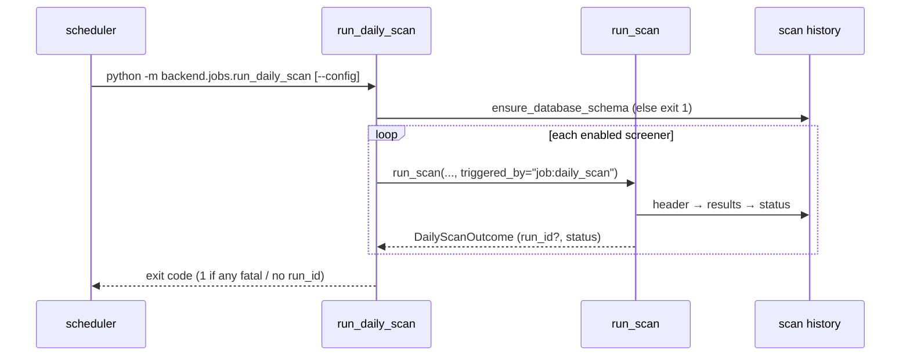
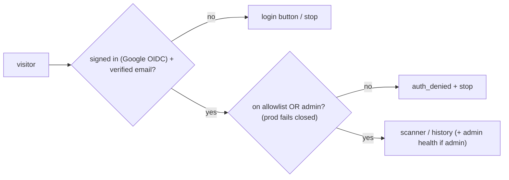

# High-Level Design — Streamlit Scanner App

> **What this is.** A whole-system design overview of the Streamlit Scanner App.
> For the internal design of any one subsystem, follow the links in the
> [component map](#5-component-map) to its low-level design (LLD) under
> [`components/`](components/). For the persistence schema rationale see the
> existing [`scan-run-persistence.md`](scan-run-persistence.md).

| | |
|---|---|
| **System** | Pluggable daily-candle stock scanner for Indian equities (DhanHQ data + Streamlit UI + optional Claude-agent analysis). |
| **Audience** | New contributors, reviewers, and the Claude/Codex split working the backlog. |
| **Status** | Living document — reflects `main`. |

## 1. System summary

`python app.py` downloads stock universes and ~10 years of daily candles, then
opens a Streamlit app. A user picks a **screener** (a single Python file in
`screeners/`), runs it over a universe, and browses the shortlist with
interactive TradingView Lightweight Charts. Shortlisted rows can be sent to a
**Check Fundamentals** Claude agent. Two screeners are themselves AI-assisted
(Technical Analysis, 67 Ka Funda). Every scan — from the UI or a headless daily
job — is recorded to a scan-history database. Access is gated behind Google SSO
with an email allowlist.

## 2. Goals & requirements

**Functional**
- Run pluggable screeners over configurable stock universes on cached daily candles.
- Interactive per-stock charts with the screener's own indicator overlay.
- Per-stock AI fundamental analysis + two AI-assisted screeners (graceful degradation when AI is unavailable).
- Persist every scan run + shortlist for later "why was this shortlisted on date D?" audit.
- Headless daily job for schedulers; Google-SSO gate + allowlist.

**Non-functional**
- **Single-writer research tool**, not a high-availability service: correctness, auditability, and low cost over throughput.
- **Fast after first run**: prefetch up front; incremental candle top-up; chart/session caches.
- **Cost-bounded AI**: cheap deterministic gates before any LLM; per-day verdict caches; Claude-subscription billing (no per-token API key).
- **Secret-safe & fail-closed**: redaction on every output sink; production refuses unsafe config.
- **Portable storage**: SQLite locally, Postgres in deployment, same schema.

**Constraints**: Python 3.11+; DhanHQ account for data; TA-Lib/pandas_ta optional (pure-pandas fallback); Claude Agent SDK + SerpAPI optional.

## 3. Context — external systems

External data and AI text are treated as **untrusted evidence**, never instructions (prompt-injection posture); server-side fetches pass SSRF guards.

## 4. Architecture overview

The deliberate boundary: **strategy logic in `screeners/`, plumbing in `backend/`**. Three entrypoints share one backend.

## 5. Component map

| Subsystem | LLD | Responsibility |
|---|---|---|
| App entrypoint & orchestration | [app-orchestration](components/app-orchestration.md) | Prefetch CLI + Streamlit `main()`, view router, scan state machine |
| Authentication | [authentication](components/authentication.md) | Google OIDC gate + email allowlist/admins |
| Configuration | [configuration](components/configuration.md) | Typed env settings, prod fail-closed, secret list |
| Data acquisition | [data-acquisition](components/data-acquisition.md) | DhanHQ client + Parquet candle cache |
| Universe management | [universe-management](components/universe-management.md) | Build/load universe CSVs, symbol→security_id |
| Screener framework | [screener-framework](components/screener-framework.md) | `BaseScanner` ABC + plugin registry |
| Indicators | [indicators](components/indicators.md) | TA-Lib/pandas_ta + fallbacks, levels, weekly |
| Screener catalog | [screener-catalog](components/screener-catalog.md) | The 10 strategies |
| Scan service & provenance | [scan-service-and-provenance](components/scan-service-and-provenance.md) | `run_scan` lifecycle + strict result/provenance contract + AI evaluation receipts |
| Storage & persistence | [storage-persistence](components/storage-persistence.md) | ORM (`scan_runs`/`scan_results`/`ai_evaluations`), engine/session, repository, Alembic |
| Daily scan job | [daily-scan-job](components/daily-scan-job.md) | Headless CLI + YAML schedule |
| Check Fundamentals (AI) | [fundamentals-ai](components/fundamentals-ai.md) | Claude agent + screener.in scraper + PDF + cache |
| Technical Analysis (AI) | [technical-analysis-ai](components/technical-analysis-ai.md) | Claude agent + price-action detectors + MCP tools |
| 67 Ka Funda (AI) | [sixty-seven-ka-funda-ai](components/sixty-seven-ka-funda-ai.md) | Drawdown gate + SerpAPI + Claude verifier |
| Charts & visualization | [charts-visualization](components/charts-visualization.md) | Lightweight-Charts specs + chart cache |
| UI pages | [ui-pages](components/ui-pages.md) | Scan-history page + shared UI helpers |
| Observability | [observability](components/observability.md) | Structured, secret-safe logging |
| Security | [security](components/security.md) | Secret redaction + SSRF guards + AI verdict-cache integrity (HMAC) |
| Health monitoring | [health-monitoring](components/health-monitoring.md) | Passive admin health snapshot/page |

## 6. End-to-end flows

### 6a. Interactive scan → chart → Check Fundamentals

### 6b. Headless daily scan + persistence

### 6c. Auth gate

## 7. Cross-cutting concerns

- **Auth** — one gate at the top of `main()`; nothing renders before it. ([authentication](components/authentication.md))
- **Observability** — named structured events, JSON in prod, identical across all three entrypoints. ([observability](components/observability.md))
- **Security** — secret redaction on every sink (logs, UI errors, persisted messages); SSRF guards on scraped fetches; CSV-injection escaping; prompt-injection posture. ([security](components/security.md))
- **Persistence & provenance** — every shortlisted row carries a deterministic receipt (PROV-002: `triggered_rules` + `indicator_values` + `source`, built by `BaseScanner.build_provenance`); AI screeners add a tamper-evident verdict receipt (PROV-003: model, semantic prompt version, prompt/evidence/context SHA-256, sanitized source URLs — never raw scraped/model text) persisted to the `ai_evaluations` ledger. Shared JSON receipt envelopes let deterministic and AI audit detail evolve without per-strategy tables. ([scan-service-and-provenance](components/scan-service-and-provenance.md), [storage-persistence](components/storage-persistence.md))
- **Caching** — Parquet candle cache (incremental), per-day AI verdict cache (**HMAC-signed and verified before reuse** — a tampered entry is rejected and recomputed), per-session chart cache, 30/60s Streamlit data caches.
- **Graceful AI degradation** — cheap gate first; if the SDK/SerpAPI is absent, Technical Analysis falls back to a gate-only BUY while 67 Ka Funda skips the candidate (partial run) — neither crashes the scan. Approved, rejected, **and** error AI decisions are all recorded in `ai_evaluations` for audit.
- **Trustworthy AI output (AI-004)** — every AI verdict is parsed into a strict Pydantic schema; malformed/incomplete output is **retried** a bounded number of times (`SCANNER_AI_MAX_ATTEMPTS`, default 2) then **rejected** as `AIValidationError`, and the run records the count distinctly (`ai_validation_failures`, `phase="ai_validation"`) so junk output can never silently corrupt scan results. ([scan-service-and-provenance](components/scan-service-and-provenance.md))

## 8. Tech stack

Python 3.11+ · Streamlit · pandas / pyarrow · SQLAlchemy 2 + Alembic · `dhanhq` · `requests` + BeautifulSoup · `pdfplumber`/`pypdf` (optional) · `claude-agent-sdk` (optional) · TradingView Lightweight Charts v5 (CDN+SRI) · Pydantic. Optional accelerators TA-Lib / pandas_ta. **Dependency policy**: `requirements.txt` (bare names) installed with `constraints.txt` (exact `==` pins); `requirements-optional.txt` / `requirements-dev.txt` separate.

## 9. Data & storage

Runtime data under `DATA_DIR` (default `./data`, git-ignored): `cache/daily/*.parquet` (candles), `cache/fundamentals/` (JSON data + verdicts + concall PDFs), `universes/*.csv`, `scanner.db` (SQLite). Scan history = `scan_runs` (1) ──< `scan_results` (many) and `scan_runs` (1) ──< `ai_evaluations` (many — the AI verdict ledger of approved/rejected/error receipts); deterministic columns for queries + `raw_result_json`/`provenance_json` for flexible audit. Full design: [scan-run-persistence.md](scan-run-persistence.md).

## 10. Deployment & runtime

- **Local dev**: `AUTH_REQUIRED=false` default, SQLite, repo-local `data/`, optional providers off.
- **Production** (`APP_ENV=production`): requires explicit `DATABASE_URL` + `DATA_DIR` (persistent volume) + Dhan creds + `AUTH_REQUIRED=true` + an allow/admin email; rejects `AUTH_REQUIRED=false`. Logs render JSON. Migrations apply automatically on startup.
- **CI quality gates** (`.github/workflows/quality-and-security.yml`, Python 3.11 + 3.12): `pytest` (coverage ≥84% on `backend`/`screeners`/`ui`), `compileall`, `ruff`, `bandit`, `pip-audit`, `pre-commit`, plus golden-snapshot + Alembic drift tests.

## 11. System-wide design decisions

| Decision | Rationale |
|---|---|
| **Screeners vs backend boundary** | Strategy authors touch one file; plumbing changes never require editing strategies. |
| **Plugin auto-discovery** | Drop a file in `screeners/` → it appears in the UI; no central registration. |
| **Prefetch-then-UI** | Slow network work happens once up front; the app feels instant. |
| **Cheap gate → AI on survivors** | Bounds AI cost/latency to a handful of candidates. |
| **One persistence schema (typed cols + JSON)** | Serves deterministic and AI screeners without per-strategy tables or flag-day migrations. |
| **Best-effort persistence in UI, strict in the job** | The UI always shows fresh rows even if the DB is down; the scheduled job fails loudly if history isn't written. |
| **Secret-safe by construction** | Redaction is a shared filter on every output sink, not a per-call concern. |
| **Claude-subscription billing** | AI features draw on the plan's Agent SDK credit; `ANTHROPIC_API_KEY` is deliberately kept unset. |
| **Tamper-evident AI receipts** | AI verdicts persist hashed evidence + a semantic prompt version as an audit ledger (`ai_evaluations`); the on-disk verdict cache is HMAC-signed so a forged/edited entry is rejected and recomputed, never trusted. Raw scraped text and raw model responses are never stored. |
| **Strict result contract, truthful status** | Rows are validated against the provenance contract *before* the DataFrame is built; contract-rejected rows and persistence failures downgrade the run to `PARTIAL`/`FAILED` rather than reporting a false success. |
| **Validate → retry → reject for AI output (AI-004)** | Strict-schema parsing with a bounded retry on malformed output (not SDK/usage-limit errors) recovers transient model glitches without burning Agent SDK credit; persistent junk is rejected and counted, never persisted. |

## 12. Risks & future evolution

- **AI/external dependency** — Dhan/screener.in/SerpAPI/CLI changes can break features; mitigated by fallbacks, caches, and untrusted-evidence handling.
- **Single-writer SQLite locally** — WAL + short sessions mitigate; Postgres for real concurrency.
- **Recently shipped**: PROV-002 (deterministic per-screener receipts via `build_provenance`) and PROV-003 (AI verdict receipts + the `ai_evaluations` ledger + HMAC verdict-cache integrity) are now on `main`.
- **Roadmap (backlog)**: RANK-* (`final_score` ranking), VALID-* (forward-return validation + `(symbol, signal_date)` index), AUTH-003 (role-gated features), DEPLOY-* (hosting). These land in reserved columns / JSON without flag-day migrations.
