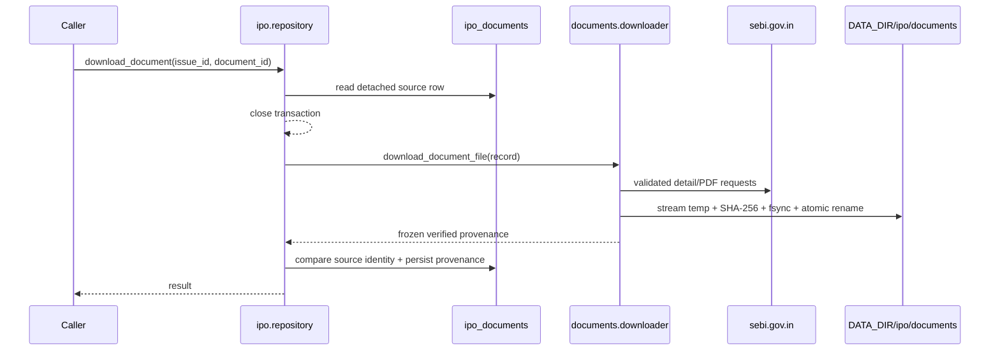

# IPO-003 - Document downloader and content-addressed cache

## Purpose

IPO-003 adds an explicitly invoked backend service that downloads an already
registered SEBI DRHP/RHP prospectus without parsing it. Verified bytes are
stored beneath `DATA_DIR/ipo/documents/` under their SHA-256 digest. IPO-002
remains a metadata-only inventory job and never triggers this service.

## Public contract

`download_document(issue_id, document_id)` loads a detached document record,
closes the database transaction, performs bounded network/filesystem work, and
opens a second short transaction to persist the result. Only `drhp` and `rhp`
documents are eligible. A `final_offer` row is rejected before any request.

The frozen `IpoDocumentDownloadResult` carries the document id, content digest,
UTC download time, DATA_DIR-relative path, null page count, `pending` status,
cache-hit flag, and byte count. `IpoDocumentDownloadError` exposes only a stable
error code; it never retains a response body, URL query, or raw exception text.

## Trust boundary and data flow

Every request requires HTTPS, an exact `sebi.gov.in`/`www.sebi.gov.in` host,
port 443, no credentials, and public DNS answers. Redirects are manual and each
hop repeats those checks. Detail HTML is capped at 2 MiB. The downloader accepts
exactly one iframe `file` target under `/sebi_data/attachdocs/`; ordinary
abridged-prospectus anchors are ignored. PDF responses are capped at 50 MiB and
must use an allowed media type plus `%PDF-` magic.

## Persistence and cache invariants

`record_hash` remains IPO-002's filing-metadata identity. IPO-003 adds the
separate `content_sha256`, `downloaded_at`, `file_path`, `page_count`, and
`parse_status` columns. The database enforces two valid shapes:

- `pending`: hash, UTC timestamp, and relative path are present; page count is
  null because no parser has run.
- `not_downloaded` or `download_failed`: all cache/parser metadata is null.

The cache filename is `<content_sha256>.pdf`, so identical bytes converge on one
file. A cache hit is returned only after path containment, regular-file, size,
and digest verification. A corrupt contained file is removed and downloaded
again. Document source/type edits reset provenance to `not_downloaded`.
Before opening the temporary file, the downloader resolves and rejects a linked
cache directory; the final digest path is checked separately before rename.

The second transaction uses one atomic compare-and-set over document id, issue
id, source URL, and document type. If an operator corrects source metadata while
HTTP is in flight, the old response cannot attach to the revised row. The caller
receives the stable `source_changed` error and the corrected row remains
`not_downloaded`, ready for an explicit retry.

The filesystem rename and database commit cannot share a transaction. The file
is atomically published first; a later database failure can therefore leave a
harmless orphan hash-named file. Document-row deletion does not unlink a file
that another row may share. Orphan pruning is intentionally deferred.

## Failure and recovery

Failures clear trusted provenance, store `download_failed`, emit the structured
`ipo_document_download_failed` event, and write a best-effort durable system
audit containing only issue id, document id/type, and stable error code. A
normal retry is the recovery path. An audit-sink outage never replaces the
already committed database state or stable caller error. Successful retries
atomically replace the status with verified `pending` metadata.

Migration `20260630ipo003` backfills existing rows to `not_downloaded`. Its
downgrade refuses before DDL if any row contains IPO-003 metadata or a nondefault
status, preventing silent provenance loss.

## Explicit non-goals

No CLI, scheduler, Streamlit page, automatic ingestion hook, PDF text parsing,
page counting, OCR, factor derivation, or LLM analysis is part of IPO-003.
