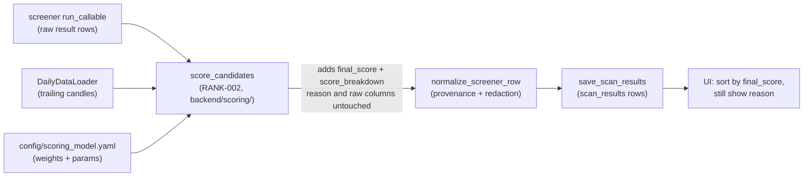

# RANK-001 — Final scoring model

| | |
|---|---|
| **Ticket** | RANK-001 — Design final scoring model |
| **Type / Priority** | Story · P2 |
| **Owner / Reviewer** | Claude / Codex |
| **Status** | Design complete (methodology only — no code/schema lands here) |
| **Branch** | `claude/rank-001-final-scoring-model` |
| **Depends on** | SCAN-001…004 (run/result persistence + the reserved `final_score` column), PROV-001/002 (the `provenance_json` receipt contract) |
| **Unblocks** | RANK-002 (scorer implementation), RANK-003 (fundamental/valuation components), the ranked-shortlist UI sort |

---

## 1. Context & goal

The scanner shortlists stocks but cannot yet say **which of today's hits is strongest**. Each
screener returns independent BUY rows with a free-text `reason`; there is no cross-candidate
number to sort by, so a 40-row shortlist lands on the trader as an unordered list. EPIC 11
(*Ranking & Portfolio-Aware Results*) closes that gap, and RANK-001 is its first step: **convert
raw scanner results into a ranked shortlist**.

This ticket is the **design** — it fixes the scoring formula, the score ranges, the missing-data
behaviour, and the guarantee that ranking never hides the raw reasons. It deliberately ships **no
code**: the `final_score` column already exists (reserved by SCAN-001), and the implementation is
**RANK-002 (Codex)**, whose build brief is [`rank-002-handoff.md`](rank-002-handoff.md). This
mirrors the codebase's established split — VALID-001 designed the methodology, VALID-002 built the
calculator — except RANK-001 is even lighter because it needs **no new table and no migration**
(§5).

The four RANK-001 acceptance criteria are all documentation deliverables, mapped in §9:
scoring formula documented · score ranges defined · missing-data behaviour defined · ranking does
not hide raw reasons.

---

## 2. Scope

**In scope (RANK-001, this ticket — design):**
- The **scoring methodology** — the v1 component set, the per-component normalization, the
  weighted-sum aggregation, the [0, 100] score range, and a worked example (§3).
- The **missing-data behaviour** and the **"ranking never hides raw reasons" guarantee** (§4).
- **Where scores live** — the existing `final_score` column plus a `score_breakdown` receipt in
  `provenance_json`, with the rationale for **no migration** (§5).
- The **configuration model** RANK-002 will implement (§6) and the **interface contract +
  integration point** (§7).
- The **security & integrity** properties the implementation must preserve (§8).

**Out of scope (later tickets):**
- The scorer **package + wiring + tests** (`backend/scoring/`, the `run_scan` call, populating
  `final_score`/`score_breakdown`) → **RANK-002 (Codex)**.
- The **`fundamental_score` and `valuation_score` components** → **RANK-003**. They need a
  fundamentals-fetch step in the scan flow first: today screener.in fundamentals are fetched
  **on-demand only for the AI screeners** ([`backend/fundamentals/`](../../backend/fundamentals/)),
  so most deterministic screener rows have no fundamentals at scan time. v1 therefore scores the
  **four always-computable components** and reserves the other two (§3.1).
- The **UI sort/column** that renders the ranked shortlist (sort by `final_score`, keep the
  `reason` column) → implemented by RANK-002's wiring.
- **Portfolio-aware** ranking (sector caps, position sizing, correlation) → later EPIC 11 tickets.

The design stops at "methodology only" — exactly as VALID-001 did for VALID-002 — so the formula
can be reviewed and agreed before any code is committed.

---

## 3. Scoring methodology

### 3.1 Components and the score scale

Every component score and the `final_score` are on **[0, 100]**, rounded to 2 decimals — which
fits the reserved `final_score` column type `Numeric(6, 2)`
([`backend/storage/models.py`](../../backend/storage/models.py)) and reads as an intuitive
"points out of 100" for a trader. Higher is always better.

**v1 scores the four components computable from data every scan already has** (daily candles +
the persisted result row + timestamps):

| Component | Raw inputs (already available) | Direction | Normalization |
|---|---|---|---|
| `technical_score` | Signal strength from the result row — e.g. `confidence`/`confirmed`/pattern fields in `raw_result_json`, trend alignment and level proximity from [`backend/indicators.py`](../../backend/indicators.py) | higher = better | **cross-sectional** (§3.2) |
| `liquidity_score` | Average traded value `mean(volume × close)` over a trailing window, from the candle frame | higher = better | **cross-sectional**, log-scaled (§3.2) |
| `risk_score` | Trailing return volatility (std-dev of daily log returns) over a trailing window, from the candle frame | lower risk = better → inverted | **absolute** (§3.3) |
| `freshness_score` | Staleness `data_snapshot_date − signal_date` (how old the signal is vs the data snapshot) | fresher = better | **absolute** decay (§3.3) |

**Reserved, not scored in v1** (documented here so the model's end-state is visible; weight 0
until RANK-003 wires them in): `fundamental_score` (quality — ROCE, margins, growth) and
`valuation_score` (cheapness — PE vs median PE, PB).

### 3.2 Cross-sectional normalization (technical, liquidity)

A *shortlist* is inherently a comparison **within today's candidates**, so technical strength and
liquidity are normalized **relative to the other rows in the same run** — the same "score relative
to the busiest level in this set" approach `rank_levels` already uses
([`backend/indicators.py`](../../backend/indicators.py)). For raw values `v` across the run's
candidate set:

```
score_i = 100 × (v_i − min(v)) / (max(v) − min(v))         # min–max within the run
```

- **Liquidity is log-scaled first** (`v = log10(1 + mean(volume × close))`) because traded value
  spans orders of magnitude; without the log a few mega-caps would flatten everyone else to ~0.
- **Degenerate distribution** — if every candidate shares the same value (or the run has a single
  candidate), `max(v) == min(v)` and the formula is undefined. The component is then **neutral
  (50)** and flagged in the breakdown. This is *not* fabrication (§4): the data exists, it simply
  carries no *relative* signal, and 50 is the honest "no information to rank on" midpoint.

Cross-sectional scores are **run-relative**: a 75 in today's run is "upper-mid of today's batch,"
not a fixed bar comparable to next week's run. That trade-off is intentional for a shortlist; §11
notes the absolute-calibration alternative for a future ticket.

### 3.3 Absolute normalization (risk, freshness)

Risk and freshness are scored on **fixed, run-independent curves** so they mean the same thing
every run (the hybrid choice for this model):

- **`risk_score`** — from trailing daily volatility `σ` (std-dev of log returns over
  `risk_window` bars, default 60):
  ```
  risk_score = 100 × clamp(1 − σ / σ_cap, 0, 1)            # higher vol → lower score
  ```
  `σ_cap` (config, default ≈ 0.06 daily ≈ a very volatile name) is the volatility at which the
  risk score reaches 0. Calmer names score higher.

- **`freshness_score`** — exponential decay of staleness `s` (trading days between the signal and
  the data snapshot), reusing the recency-halflife idea from `rank_levels`:
  ```
  freshness_score = 100 × 0.5 ^ (s / freshness_halflife_days)   # s=0 → 100; s=halflife → 50
  ```
  `freshness_halflife_days` is config (default 5). For a normal live scan the signal fires on the
  latest bar (`s = 0 → 100`), so freshness acts as a small guard/tiebreaker that only bites for
  re-scored or multi-day-old signals. Crucially it is computed from **stored dates, never wall-clock
  `now()`**, which keeps re-scoring replay-stable (§8).

### 3.4 Weighting and the final score

Default weights (v1 — a reviewable starting point with rationale, exactly like
`_RELEVANCE_WEIGHTS`; they **sum to 1.0**):

| Component | Weight | Why |
|---|---|---|
| `technical_score` | **0.45** | The technical signal is *why* the row was shortlisted; it should dominate. |
| `risk_score` | **0.25** | A strong signal on a wildly volatile name deserves a discount. |
| `liquidity_score` | **0.20** | An un-tradeable name is a worse pick regardless of signal. |
| `freshness_score` | **0.10** | A guard/tiebreaker, not a primary driver. |

> When RANK-003 adds the reserved components, the target six-way split is roughly
> `technical 0.30 · fundamental 0.20 · valuation 0.15 · liquidity 0.15 · risk 0.15 · freshness 0.05`;
> v1 redistributes the reserved 0.35 across the four it can actually measure.

**Formula** — a renormalized weighted mean over the components that have data (`P`):

```
final_score = Σ_{c ∈ P} (w_c × score_c) / Σ_{c ∈ P} w_c          # rounded to 2 dp
```

Renormalizing by `Σ w_c` keeps `final_score` on [0, 100] even when a component is dropped (§4),
and means a fully-covered row and a partially-covered row are both scored on the same scale.

### 3.5 Worked example

A run shortlists three candidates. Trailing candles give each a volatility and traded value; all
fired on the latest bar (`s = 0 → freshness 100`).

| Symbol | technical (cross-sec) | liquidity (cross-sec) | risk (abs, σ) | freshness | `final_score` |
|---|---|---|---|---|---|
| AAA | 100.0 (best signal) | 60.0 | 80.0 (σ=0.012) | 100.0 | `0.45·100 + 0.20·60 + 0.25·80 + 0.10·100 / 1.0` = **87.00** |
| BBB | 50.0 | 100.0 (most liquid) | 50.0 (σ=0.030) | 100.0 | **66.00** |
| CCC | 0.0 (weakest) | 0.0 | 100.0 (σ=0.004) | 100.0 | **35.00** |

**Partial coverage** — suppose CCC is a freshly-listed name with too few bars to compute
volatility. `risk` is **dropped**, weights renormalize over `{technical, liquidity, freshness}`
(`Σw = 0.75`): `final_score = (0.45·0 + 0.20·0 + 0.10·100) / 0.75 = 13.33`, and the breakdown
records `"missing": ["risk"]` so the partial coverage is visible, never silent.

### 3.6 Position in the system

The scorer is a pure annotation step inside `run_scan`, **after** the screener returns and
**before** persistence — it adds columns, it never gates or filters rows.



---

## 4. Missing-data behaviour & the no-hidden-reasons guarantee

Two acceptance criteria — "missing data behaviour is defined" and "ranking does not hide raw
reasons" — are pinned down here as hard rules, in the spirit of VALID-001 §4's
"degrade gracefully, never fabricate."

1. **Drop, renormalize, record — never fabricate.** A component whose inputs are absent (e.g. a
   name with too little history for volatility) is **dropped** from that row's score; the remaining
   weights renormalize (§3.4). A neutral value is **never** substituted for a *missing input*. (The
   §3.2 degenerate-distribution neutral-50 is different: there the data is present but carries no
   relative signal.)
2. **Never drop a row.** Scoring is annotation, not filtering. A row that cannot be scored at all
   (no component computable — rare, since candle-derived components almost always exist) keeps
   `final_score = NULL` and is still persisted with its `reason` and `raw_result_json` intact. A
   NULL score sorts last, it does not erase the candidate.
3. **Every score carries its receipt.** Each scored row records a `score_breakdown` (§5) listing the
   component scores, the **effective weights**, and explicit `coverage`/`missing` lists — so a
   partially-covered score is self-explaining and auditable, exactly like the PROV-001 receipts.
4. **Ranking is purely additive — raw reasons are never hidden.** The scorer **only** sets
   `final_score` and appends `score_breakdown`. It does **not** edit or remove `reason`,
   `raw_result_json`, any screener column, or any provenance field. The UI sorts by `final_score`
   but keeps the `reason` column visible; the score is an *additional* signal beside the raw
   evidence, never a replacement for it. This is the literal acceptance criterion, stated as an
   invariant the implementation must hold.

---

## 5. Where the scores live (no migration)

| Datum | Stored in | Migration? |
|---|---|---|
| `final_score` (the composite) | The **existing** `scan_results.final_score` column (`Numeric(6,2)`, nullable), reserved by SCAN-001 "filled later by RANK-*". The typed `ScreenerResult.final_score` field is already present in [`result_contract.py`](../../backend/scanning/result_contract.py). | **None** — column + typed field already exist. |
| `score_breakdown` (the receipt) | A `score_breakdown` block inside the row's **`provenance_json`** (PROV-001 contract). `normalize_screener_row` preserves unknown provenance keys, so the block survives to the database **and** is automatically run through redaction + NaN→null (§8). | **None** — JSON evolves without a migration, the same rationale the codebase already uses. |

This is the decisive difference from VALID-001 (which added a table and therefore had to ship a
schema stub + migration): RANK-001 changes **no schema**, so the `test_migration_matches_orm_metadata`
drift guard forces no code at all. RANK-002 promotes `score_breakdown` to a typed optional field on
`SignalProvenance` while still storing it as a provenance JSON key for backward-compatible readers.

**Example `score_breakdown`** (one row, fully covered):

```json
"score_breakdown": {
  "final_score": 87.00,
  "scale": "0-100",
  "model_version": "rank-1.0",
  "components": {"technical": 100.0, "liquidity": 60.0, "risk": 80.0, "freshness": 100.0},
  "weights_effective": {"technical": 0.45, "liquidity": 0.20, "risk": 0.25, "freshness": 0.10},
  "coverage": ["technical", "liquidity", "risk", "freshness"],
  "missing": []
}
```

---

## 6. Configuration model

Weights and per-component parameters are externalised to YAML, mirroring the VALID-002B
`config/benchmarks.yaml` shape (top-level key → entries; PyYAML is already a pinned dependency).
RANK-002 implements the loader in `backend/scoring/config.py`, reusing the **null-safe parsing**
lesson from VALID-002B ("handle null benchmark config values") so a partially-filled file degrades
to defaults rather than crashing.

```yaml
# config/scoring_model.yaml — RANK-002 reads this; defaults apply when a key is absent.
scoring:
  model_version: "rank-1.0"
  weights:                 # validated to sum ≈ 1.0 over the present components (else renormalized)
    technical: 0.45
    risk: 0.25
    liquidity: 0.20
    freshness: 0.10
  liquidity_window: 20         # trailing bars for mean(volume × close)
  risk_window: 60              # trailing bars for the volatility std-dev
  risk_vol_cap: 0.06           # daily σ at which risk_score reaches 0
  freshness_halflife_days: 5   # staleness at which freshness_score reaches 50
```

A `ScoringConfig` dataclass (frozen, like `BenchmarkSpec`) carries these into `score_candidates`.
Per-screener weight overrides (a screener that should lean harder on its technical signal) are a
deliberate **future** extension, not v1.

---

## 7. Interface contract & integration point

RANK-002 implements one public entry point; this design fixes its shape so the wiring is
unambiguous:

```python
# backend/scoring/model.py
from dataclasses import dataclass
import pandas as pd

@dataclass(frozen=True)
class ScoringContext:
    """Everything the scorer needs that isn't in the result row itself."""
    universe_key: str
    data_loader: object                 # DailyDataLoader — trailing candles for liquidity/risk
    data_snapshot_date: "dt.date | None" # for the freshness leg (stored, not now())
    config: "ScoringConfig"

def score_candidates(results: pd.DataFrame, *, context: ScoringContext) -> pd.DataFrame:
    """Return a COPY of `results` with a `final_score` column and a `score_breakdown`
    entry in each row's provenance. Never mutates the caller's DataFrame. Computes
    cross-sectional components over the candidate set and absolute components per row,
    renormalizing weights over present components (design §3–4)."""
    ...
```

**Integration point** — inside `run_scan`
([`backend/scanning/service.py`](../../backend/scanning/service.py)), immediately after the
screener returns and before the rows are persisted:

```python
results = run_callable(universe_df, data_loader, run_params)   # existing (service.py)
# RANK-002: annotate with final_score + score_breakdown (additive; never gates rows)
results = score_candidates(results, context=scoring_context)
```

**Scoring must be non-fatal.** `run_scan` already owns failure observation and "never raises for
screener/DB failures" — the scorer must follow suit: any exception inside `score_candidates`
degrades to *no scores* (`final_score` NULL, rows and reasons intact), it must **never** fail the
scan. RANK-002 wraps the call defensively and logs via the existing OBS-001 event path.

---

## 8. Security & integrity considerations

Scoring adds **no new external calls, no network, no secrets** — it is pure in-memory math over
candles and result rows the scan already loaded, so it widens no attack surface (bandit/pip-audit
unaffected). The properties the implementation must preserve:

- **Untrusted numeric inputs are coerced and clamped before use.** Result-row fields and (later)
  scraped fundamentals are untrusted evidence. Parse every raw input with
  `pd.to_numeric(errors="coerce")` and treat NaN/±inf as *missing* (the existing `_is_missing`
  semantics), then clamp to finite bounds before normalizing. A garbage, enormous, or NaN value
  must yield a *dropped component*, never an `inf`/`NaN` `final_score` or a crash.
- **The breakdown inherits the secret-safe pipeline for free.** Because `score_breakdown` is stored
  inside `provenance_json`, `normalize_screener_row` → `_normalize_json` runs it through the
  SEC-002 redactor and converts non-finite numbers to JSON `null` automatically. Component keys are
  fixed internal names (`technical`/`liquidity`/`risk`/`freshness`), not user- or scrape-derived
  strings, so the breakdown carries no injection vector.
- **CSV export stays formula-injection-safe.** The ranked shortlist export reuses the JOB-003
  formula-safe CSV path ([`ui/common.py`](../../ui/common.py)); `final_score` is numeric and the
  breakdown is not exported by default.
- **Deterministic & replay-stable.** No wall-clock in the formula — freshness uses the stored
  `data_snapshot_date`/`signal_date`, cross-sectional normalization is deterministic over the
  candidate set, and `model_version` pins the formula. Re-scoring the same run reproduces identical
  scores, so the audit trail cannot silently drift.
- **AI outputs are data, not instructions.** Technical inputs sourced from AI-screener rows are
  consumed as numbers/evidence only, consistent with the repo's untrusted-evidence posture.
- **Config is loaded with `yaml.safe_load`.** `config/scoring_model.yaml` is parsed the same way as
  `config/benchmarks.yaml` ([`benchmarks.py`](../../backend/validation/benchmarks.py) uses
  `yaml.safe_load`), so a config file can never deserialize arbitrary Python objects; malformed/null
  values fall back to defaults rather than crashing.

---

## 9. Acceptance-criteria mapping

| RANK-001 acceptance criterion | How this design satisfies it |
|---|---|
| **Scoring formula is documented** | §3 — the four components, their normalization (cross-sectional vs absolute), the renormalized weighted-mean aggregation, default weights with rationale, and a worked example with partial coverage. |
| **Score ranges are defined** | §3.1 — every component and `final_score` on **[0, 100]** (2 dp, fits `Numeric(6,2)`); §4 — `final_score` is NULL only when no component is computable; the degenerate-distribution neutral-50 is defined in §3.2. |
| **Missing data behaviour is defined** | §4 rules 1–3 — drop the component, renormalize weights, record `coverage`/`missing`; never fabricate a missing input; never drop the row; NULL-when-empty. §8 — NaN/inf inputs coerce to "missing." |
| **Ranking does not hide raw reasons** | §4 rule 4 — scoring is purely additive (sets `final_score`, appends `score_breakdown`); it never edits/removes `reason`, `raw_result_json`, or any column; the UI sorts by score but keeps `reason` visible. |

---

## 10. Files in this change

| File | Change |
|---|---|
| `docs/architecture/rank-001-final-scoring-model.md` | **New** — this design doc. |
| `docs/architecture/rank-002-handoff.md` | **New** — the RANK-002 build brief for Codex. |
| `docs/architecture/README.md` | **Edit** — index RANK-001 + RANK-002 under "Ticket-scoped design docs." |
| `docs/architecture/high-level-design.md` | **Edit** — add the ranking subsystem to the component map, a system-wide decision row, and the roadmap note. |

**No code, schema, or migration lands in RANK-001.** The `final_score` column
([`models.py`](../../backend/storage/models.py)) and the `ScreenerResult.final_score` field
([`result_contract.py`](../../backend/scanning/result_contract.py)) already exist, and the
breakdown rides in `provenance_json` — so unlike VALID-001 there is nothing to migrate and the
drift guard forces no code. All logic + tests are RANK-002's scope.

---

## 11. Notes for the reviewer (Codex)

- **Weights are a reviewable default** (like `_RELEVANCE_WEIGHTS`). `technical 0.45 / risk 0.25 /
  liquidity 0.20 / freshness 0.10` is a starting point — flag if you'd rebalance.
- **Hybrid normalization is a deliberate choice** — technical/liquidity cross-sectional (rank within
  the run), risk/freshness absolute (fixed curve). The alternative is all-absolute (needs domain
  thresholds, comparable across runs) or all-relative (no fixed meaning). v1 picks hybrid; raise it
  if you'd prefer one extreme.
- **v1 omits `fundamental_score`/`valuation_score`** (→ RANK-003) because fundamentals are fetched
  on-demand only for AI screeners today. Confirm the four-component first cut is agreed.
- **`score_breakdown` storage** — preserved provenance key vs a typed `SignalProvenance` field. Both
  persist; pick when implementing. A typed field is mypy-friendlier.
- **`final_score` persistence path** — the `ScreenerResult` contract states the column and repository
  mapping already exist; confirm the save path maps `final_score` from the normalized row. If a gap
  exists it is a one-line repository edit, **not** a migration.
- **Non-fatal scoring** — a scorer exception must degrade to NULL scores, never fail the scan (§7).
- **Degenerate distribution / single-candidate runs** score the relative components neutral-50 (§3.2)
  — confirm that's acceptable behaviour for a one-row shortlist.
