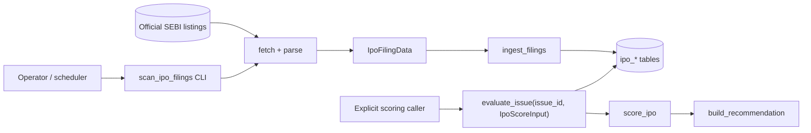

# IPO Architecture Consistency Implementation Plan

> **For agentic workers:** REQUIRED SUB-SKILL: Use superpowers:subagent-driven-development (recommended) or superpowers:executing-plans to implement this plan task-by-task. Steps use checkbox (`- [ ]`) syntax for tracking.

**Goal:** Make the whole-system and cross-cutting architecture documentation accurately expose the landed IPO-001 domain/scoring boundary and IPO-002 SEBI filing-ingestion boundary.

**Architecture:** Keep `docs/architecture/components/ipo-screener.md` as the consolidated current-state LLD and the IPO-001/IPO-002 ticket documents as the detailed authorities. Wire that component into the HLD and cross-cutting storage, observability, security, deployment, and operations documents without changing runtime behavior or implying that ingestion automatically scores an issue.

**Tech Stack:** Markdown, GitHub Mermaid, Python repository contract tests, Git.

---

### Task 1: Correct and sharpen the IPO Screener LLD

**Files:**
- Modify: `docs/architecture/components/ipo-screener.md:32-75`
- Modify: `docs/architecture/components/ipo-screener.md:179-191`

- [ ] **Step 1: Capture the current misleading assertions**

Run:

```powershell
rg -n "Storage -\. normalized facts|sources\.sebi|Automation & UI" docs/architecture/components/ipo-screener.md
```

Expected: the diagram connects storage directly to scoring, the repository dependency row names `sources.sebi`, and the extension text does not distinguish a runnable CLI from a deployed schedule.

- [ ] **Step 2: Separate ingestion from evaluation in the Mermaid diagram**

Replace the single blended path with two explicit paths:



Add one sentence stating that persisted financial/subscription facts are not yet converted into factor scores automatically.

- [ ] **Step 3: Correct module dependencies and scheduling language**

Change the `backend/ipo/repository.py` dependency cell to:

```text
models, scorecard, verdict, scanning.result_contract, storage
```

State that `python -m backend.jobs.scan_ipo_filings` is manually runnable and scheduler-compatible, but IPO-002 does not add a scheduler, Render cron, Compose daemon, or Streamlit entrypoint.

- [ ] **Step 4: Verify the LLD against source**

Run:

```powershell
rg -n "from backend" backend/ipo/repository.py
rg -n "Explicit scoring caller|not.*automatically|does not add a scheduler" docs/architecture/components/ipo-screener.md
```

Expected: the documented dependencies match the imports and all three boundary statements are present.

- [ ] **Step 5: Commit the focused LLD correction**

```powershell
git add docs/architecture/components/ipo-screener.md
git commit -m "docs: clarify IPO ingestion and evaluation boundaries" -m "Co-authored-by: Codex <codex@openai.com>"
```

### Task 2: Wire IPO-001 and IPO-002 through the HLD

**Files:**
- Modify: `docs/architecture/high-level-design.md:9-95`
- Modify: `docs/architecture/high-level-design.md:129-194`
- Modify: `docs/architecture/high-level-design.md:196-242`

- [ ] **Step 1: Record the missing HLD surfaces**

Run:

```powershell
rg -n "SEBI|scan_ipo_filings|ipo_issues|category" docs/architecture/high-level-design.md
```

Expected before editing: only the component-map row mentions IPO; the context diagram, architecture diagram, end-to-end flows, storage summary, and system decisions omit it.

- [ ] **Step 2: Update summary, requirements, and context**

Add these current-state facts:

```text
- The backend also inventories official SEBI IPO filings and supports deterministic, explicitly invoked IPO evaluation; it has no Streamlit surface yet.
- A functional requirement for backend-only IPO issue/document inventory and immutable score/recommendation history.
- requests + Beautiful Soup are required for the official SEBI listing source; prospectus PDF parsing remains out of scope.
```

Add `Official SEBI listings` and a separate `IPO filing job` to the context diagram. Route the scheduler/operator to that job, the job to SEBI and the shared database, and do not route it through the Streamlit app.

- [ ] **Step 3: Update the architecture overview**

Change “Three entrypoints” to wording that covers the Streamlit/prefetch path plus independent headless jobs. Add `python -m backend.jobs.scan_ipo_filings` under entrypoints and `ipo` under `backend/`; connect the IPO job to the IPO component and the IPO component to shared storage.

- [ ] **Step 4: Add the IPO filing end-to-end flow**

Add section `6d. Official SEBI IPO filing inventory` with this sequence:

```mermaid
sequenceDiagram
    participant O as Operator / scheduler
    participant Job as scan_ipo_filings
    participant SEBI as Official SEBI listings
    participant Repo as ipo.repository
    participant DB as ipo_* tables
    O->>Job: run inclusive date window
    loop DRHP, RHP, final_offer
        Job->>SEBI: bounded fetch + parse
        SEBI-->>Job: frozen filing rows
        Job->>Repo: ingest_filings(category rows)
        Repo->>DB: one atomic category transaction
    end
    Job-->>O: exit 1 if any category failed; otherwise 0
```

Follow it with prose that failures are isolated by category, failed categories create secret-safe durable audits, and no PDF is downloaded.

- [ ] **Step 5: Extend cross-cutting, storage, decisions, and roadmap text**

Document:

```text
- IPO observability uses four named lifecycle events and durable audits only for failed categories.
- IPO network access is restricted to the source package with exact HTTPS SEBI hosts, bounded manual redirects, response/page limits, and fail-closed parsing.
- The six ipo_* tables share Base; issue deletion cascades; score/recommendation pairs are immutable and atomic.
- Missing fundamental factors force Not Recommended / Skip; ingestion never invents scores or reweights missing factors.
- IPO-002 is implemented, while PDF extraction, factor derivation, UI, and deployed scheduling remain future work.
```

- [ ] **Step 6: Verify HLD coverage and Mermaid balance**

Run:

```powershell
rg -n "Official SEBI|scan_ipo_filings|6d\.|ipo_issues|Not Recommended|PDF extraction" docs/architecture/high-level-design.md
@'
from pathlib import Path
p = Path("docs/architecture/high-level-design.md")
text = p.read_text(encoding="utf-8")
fences = [line.strip() for line in text.splitlines() if line.strip().startswith("```")]
assert len(fences) % 2 == 0
for opening, closing in zip(fences[0::2], fences[1::2], strict=True):
    assert opening == "```mermaid"
    assert closing == "```"
print(f"HLD Mermaid fences balanced: {len(fences) // 2}")
'@ | python -
```

Expected: every named IPO surface is present and the Python assertion prints `HLD Mermaid fences balanced`.

- [ ] **Step 7: Commit the HLD wiring**

```powershell
git add docs/architecture/high-level-design.md
git commit -m "docs: wire IPO subsystem through the HLD" -m "Co-authored-by: Codex <codex@openai.com>"
```

### Task 3: Reconcile cross-cutting LLDs and the operator runbook

**Files:**
- Modify: `docs/architecture/components/storage-persistence.md:1-149`
- Modify: `docs/architecture/components/observability.md:1-99`
- Modify: `docs/architecture/components/security.md:1-158`
- Modify: `docs/architecture/components/deployment-runtime.md:1-149`
- Modify: `docs/operations.md:58-87`

- [ ] **Step 1: Add the missing storage boundaries**

Update storage metadata and diagrams to include `backend/storage/ipo_repository.py`, the six IPO ORM models, and `backend/ipo/repository.py`. Change “Three sub-layers” to four and define the fourth as the isolated IPO query module.

Add an IPO public-interface summary linking to the consolidated LLD instead of duplicating every CRUD signature. Update the migration chain through `20260629ipo001` and `20260630ipo002`; document the lossless-downgrade refusal, ownership conflicts, and IPO persistence tests.

- [ ] **Step 2: Add IPO observability contracts**

Add `scan_ipo_filings` to the observability position diagram and replace “all three entrypoints” with “all entrypoints.” Add this event row:

```text
ipo_filing_scan_started / ipo_filing_scan_completed | INFO/ERROR | aggregate IPO inventory lifecycle
ipo_filing_category_completed | INFO | one category committed
ipo_filing_category_failed | ERROR | one category failed; also durable system audit
```

State that only bounded category/date/count fields and exception class are emitted.

- [ ] **Step 3: Add the source-specific security policy**

Link `ipo-screener.md` in the security LLD metadata. Extend the URL-safety diagram and decisions with a SEBI branch that layers exact HTTPS host matching, credential/non-443 rejection, manual redirect validation, and bounded streamed reads over the shared public-URL check. Make clear that generic provenance URLs are stored but not fetched.

- [ ] **Step 4: Add the one-off container invocation**

Add this deployment public interface:

```bash
docker compose run --rm scanner-ui python -m backend.jobs.scan_ipo_filings
```

State that the image contains the CLI, while Compose and Render do not schedule it. Add an extension-point note that scheduling requires an explicit future orchestration decision.

- [ ] **Step 5: Link the runbook to the LLD**

At the start of the existing operations section, link to `architecture/components/ipo-screener.md`. Do not change the date semantics, recovery command, exit-code behavior, or full-history warning.

- [ ] **Step 6: Verify concrete names against implementation**

Run:

```powershell
rg -n "EVENT_IPO_FILING" backend/observability/__init__.py backend/jobs/scan_ipo_filings.py
rg -n "20260629ipo001|20260630ipo002" migrations/versions
rg -n "ipo_repository|ipo_filing_category_failed|scan_ipo_filings|exact.*SEBI|ipo-screener" docs/architecture/components docs/operations.md
```

Expected: implementation names and documentation names agree, both migration revisions are documented, and every cross-cutting file contains its intended IPO contract.

- [ ] **Step 7: Commit the cross-cutting reconciliation**

```powershell
git add docs/architecture/components/storage-persistence.md docs/architecture/components/observability.md docs/architecture/components/security.md docs/architecture/components/deployment-runtime.md docs/operations.md
git commit -m "docs: reconcile IPO cross-cutting architecture" -m "Co-authored-by: Codex <codex@openai.com>"
```

### Task 4: Validate and publish the documentation follow-up

**Files:**
- Modify: `docs/superpowers/plans/2026-06-30-ipo-architecture-consistency.md` (checkbox tracking only)

- [ ] **Step 1: Validate whitespace, links, and Mermaid fences**

Run:

```powershell
git diff origin/main...HEAD --check
@'
from pathlib import Path
import re
import subprocess

root = Path.cwd()
tracked = subprocess.check_output(
    ["git", "diff", "--name-only", "--diff-filter=ACMRT", "origin/main...HEAD", "--", "*.md"],
    text=True,
).splitlines()
untracked = subprocess.check_output(
    ["git", "ls-files", "--others", "--exclude-standard", "--", "*.md"],
    text=True,
).splitlines()
docs = sorted({Path(item) for item in tracked + untracked if item})
missing = []
for relative in docs:
    doc = root / relative
    text = doc.read_text(encoding="utf-8")
    fences = [line.strip() for line in text.splitlines() if line.strip().startswith("```")]
    assert len(fences) % 2 == 0, f"unbalanced code fences: {relative}"
    for target in re.findall(r"\[[^\]]+\]\(([^)]+)\)", text):
        if "://" in target or target.startswith("#"):
            continue
        path = target.split("#", 1)[0]
        if path and not (doc.parent / path).resolve().exists():
            missing.append(f"{relative} -> {target}")
assert not missing, "\n".join(missing)
print(f"Changed Markdown links and code fences valid: {len(docs)} files")
'@ | python -
```

Expected: `git diff --check` exits zero and the script prints the count of changed
Markdown files with valid links and balanced code fences. The check is diff-scoped
so unrelated historical documentation does not expand this targeted pass.

- [ ] **Step 2: Run focused contract and IPO tests**

Run:

```powershell
python -m pytest -q tests/test_ipo_contract_policy.py tests/test_ipo_models.py tests/test_ipo_repository.py tests/test_ipo_sebi_models.py tests/test_ipo_sebi_source.py tests/test_ipo_sebi_ingestion.py tests/test_scan_ipo_filings_job.py tests/test_scan_storage_migrations.py
```

Expected: all selected tests pass.

- [ ] **Step 3: Run repository gates**

Run:

```powershell
python -m ruff check app.py backend screeners ui Dependencies tests
python -m pytest -q --cov=backend --cov=screeners --cov=ui --cov-fail-under=84
```

Expected: Ruff reports `All checks passed`; pytest reports zero failures and coverage at or above 84%.

- [ ] **Step 4: Commit the plan ledger and push**

```powershell
git add docs/superpowers/plans/2026-06-30-ipo-architecture-consistency.md
git commit -m "docs: record IPO architecture consistency execution" -m "Co-authored-by: Codex <codex@openai.com>"
git push origin feat/ipo-002-sebi-filing-ingestion
```

- [ ] **Step 5: Monitor PR #83**

Run:

```powershell
gh pr checks 83 --watch --interval 10
```

Expected: Python 3.11, Python 3.12, and Docker image build complete successfully.
